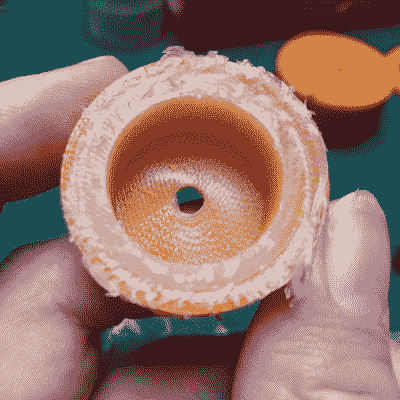

# 铸造彩色硅胶轮胎的实心尖

> 原文：<https://hackaday.com/2021/04/05/solid-tips-for-casting-colored-silicone-tires/>

对于使用轮式机器人或遥控车辆的人来说，迟早会对定制轮胎感兴趣，而不是处理现成的东西。[concreted0g]的首选方法是设计和 3D 打印轮毂，然后铸造一些定制的硅胶轮胎，以适合它们。当然，魔鬼在细节中，这个过程可能有点混乱，所以[他分享了如何用简单的材料获得可靠结果的有用技巧](https://concretedog.blogspot.com/2020/10/casting-silicon-tyres.html)。

 铸造材料是五金店的廉价硅胶填缝，颜色可以加入少量廉价的丙烯颜料。几滴甘油加入到硅树脂中会使其变薄，有助于它更好地流入模具。充分混合(涂料也将作为混合程度的视觉指标)，然后将混合物舀入模具，同时尽量避免产生气泡。如果你的模具是两件式的，组装模具并清除溢出物，然后让它静置至少几个小时，直到它固化。

将制成的轮胎安装到轮毂上可以用一层薄薄的强力胶来完成，这似乎对小轮胎非常有效，并且易于使用。

对于大型物体，规则会有所不同。我们知道硅胶填缝很厚时很难完全固化，特别是当密封在几乎没有气流的模具中时。在这种情况下，[加入玉米淀粉(硅树脂和玉米淀粉的体积比为 5:1)就可以在不到一个小时的时间内固化厚团的粘性物质](https://hackaday.com/2015/03/13/3d-printed-molds-and-silicone-caulking/)。搅拌玉米淀粉会将更多的气泡引入混合物中，但对于较大的块来说，这是一个可以接受的权衡。廉价硅胶填缝是多才多艺的东西，一个人只需要知道会发生什么，并采取一些步骤来处理混乱。

需要更强硬的吗？也许可以试试[用汽车硅胶软管切片做机器人轮子](https://hackaday.com/2019/12/19/super-easy-small-robot-wheels/)来得到同样好用，但更耐用的东西。