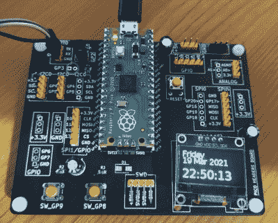

# 用 Pico 和 Python 搭建 PC 和嵌入式世界的桥梁

> 原文：<https://hackaday.com/2021/04/18/bridging-the-pc-and-embedded-worlds-with-pico-and-python/>

虽然 I2C 和 SPI 等协议非常适合嵌入式设备与其外设之间的通信，但将这些低级数字接口与 PC 接口可能会很麻烦。[Alexandre]通常使用 Arduino 来连接 PC 和嵌入式世界，但是他厌倦了为每个项目定义一个定制的串行协议。受 MicroPython 机器模块的启发，[Alexandre]开发了[u2if——MicroPython 用于 PC](https://github.com/execuc/u2if) 的一些机器模块的实现——使用 USB 连接的 Raspberry Pi Pico 在 PC 和低级数字接口之间建立桥梁。

u2if 由两部分组成:PC 部分是 MicroPython 机器模块的一部分的 Python 实现，Raspberry Pi Pico 接收一些自定义的 C++固件。到目前为止，[Alexandre]已经实现了板载 ADC、I2C、SPI、UART 和 GPIO 线路的功能，以及对 I2S 声音和 WS2812B 可寻址 LED 的额外支持。

除了 u2if 封装之外，[Alexandre]还设计了一个 PCB，将 Raspberry Pi Pico 的所有接口集成在一个方便的 3×3.9 英寸电路板中。我们特别喜欢为 I2C 提供多个接头，其中一个有足够的空间安装一个 [SSD1306 有机发光二极管显示器](https://hackaday.com/2015/04/03/high-speed-ssd1306-library/)。

我们认为这可能是一个非常有用的工具，更令人印象深刻的是，它使用了我们许多人已经有的一块板。如果你想要一个与低电平数字总线接口的专用器件，你可能想看看 GreatFET。