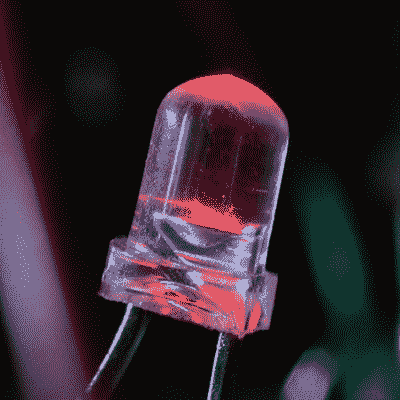

# LED 亮度调节将自身用作传感器

> 原文：<https://hackaday.com/2021/04/11/led-brightness-adjustment-uses-itself-as-sensor/>

这是一个关于一个成功的系统却没有成功的故事。一个实验性的 LED 亮度调节是[Mitxela]在一个高精度时钟项目中探索的东西；它可以显示精确到毫秒的时间，并且在用高速相机拍摄时不会闪烁或看起来怪异。要做到这一点，意味着要彻底改造时钟显示器的许多方面，包括如何优雅地调节亮度。现在，要明确的是，这里描述的亮度调节想法并没有最终被使用，但它足够有趣，以至于[Mitxela]写了它，我们很高兴他做到了。

 这个想法是为了有一个平滑无缝的自动亮度调节，理想情况下没有添加组件。由于[发光二极管可以被用作光传感器](https://hackaday.com/2016/06/17/ask-hackaday-whatever-happened-to-led-light-sensors/)，【Mitxela】看到了一个机会，可以将时钟显示器本身的元件用作传感器。它是这样工作的:组成 LED 的 pn 结中的电荷会以与到达结的光量成比例的速率衰减。通过测量这种衰减的速度，就可以知道有多少光照射到了 LED 上。它既有效又优雅，但是还有一些实际问题需要处理。

第一个失败的想法是利用七段 led 模块中未使用的小数点作为传感器，但这被证明是有问题的。一个是显示模块的共阴极布线；这使得它们非常方便作为显示器来驱动，但是使用小数点作为光传感器是不切实际的。另一个问题是，使显示器更容易阅读的内置漫射器吸收了大量的环境光。更好的选择是在数字之间的冒号分隔符中使用 led，因为它们是独立的。当然，除了用作传感器之外，它们还必须点亮，但[Mitxela]通过在由 PWM 驱动的 led 之间进行必要的测量，制作了一个成功的原型。

尽管这个解决方案是多么聪明和有效，但最终导致失败的事实是，led 不能很好地感应环境光。led 的方向性太强了。即使打磨掉发光二极管的顶部(透镜),它们的视野仍然很窄。正如[Mitxela]所描述的那样，将时钟向天花板倾斜可以让它达到最大亮度，而一个人的头落在时钟上的影子会让它陷入“夜间模式”的昏暗。简而言之，它对正前方的东西做出了反应，而不是整体的环境光水平。

这提醒我们，有时解决方案并不能完全符合所有的要求，而且可能会因为意想不到的原因而发生。尽管如此，发光二极管是多功能的东西。它们不仅能感知光线，而且顾名思义，它们还是二极管。由于[二极管可以用作温度传感器](https://hackaday.com/2018/04/16/two-cent-temperature-sensors/)，这意味着[led 也可以](https://hackaday.com/2018/08/21/an-led-you-can-blow-out-with-no-added-sensor/)。