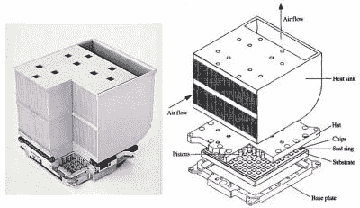

# 从 20 世纪 90 年代早期的 IBM ES/9000 大型机中拆除逻辑芯片

> 原文：<https://hackaday.com/2021/04/14/logic-chip-teardown-from-early-1990s-ibm-es-9000-mainframe/>

20 世纪 80 年代和 90 年代初对半导体技术来说有点奇怪，几十年来使用的各种晶体管技术慢慢为 CMOS 技术让路。1991 年的 IBM ES/9000 大型机是最后一批围绕双极晶体管技术构建的系统之一，其中[Ken Shirriff] [拆卸了组成这些大型机之一的处理器模块](http://www.righto.com/2021/03/logic-chip-teardown-from-vintage-ibm.html) (TCM)。

A Thermal Conduction Module from an IBM ES/9000 mainframe.

这些热传导模块中的五个(127.5 毫米边)组成了这些旧主机中的处理器。最值得注意的是上述双极性晶体管的使用和基于 DCS(差分电流开关)逻辑的使用。在 ES/9000 中，功耗已经很高的双极晶体管已经达到了极限，并且使用了相当大的 DCS 门，每个 TCM 不仅被提供了许多安培的电流，而且能够消耗高达 600 瓦的功率。

每个 TCM 也不包含一个大的双极晶体管芯片，而是将许多较小的芯片结合在一个特殊制备的陶瓷层上，其中的布线是通过非常精确的工艺添加的。虽然 ES/9000 绝对是工程上的奇迹，但本质上是一个失败，到 1997 年，IBM 也将完全转向 CMOS 晶体管技术。

这些年来，我们报道了许多[Ken]的作品，[也许你想更多地了解他的技术](https://hackaday.com/2018/12/05/hold-for-publishing-plan-ken-shirriff-explains-his-techniques-for-reverse-engineering-silicon/)。