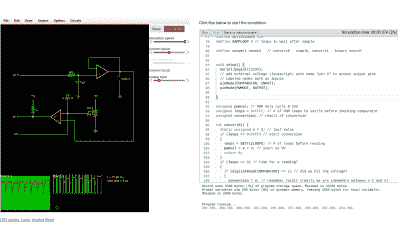
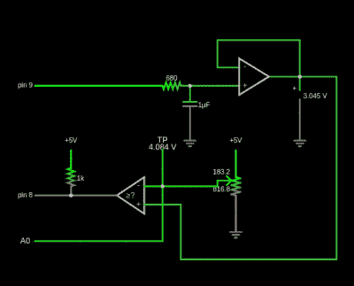
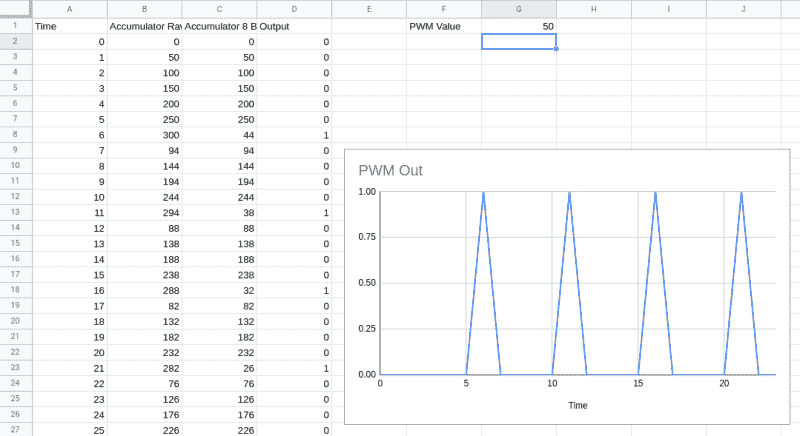

# 电路虚拟现实:Arduino 几乎符合模拟

> 原文：<https://hackaday.com/2021/06/11/circuit-vr-arduino-virtually-meets-analog/>

曾几何时，制造电子产品和制造软件是两种截然不同的活动。如今，几乎任何重大的电子项目都会在某个地方使用 CPU，或者至少可以使用。使用电路模拟器可以让你走一部分路，软件模拟器比比皆是。但是联合仿真——模拟模拟电路和正在运行的处理器——通常只出现在高端仿真产品中。但是有一天我注意到这个特性悄悄地溜进了我们最喜欢的基于网络的模拟器 [Falstad](http://falstad.com/circuit/avr8js/) 。

The classic simulator is on the left and the virtual Arduino is on the right.

回到三月份，[主项目](https://github.com/pfalstad/circuitjs1)增加了来自【Mark McGarry】的工作来支持由【Uri Shaked】编写的 AVR8js。最终结果是，您可以在屏幕左侧看到电路模拟器，在右侧看到基于 Web 的 Arduino IDE。但是除了简单的演示之外，它是如何工作的呢？我们想弄清楚。

屏幕看起来很有前途。熟悉的模拟器在左边，Arduino IDE——有点——在右边。源代码下面有串行输出，但是滚动不太好，所以如果输出很多串行数据，很难读。

## 没有什么是完美的

我喜欢法尔斯塔德模拟器的一切，拥有一个 Arduino 联合模拟非常棒。但有一个真正重要的问题可能最终会得到解决。通常，当您绘制原理图时，您可以将其保存为文本或编码在链接中。如果您点按链接或导入文本，一切都会恢复到您存储时的状态。我在很多 Circuit VR 帖子中使用了这一点，这样你就可以点击一条赛道，看到它的实况。

但是，模拟器不会将源代码保存在虚拟 Arduino 中。你必须自己去做。这意味着如果你一切正常，保存你的电路，关闭你的浏览器，下次你将不得不重新创建你的 Arduino 代码。幸运的是，我在丢失任何工作之前测试了这个。不过，页面上应该有一个大大的红色警告。

这意味着，虽然，我不能给你一个链接跟随例子。你可以这样做:

1.  看一下[源代码](https://gist.github.com/wd5gnr/0c699073c498ef80b3f0d6f3f1b98c5d)。
2.  打开[模拟器](http://falstad.com/circuit/avr8js/)。
3.  复制源代码注释顶部的文本，粘贴到模拟器中(注释中有详细说明)。

只是不要忘记保存您的源代码更改。如果您对电路进行了更改，您会希望将它们导出为文本并复制到源代码中，这样您就可以一起保存所有内容。

## 一个例子

Test schematic.

我想要一个简单的例子来展示使用联合模拟的好处。我决定寻找一些使用逐次逼近法进行模数转换的替代方案。虚拟电位计提供输入电压。有一个比较器和一个缓冲 PWM 输出。这是示意图:

## 输入/输出

Arduino 有三个接口点。使用“输入和源”组件将 PWM 输出设置为外部电压(记住，Arduino 的输出是电路的输入)。相反，比较器输出和与 Arduino 模拟转换器(A0)的连接在“输出和标签”菜单中被标记为节点。名字是有意义的，包括空格。

## 代码

理论上，代码非常简单。你猜一个电压，读取比较器的输出，看看你是否正确。代码中有两种方法，您可以通过将`convert`定义设置为`convert0`或`convert1`来在它们之间切换。

每次循环时，代码都会调用一个 convert 函数，通过不同的算法来管理逐次逼近过程。它还会在每次通过时更新 PWM 输出。

第一种近似算法非常简单，但效率不高。它猜测每个输出电压从 0 开始，每次上升 1/255 V。当比较器从假变为真时，你知道输入电压必须小于当前电压，但大于前一个电压。

第二种算法更聪明，像二分搜索法一样工作。第一个猜测是 128/255。该电压高于或低于我们的目标。如果它更低，我们记得该位应该打开，无论如何，移动到下一位。换句话说，第二次测试将是 64/255 或 128/255 +模拟 64/255。同样，新值为高或低，将决定下一位的状态。

第一个算法可能会很快完成，或者可能要一直数到 255 才能找到答案。第二种算法总是进行 8 次测量。比较器无法告诉我们基准电压与输入完全相等，即使我们可以定义这对模拟信号意味着什么。因此，我们必须测量每一位，并决定它应该是开还是关。

输出出现在串行终端。第一个数字是转换的结果，第二个数字是相同电压下内置转换器的值。

## 参考电压

产生基准电压是关键。使用 8 个输出位和一个 R2R 网络来快速产生一个输出电压是可能的，但这会消耗很多引脚。相反，我用一个引脚通过 PWM 产生电压。当然，这并没有那么快，因为你必须让 RC 滤波器有时间让电压达到期望值。

引脚 9 使用历史悠久的技术产生 PWM 信号。假设你想产生 20/255(约 8%占空比)。你取一个 8 位的累加器，反复加 20。PWM 输出是最高位的进位。你可以找到一个带有逻辑的[电子表格](https://docs.google.com/spreadsheets/d/1SaKhDi97CZUmQr6C2zPNUDs8Z9tkr7_FFYWinAMsEcc/edit?usp=sharing)，但是你必须想象输出波是正方形的，因为电子表格在点之间画直线很有用。

This spreadsheet models the PWM output logic.

要做到这一点，代码应该在一个精确的中断上运行，并均衡输出之间的时间。然而，对于这个快速演示，我假设调用主循环的时间足够规律。我考虑过在中断时这样做，但是——老实说——我不确定模拟器有多可靠，它的时间精度有多高，而且你似乎不能很容易地向它添加库，所以你几乎肯定必须在寄存器级别管理中断。

输出信号由 RC 滤波器平滑。这里的值很有趣，当你改变这部分电路的参数时，观察示波器也很有趣。您需要一个无噪声的参考信号。这意味着一个大电容。然而，大电容需要更多的时间来充电和放电，因此电压需要更长的时间来建立。这是一个典型的权衡。你想要嘈杂的快速响应还是干净的慢速响应？

在这种情况下，底池可能不会变化很快，但在现实生活中，输入信号可能一直在变化，您甚至可以考虑一个样本，并保持该输入，以确保在猜测过程中它不会变化。

## 调谐

显然，您可以在模拟器中轻松更改 RC 值。甚至可以添加滑块，在模拟运行时以图形方式设置值(pot 已经设置好了)。然而，更改代码需要停止并重新启动。

在代码中，您可以更改转换例程等待新 PWM 值建立的循环周期数(`SETTLELOOPS`)以及读数之间暂停的时间长度(`SAMPLOOP`)。这些数字和 RC 值之间的相互作用至关重要。较大的 RC 时间常数需要更多的时间来产生正确的结果。较小的 RC 数需要较少的时间，但噪声会引入误差。你挑吧。

PWM signal with 2uF capacitor.

PWM signal with 47uF capacitor.

## 判决

这是一个玩具的例子。PWM 产生存在一些问题，PWM 不是转换基准电压源的好主意。尽管如此，它还是很好地展示了 Falstad 提供的联合模拟的可能性。我真的很期待下一次我需要一些外来信号馈入电路。仅仅使用 Arduino 作为一个函数发生器就有它的用处。

我真的希望你能更容易地添加库和保存整个项目。不过，使用这个工具，您可以快速、轻松地模拟许多假设场景。由于它在代码库中只存在了几个月，我希望随着时间的推移，其中的一些问题会得到解决。将调试加入其中，这将是一个真正的赢家。

Tinkercad 允许你模拟 Arduino，但不能模拟法尔斯塔德的复杂电路。它确实需要安装，但是我们总是很惊讶没有听到更多关于[的消息。](https://hackaday.com/2018/08/22/simulate-pic-and-arduino-avr-designs-with-no-cloud/)