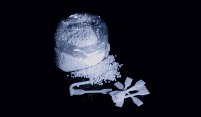

# 注塑玻璃突破了工作方法的天花板

> 原文：<https://hackaday.com/2021/06/10/injection-molded-glass-breakthrough-shatters-ceiling-of-work-methods/>

玻璃是人类最古老的材料之一，它仍然被广泛应用于从饮用器皿和包装到光学和通讯的方方面面。不幸的是，使用玻璃的方法还停留在过去。大多数方法需要 1500℃到 2000℃的高温，并且它们都受限于可以制造的形状的复杂性。

就制造形状而言，玻璃可以吹制，熔融玻璃可以压入模具。玻璃也可以在窑中研磨、蚀刻或铸造。如果不是因为整个有限的几何形状，玻璃在许多方面都将是梦幻般的。由于形成玻璃的限制，一些光学透镜由聚合物制成，尽管玻璃具有更好的光学特性。

理想情况下，玻璃可以像塑料一样注射成型。这样做的好处是双重的:更复杂的形状将成为可能，它们的制造时间将会更快。好了，等待结束了。德国弗赖堡大学的研究人员已经找到了一种将注射成型应用于玻璃的方法。这不是普通的玻璃——他们制造了高质量、透明的熔融石英玻璃，而且制造温度比传统方法低。该团队使用 x 射线衍射来验证玻璃是无定形的，没有晶体，并能够通过三种方式来确认其光学透明度——光学显微镜，紫外可见和红外测量。它揭示的只是一点点灰尘，这在洁净室之外是可以预料的。

##  聚合物使之成为可能

这是一个令人兴奋的消息，原因有二:注射成型打开了复杂形状的大门，而且它比传统的玻璃成型方法耗能更少。该团队于 2017 年开始了这一旅程，黑客入侵了一台 3D 打印机来喷射玻璃糊而不是塑料。为此，他们用二氧化硅纳米粒子和紫外线固化聚合物制成了一种可打印的粉末。虽然它确实适用于制作复杂的形状，但印刷和固化是一个缓慢的、一次一个的过程。

但是现在他们已经升级了注射成型工艺。那么秘诀是什么呢？更多太空时代的聚合物。他们又从二氧化硅纳米颗粒开始，加入聚乙二醇(PEG)和聚乙烯醇缩丁醛(PVG)。这就产生了一种糊状物，他们将这种糊状物送入挤压机，挤压机将塑化的玻璃喷入形状像小齿轮、圆盘和石块的复杂小模具中。

一旦它们从模具中出来，由于二氧化硅颗粒之间发生的[范德瓦尔斯相互作用](https://en.wikipedia.org/wiki/Van_der_Waals_force)，这些碎片会结合在一起。这些微弱的静电力使分子相互结合。为了获得更持久的结合，研究人员首先将碎片浸泡在水中几个小时，以洗掉钉子。然后他们分两个阶段烧制这些碎片——第一次在 600 摄氏度烧去 PVB，第二次在 1300 摄氏度将二氧化硅颗粒融合在一起。至此，塑料不见了，剩下的只有玻璃。

Frederik Kotz 博士是研究人员之一，也是材料初创公司 [Glassomer](https://www.glassomer.com/) 的团队负责人，他对自己的发现是这样说的:

> 我们看到了巨大的潜力，特别是对于具有复杂几何形状的小型高科技玻璃部件。除了透明性，玻璃非常低的膨胀系数也使这项技术变得有趣。如果关键部件由玻璃制成，传感器和光学器件在任何温度下都可以可靠地工作。

## 一种新的快速玻璃

虽然注射成型比几年前该团队的印刷和固化工艺更快，但有一个问题:必须在几天内洗去挂钩，以防止玻璃破裂。肯定有人会想出一个更快的方法。也许在下一次世界需要几十亿剂新疫苗的玻璃瓶之前。

通过[玻璃观察器](https://www.glassomer.com/)获得的图像