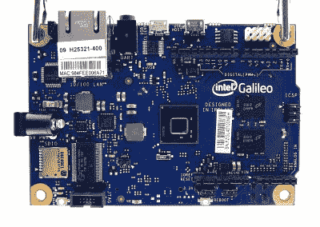
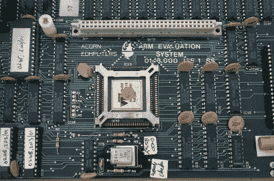
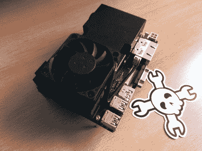

# 便宜的 X86 单板 PC 都去哪了？

> 原文：<https://hackaday.com/2021/06/17/where-are-all-the-cheap-x86-single-board-pcs/>

如果我们想到一台复古计算机，我们很可能会想到经典 8 位时代的东西，或者一台游戏机。看到 DOS 和 Pentium 时代的普通台式个人电脑加入它们的行列几乎令人震惊，但这些机器现在成为玩 DOS 和 Windows 95 游戏的重要方式，这些游戏不适合更现代的操作系统。对于那些希望在合适的硬件上玩游戏，而不是肮脏的米色迷你塔和巨大的 CRT 显示器的人来说，甚至可以选择购买一台新的机器:更苗条的基于奔腾的 PC104 工业 PC。

## 在廉价芯片的世界里，为什么没有英特尔？

Intel’s Galileo and Edison boards hardly set the world of embedded computing on fire. Regi51, [CC0](https://commons.wikimedia.org/wiki/File:Embedded_World_2014_Intel_Galileo_01.jpg).

在最近的一篇 Hackaday 文章之后，我们稍微转向了 PC104 板的世界。首先，看到 486 和奔腾级处理器以及片上系统仍在生产令人着迷，但也令人惊讶地发现包含它们的板可能有多贵。当一个普通的基于 ARM 的基于 Linux 的 SBC 售价不到 10 美元时，它提出了一个问题:为什么很少有相应的带有 SOC 的 x86 主板给我们提供商品化的 PC 硬件，我们习惯于在其上运行我们的主流发行版？答案既在于 ARM 做对了什么，也在于 x86 处理器中是否有这种主板。

想象一下过去三十年的另一条时间线。这是我们的时间线，因此网络从未屏蔽 *Firefly，*但更重要的是，微处理器进化的时间线发生了不同的转变，因为 ARM 从未从 Acorn 中分离出来，其架构作为一种有趣的利基处理器而受到冷落，只有在 Acorn 的阿基米德线中才能找到。在这个没有手臂的 90 年代末平行宇宙，接下来发生了什么？

Imagine the chain of events started by this early ARM chip never happened. Peter Howkins, [CC BY-SA 3.0](https://commons.wikimedia.org/wiki/File:Acorn-ARM-Evaluation-System.jpg).

当英特尔的奔腾处理器成为主流处理器时，似乎有一大堆令人眼花缭乱的公司在争相提供替代品。您将熟悉 Intel、AMD 和 Cyrix，并且您可能知道 Transmeta 曾经是 Linus Torvalds 的雇主，但是如果 Rise Technologies、NexGen、IDT 或国家半导体等公司的 x86 产品与您擦肩而过，我们也不会感到惊讶。

在这个时期，RISC 内核通常被视为下一个大事件，因此这些公司的一些设计是更加高效的混合 RISC/CISC 内核，首次推出了现代台式机 x86 芯片中的架构类型。我们知道，随着 20 世纪 90 年代进入 21 世纪，这些公司中的大多数都被企业收购了，所以到目前为止，台式机的选择仅限于 AMD 和英特尔。但是，如果 ARM 没有填补强大的低功耗和低成本处理器核心的空白，那些平庸的处理器会不会走上正轨？

很有可能它们会以某种形式存在，也许你的树莓 Pi 可能会有来自威盛或 IDT 的芯片，而不是它的 Broadcom 部分。所有那些“它能运行 Windows 吗？”Raspberry Pi 论坛上的问题会得到解答，几乎任何 PC Linux 发行版都可以毫无问题地安装和运行。因此，鉴于这一切都没有发生，是时候回到真正的时间线了。ARM 做对了什么，x86 Raspberry Pi 或类似产品的障碍是什么？

## 销售 IP，赢得胜利

如果你对 ARM 有所了解的话，那就是它们本身并不是一家半导体公司。相反，他们是一家半导体知识产权公司；你买不到 ARM 芯片，但你可以从许多其他公司购买包含 ARM 内核的芯片。相比之下，x86 世界缺乏一个准备如此自由地许可其内核的玩家，因此 ARM 市场的纯粹多样性没有被复制。x86 SoC 供应商的数量与运动设备供应商的数量相比只有一小部分，因此对于那些十美元的主板来说，根本没有足够便宜的竞争。

Somewhere underneath all that heatsink is an x86 SBC.

然后就是权力的问题。有一个故事，当 Acorn 的电源断开时，交付给 Acorn 的第一个 ARM 芯片寄生地从其总线上的逻辑 1 信号为自己供电，不管是真是假，ARM 处理器在历史上一直比 x86 处理器更省电。那些达到可比功耗的 x86 芯片少之又少。因此，那些确实存在的小型 x86 主板与它们的 ARM 同类产品相比，通常会有过多的散热器需求和功耗数字。

将这两者结合在一起，它创造了一种极有可能构建的技术，但它带来了昂贵的芯片组和支持电路，以及对功率的贪婪需求，这些因素使它在与低功率和廉价的 ARM 竞争中缺乏竞争力。如果技术世界有一件事是出乎意料的，那么可访问的 x86 平台的机会会增加吗？如果留给 AMD 和英特尔，可能不会，但谁能说 x86 软核不能打破平衡。只有时间能证明一切。

表头:寡头， [CC0](https://commons.wikimedia.org/wiki/File:Intel_i386DX-25_IV.jpg) 。