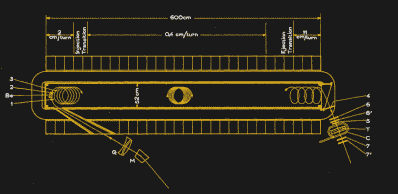
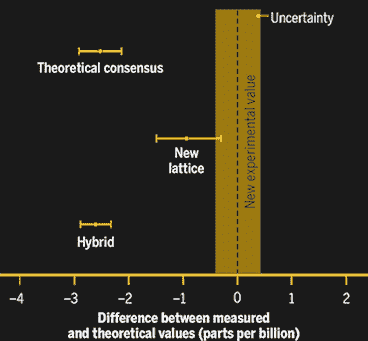

# μ介子的神秘抖动

> 原文：<https://hackaday.com/2021/05/11/the-mysterious-wobble-of-muons/>

你可能会认为，当实验得出的结果与他们的理论预测不同时，粒子物理学家会感到难过，但没有什么比无法解释的现象更能照亮一个领域了。事实上，粒子物理学家一直在狂热地寻找标准模型的偏差。今年，有诱人的迹象表明，理论和实验之间长期未解决的差异将被新的实验结果所证实。

特别是，测量μ介子磁矩的探索始于 60 多年前，从那以后测量得越来越精确。从 1959 年在瑞士 CERN 的实验，到世纪之交在布鲁克海文的实验，再到今年在费米实验室的结果，μ子的磁矩似乎与理论预测不一致。

虽然基本上排除了统计上的侥幸，但这个值也依赖于复杂的理论计算，而这些计算并不完全一致。这可能只是另一个好得令人难以置信的标题，而不是预示着物理学的新时代。但是一些物理学家小声嘟囔着“新粒子”。让我们看看到底是怎么回事。

## 电子的老大哥

The muon is often called the big brother of the electron: it is an elementary particle with a negative charge, and it is about 200 times heavier than its little brother. Muons are omnipresent because they are produced when cosmic rays smash into the atoms of our atmosphere. If you hold out your hand there is probably a muon going through it every second. To study muons, they can also be artificially produced using particle accelerators that mimic the reactions occurring in our atmosphere. The generated muon beam can then be circulated and stored in a big magnetic ring.

μ子具有自旋和电荷，产生磁矩，用于测量其磁场的强度和方向。你可以想象μ子就像微小的永久磁铁，当它们被放置在外部磁场中时，它们的方向会对齐。“g 因子”是磁矩和自旋之间的无量纲比例常数。

使用一些[奇特的数学，](https://physics.stackexchange.com/questions/503138/electron-spin-g-factor)人们可以从[狄拉克方程中计算出μ子(或电子)的 g 因子，](https://en.wikipedia.org/wiki/Dirac_equation)给出的值正好是 2。但这并不是全部真相:在量子电动力学(QED)中，[“虚拟”粒子](https://en.wikipedia.org/wiki/Virtual_particle)可以突然出现又突然消失，只要它们的速度足够快，以至于它们落入海森堡测不准原理的覆盖范围内。这种存在与不存在的循环导致了计算中的校正项。对于μ介子来说，环修正导致 g 因子不完全是 2 而是 [2.00233183620](https://arxiv.org/abs/2006.04822) ，这个差值被称为μ介子的反常磁矩。

## 你只需要一个巨大的磁铁

Experimental setup of the g-2 experiment at CERN. Muons enter the magnet at the lower left and then propagate in a spiral path to the right where they exit and are analyzed.
Credit: [G. Charpak et al.](https://journals.aps.org/prl/abstract/10.1103/PhysRevLett.6.128)

1959 年，欧洲核子研究中心决定进行一项实验，以测试量子电动力学的有效性，量子电动力学预测了介子的异常磁矩。忽略了想出一个创造性缩写词的通常传统，这个实验被简单地称为“g-2”(读作“gee minus two”)。

在实验中，来自欧洲粒子物理研究所同步回旋加速器的一束质子被射到一个目标上，产生一束π介子，它立即衰变为μ介子。这个μ介子束然后进入一个 6 米长的磁铁。

磁场垂直于μ子束，这使得μ子弯曲成圆形路径。磁场也从左到右变化，这是通过在磁铁中仔细插入精确计算的垫片实现的。这导致μ子缓慢地从左向右漂移，形成一个螺旋曲线。

在这个磁场中，μ子的自旋在摆动(进动)，就像核磁共振成像仪中质子的自旋一样。在磁体的右端，μ子被喷射出来，并分析它们相对于动量的自旋方向。从这个测量中，可以计算出反常磁矩，因为它对轨道频率和自旋进动频率之间的差异很敏感。仅在开始后六个月，实验[得出 g = 2.001165 5 的结果](https://journals.aps.org/prl/abstract/10.1103/PhysRevLett.6.128)，与当时的理论值非常吻合，从而证实了 QED 的有效性。在接下来的几年中，第二次实验的准确度提高了 25 倍，实际上发现了理论和测量之间的差异，但这在理论家完善他们的模型后消失了。欧洲核子研究中心的第三次也是最后一次实验以 0.0007% (7 ppm)的惊人精度证实了这一新的理论结果。

## 理论和实验之间的矛盾

1984 年，美国接手研究μ子反常磁矩。利用布鲁克海文国家实验室(BNL)的质子加速器，他们的实验对欧洲粒子物理研究所的测量进行了几项改进。其中包括更高的质子强度、14 米直径的超导磁体(当时世界上最大的磁体)、更高效的μ介子注入、μ介子束的静电聚焦以及定制的 400 MHz 波形数字化仪。实验的目的是达到 0.35 ppm 的精度，以便检查由 W 和 Z 玻色子引起的环路校正，这是一年前在欧洲粒子物理研究所发现的。

为了获得一个客观的结果，合作使用了“盲分析”。这是粒子物理学中常用的技术，以避免分析数据的人对某个结果产生意外的偏见。它类似于医学研究中使用的双盲随机临床试验。在 BNL 实验中，两个不同的小组进行了数据分析，以获得计算 g-2 的两个频率。此外，每个频率都有一个人为引入的偏移，这是数据分析团队所不知道的，只有在结果确定后才能减去。

当最终数据采集运行于 2001 年结束时，[综合结果](https://arxiv.org/abs/hep-ex/0602035)与理论不符，有 2.2-2.7 个标准偏差，这取决于理论计算。这引起了很多关于它是否可能是新物理学的一个暗示的讨论，因为尚未发现的粒子将导致理论计算值的额外修正项。与其他结果一样，当然也有不太引人注目的可能性，即这只是一个统计波动，在 2.7 倍标准差的情况下这是不太可能的，但历史已经证明这完全不可能。另一个无聊的解释是实验中一些无法解释的系统误差。

而且理论值本身也不是防弹的。这是因为存在来自粒子环的大的修正，这些粒子环涉及不能从理论上计算的强相互作用粒子。取而代之的是，理论家们使用这些粒子在其他实验中测得的生产率来近似修正项。

## 热切期待的结果

Summary of the theoretical and experimental values for g-2\. The theoretical consensus value is in tension with the experimental results while new lattice calculations agree with their uncertainties.
Credit: [V. ALTOUNIAN/SCIENCE](https://www.sciencemag.org/news/2021/04/fresh-calculation-obscure-particles-magnetism-could-dim-hopes-new-physics)

2013 年，BNL 实验的超导磁体被运输了 3200 英里到芝加哥附近的费米实验室，以便使用他们更强的μ介子束重复实验。由于理论和实验之间的紧张关系在过去的 20 年里一直没有得到解决，物理学界急切地等待着这个结果。

几周前，费米实验室发表了他们的第一个结果,这也是通过盲分析获得的，其中他们的主时钟频率委托给了合作之外的其他两位物理学家。在揭开数据之后，结果显然证实了 BNL 测量。

理论和实验之间的综合张力现在达到了 4.2 个标准偏差，离宣称有新发现的 5 个标准偏差阈值还差一点。尽管如此，理论值和实验值之间的差异足够大，以至于它随机发生的几率约为 1 到 40，000。实验上的失误也不太可能，因为结果已经被两个独立的实验所证实，尽管他们使用了相同的技术和一些相同的设备。

讽刺的是，理论价值可能是罪魁祸首。事实上，在费米实验室发表他们的结果的同一天，一篇发表在《自然》杂志上的新理论论文[，](https://www.nature.com/articles/s41586-021-03418-1)，但从去年开始已经可以作为[预印本获得，](https://arxiv.org/abs/2002.12347)得出了一个实际上与实验数据兼容的值。这个新的理论值完全是通过在超级计算机上运行所谓的晶格计算从零开始计算出来的。然而，这一结果与理论上的一致值相差甚远，仍有待其他独立计算的证实。但是如前所述，在理论家重新评估他们的模型之后，理论和实验之间的紧张关系已经消失了。当理论和实验相互磨砺时，它们都会变得更加锋利。

因此，目前还不清楚粒子物理学的标准模型是否最终被破解了。许多人怀疑 g-2 的结果是由于一种新粒子，因为我们应该已经在当前的粒子对撞机如 LHC 中看到它了。另一方面，它可能就在眼前，被当前或不久的将来的对撞机发现。与此同时，费米实验室已经在忙于分析他们最近的一些数据，并且仍在继续收集数据，所以我们可以期待一个更准确的 g-2 值。这个话题无疑是目前粒子物理学中最令人兴奋的话题之一，值得关注。