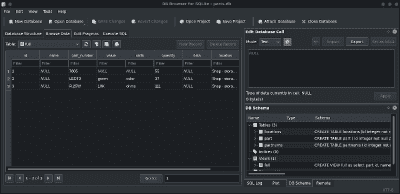

# Linux Fu:数据库是下一级文件系统

> 原文：<https://hackaday.com/2021/06/08/linux-fu-databases-are-next-level-file-systems/>

有趣的是，外来的计算机技术最终要么失败，要么变得司空见惯。例如，曾经有一段时间，在一台电脑上同时拥有多个用户是一项高科技。还有一些东西没有广泛流行，比如矢量显示或内容寻址存储器。然而，在计算机中使用大容量存储器——尤其是磁盘驱动器——已经变得非常普遍。但它曾经是一种奇异的技术，远不像今天这样简单。

然而，我感到惊讶的是，我们所知道的文件系统这些年来并没有太大的变化。当然，与 20 世纪 60 年代相比，我们有了更好的功能。我们在速度、编码、加密、压缩等方面有很多改进。但是我们如何在计算机程序中存储和访问文件的基本性质是停滞不前的。但不一定非要这样。我们知道更好的组织数据的方法，但是由于某种原因，我们大多数人在程序中不使用它们。不过，事实证明，这相当简单，我将通过一个玩具应用程序向您展示这一点，这个应用程序可能是我实验室中电子元件数据库的开始。

您可以将这样的数据库存储在逗号分隔的文件中，或者使用 JSON 之类的东西。但是我将使用一个全功能的 SQLite 数据库，以避免拥有一个重量级的数据库服务器以及由此带来的所有痛苦。它会取代机票预订系统背后的数据库吗？不。但是它对你可能做的大多数事情有用吗？你打赌。

## 抽象

仔细想想，文件系统只不过是对磁盘驱动器的一种抽象。我们通常不知道也不关心`hello.c`到底存储在哪里。我们甚至不在乎它是加密的还是压缩的。它可以通过网络获取，也可以随机分布在磁盘上。我们一般不会在意。如果您抽象了文件系统本身会怎么样？

这差不多就是数据库的概念。如果我有一个电子元件的列表，我可以将它们存储在一个逗号分隔的文件中，然后用电子表格读取。或者我可以用一个完整的数据库。数据库的问题是，传统上它需要一些服务器软件，例如 MySQL、SQLServer 或 Oracle。您可以抽象数据库接口，但是与仅仅打开一个文件并正常使用它相比，这是一个相当笨重的解决方案。

但是，有一个经常使用的库叫做 SQLite，它提供了一个非常健壮的数据库，可以保存在一个文件中，不需要外部服务器或维护。当然，它有局限性，但是对于许多简单的程序来说，它可以带来数据库的好处，而没有开销和费用。

## 适合正确工作的正确工具

当然也有局限性。但是，如果您正在开发自己的文件格式，您可能会考虑切换到 SQLite，并将其作为数据库来处理。根据该项目的网站，这样做实际上可以节省空间并提高访问速度。另外，一旦你掌握了窍门，事情就简单多了。如果您决定切换到一个真实的数据库，以后也更容易扩展。



如果您正在存储巨大的数据库(如 TB 级),或者您需要许多并发用户——特别是写入数据库——这可能不适合您。SQLite 网站有一个很好的页面，关于图书馆的哪些用途是好的，哪些不是最佳的。

另一个优点是:有一个命令行程序(和一些 GUI 变体，如附带图片中的浏览器)，让您无需编写任何代码就可以使用 SQLite 数据库。因此，您可以做一些事情，比如填充数据或检查数据库，而根本不用编写 SQL。对于自定义文件格式，您可能必须自己完成所有工作，或者使用不了解您的具体数据的通用工具来填充和调试数据。

## **我的任务**

我不想在一篇文章中开发整个应用程序，也不想教 SQL——大多数数据库都包含 SQLite 使用的结构化查询语言。但是我想向您展示，使用 C 语言开始一个简单的电子数据库是多么容易。C 代码将成为我们最少的问题。您最想了解的两件事是如何组织数据——数据库模式——以及如何填充初始数据。即使你想让你的程序最终添加数据，从少量数据开始让你的程序工作也是不错的。

## 数据库基础

现代关系数据库有一个或多个表。每个表都有数据行。一行有一列或多列，每列有一种数据类型。例如，您可能有一个表示序列号的文本列，一个表示测试点电压的实数值，以及一个表示通过/失败的布尔值。

每个表的每一行都有一个唯一的 ID。如果没有，数据库会为您提供一个，但是通常，您会希望自己提供这个唯一的 ID。数据库将通过自动增加数字来帮助您，并确保它对于每一行都是唯一的。

如果这就是它的全部，那么它就不会比逗号分隔的文件有多少优势。但是一旦我们有了这样的组织结构，我们可以做得更好。例如，很容易要求数据库对项目进行排序，或者从表中挑选出最高的三个电压。

然而，数据库的最大优势之一是能够进行连接。假设我有一个组件列表:一块 PC 板、一个电阻、一个电池座和一个 LED。我有一个表，其中每一行对应一个。现在假设我想要一个由组件组成的装配表。

我可以采取一个简单的方法:

```
Table Component
ID    Name
===========
1     PCB
2     Resistor
3     LED
4     Battery Holder

Table Assembly
ID    Name       Components
============================
1     Blink1     PCB, Resistor, LED, Battery Holder
2     Blink2     PCB, Resistor, LED, Resistor, LED, Battery Holder

That's ugly and wasteful. A better approach would be to use three tables:

Table Component
ID Name
===========
1 PCB
2 Resistor
3 LED
4 Battery Holder

Table Assembly
ID Name 
=========
1 Blink1 
2 Blink2 

Table Assembly_Parts
ID    Component    Quan
=======================
1     1            1
1     2            1
1     3            1
1     4            1
2     1            1
2     2            2
2     3            2
2     4            1
```

使用连接操作，您可以将这些表绑定在一起，生成第一个表，而无需复制大量数据。

对于我的玩具数据库，我将创建三个表:`part`将包含我拥有的零件。`partnums`表将保存零件类型(例如，7805 与 2N2222 或 CDP1802。最后，一个`locations`表会告诉我在哪里存放东西。还有其他的方式来构建。例如，可以有一个表来存储封装类型:2N2222 可以是 TO92 封装，也可以是表面贴装。此外，我将创建一个视图，显示第一个示例中展开的所有内容。视图是不存储的东西，但为了方便起见，它的作用就像一个表。实际上，它只是对数据库的一个查询。

当然，还有更多的东西。有内部和外部连接以及许多其他细节和细微差别。幸运的是，网上有很多关于数据库的资料可以阅读，包括 SQLite 文档。

## 刚刚够用的 SQL

出于我们的目的，我们将只使用少数 SQL 语句:`create`、`insert`和`select`。有一个可执行文件`sqlite3`，您可以在其中输入数据库命令。您可以在命令行上提供数据库的名称，这是最简单的方法。当你想退出时，使用`.exit`。

您可能会明白 SQL 语法，因为它非常冗长:

```
create table part ( id integer not null primary key, name text, partnum integer, value text, 
   units text, quantity integer, photo blob, data text, location integer, footprint text);
create table partnums (id integer not null primary key, partnum text, desc text);

create table locations (id integer not null primary key, location text, desc text);

create view full as select part.id, name, partnums.partnum as part_number, value, units, 
   quantity, data, locations.location as location, footprint from part 
   inner join partnums on part.partnum = partnums.id inner join locations on locations.id=part.location
```

我只是在 sqlite3 命令行程序中进行这些调用，尽管我可以使用 GUI，或者如果我愿意，我可以让我的 C 程序执行这些命令。我还使用命令行插入了一些测试记录。例如:

```
insert into locations (location,desc) values ("Shop - storage II","Storage over computer desk in shop");
insert into partnums(partnum,desc) values("R.25W","Quarter Watt Resistor");
insert into part(partnum,quantity,location,value,units) values (2,111,1,"10K","ohms");

```

要取回数据，您将使用 select 命令:

```
select * from part;

select partnum, quantity from part where quantity<5;

```

如果你想了解更多，网上有大量的 SQL 教程。

## 编程！

到目前为止，这些都不需要编程。假设您有`libsqlite3-dev`包或它的等价物，您不需要太多就可以将数据库函数添加到您的 C 程序中。你需要包括`sqlite3.h`。如果找不到，可能是没有安装开发文件。你还需要和`libsqlite3`联系。对于一个简单的单个文件项目，这个 makefile 可能会帮助您开始:

```
CC=gcc
CFLAGS+=-std=c99 -g
LDFLAGS=-g
LDLIBS+=-lsqlite3

edatabase : main

main : main.c

```

代码本身很简单。你需要打开数据库文件(`sqllite3_open`)。你可以传递“:memory”来获得一个内存中的数据库，而不是一个文件，这个数据库不会持续到你的程序结束。这个调用会给你一个返回数据库的句柄。接下来，您必须解析或准备想要执行的 SQL 语句。这可能是我们通过接口执行的任何 SQL 语句，也可能是许多其他 SQL 语句。在我的例子中，我想从完整视图中提取数据并显示它，所以我将解析:

```
select * from full;
```

最后，您将调用`sqlite3_step`，当它返回`SQLITE_ROW`时，您可以使用类似`sqlite3_column_text`的调用来处理该行。最后，您完成数据库并关闭它。下面是删除了错误处理的代码:

```

#include <sqlite3.h>
#include <stdio.h>

int main(int argc, char *argv[])
   {
   sqlite3 *db;
   sqlite3_stmt *sql;
   int rv;

   rv=sqlite3_open("parts.db",&db);
   rv=sqlite3_prepare_v2(db, "SELECT * from full", -1, &sql, NULL);
   do
     {
     rv=sqlite3_step(sql);
     if (rv==SQLITE_ROW)
        {
        printf("%s,",sqlite3_column_text(sql,0));
        printf("%s\n",sqlite3_column_text(sql,2));
        }
     } while (rv==SQLITE_ROW); 
   sqlite3_finalize(sql);
   sqlite3_close(db);
   return 0;
}

```

或者，看看完整的代码。在您不关心遍历行的情况下，您可能已经调用了`sqlite3_exec`。甚至文档也承认这只是一个围绕准备、步骤和终结的包装，所以你可以只传入一个字符串并期望它工作。

当然，还有[更多的电话](https://sqlite.org/c3ref/funclist.html)。例如，您可以调用`sqlite_column_int`或其他调用来获取特定的类型。您可以将参数绑定到 SQL 调用来设置值，而不是构建字符串。但是这向您展示了做一个简单的 SQLite 程序是多么容易。

所以下次你发现自己发明了一种新的文件格式，考虑使用 SQLite。你会得到免费的工具，一旦你学会了 SQL，你会发现除了不同的 SQL 命令之外，你不用写任何实际的代码就可以做很多事情。你甚至可以使用类似于 [Git 的分支来保存你的数据库](https://hackaday.com/2018/09/02/branch-out-your-sqlite-database-with-litetree/)的版本。话又说回来，有人用 [git 做数据库](https://hackaday.com/2017/05/23/stupid-git-tricks/)，但是我们不建议。