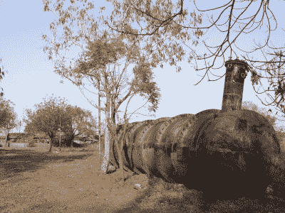
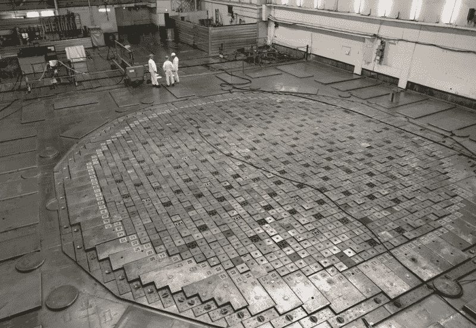
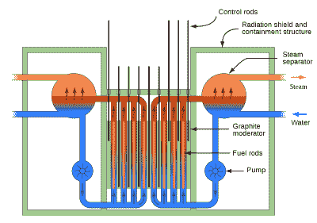
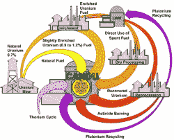
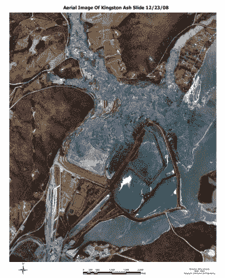

# 苏联 RBMK 反应堆:切尔诺贝利灾难后的 35 年

> 原文：<https://hackaday.com/2021/05/05/the-soviet-rbmk-reactor-35-years-after-the-chernobyl-disaster/>

35 年前，瑞典福斯马克核电站的辐射警报响起。经过调查，确定辐射不是来自工厂内部，而是来自其他地方。根据当时的盛行风，最终确定辐射来自苏联境内。经过一些政治争论，苏联政府最终承认切尔诺贝利核电站是源头，因为那里发生了一起事故。

灾难发生后，已经对原因进行了深入调查，因此我们现在对问题所在有了一个相当好的了解。也许切尔诺贝利核电站灾难给我们的最重要的教训是，它不是关于一个核反应堆的设计，一个控制室的工作人员，或一个极权主义政权，而是导致这种规模的灾难的一连串事件。

为了说明这一点，剩余的 RBMK 式反应堆——包括切尔诺贝利核电站的三个——自 1986 年以来一直运行，没有出现明显的问题，其中九个反应堆至今仍在运行。在切尔诺贝利核电站灾难的国际调查期间，INSAG 的报告反复提到了“安全文化”的缺乏。

审视导致切尔诺贝利 4 号反应堆发展和随后不安全使用的环境，可以让我们学到很多防灾知识。这是一个安全文化在工业中发挥重要作用的故事，在工业中事故的代价是以人的生命来衡量的。

## 对灾难的剖析

Tank 610, the source of the lethal cloud in Bhopal.

切尔诺贝利核电站灾难发生的两年前——1984 年 12 月 3 日晚，博帕尔市有 2000 多人死亡，原因是附近的联合碳化物印度有限公司化工厂意外释放出致命的异氰酸甲酯云。在随后的几年里，超过 1000 人死亡，超过 50 万人受伤。直到今天，来自工厂的化学污染使得现在废弃的工厂周围的土壤和地下水对人类的生活构成了威胁，即使人们继续生活在这个地区。

博帕尔灾难是缺乏维护、有缺陷的安全设备以及缺乏安全文化的顶峰。这种结合使得水流过有缺陷的阀门进入 MIC 水箱，导致在放热反应中产生致命气体。由于工厂的美国所有者(今天的陶氏化学公司)未能在工厂于 1986 年关闭时清理现场，这项任务现在留给了当地政府。

1986 年的切尔诺贝利核电站灾难显示了许多相似之处，尤其是缺乏安全文化。这始于 RBMK 的设计(*reaktor bols hoy moshchnosti kanal nyy*，或“高功率通道式反应堆”)，在那里选择天然铀以避免 ^(235) U 浓缩的成本。这意味着一个物理上更大的反应堆，导致决定跳过竞争设计(如 VVER)包括的安全壳，因为它太大太贵。

虽然 RBMK 的设计确实具有许多安全功能，包括一个分离的主冷却回路、一个紧急冷却系统(ECCS)和一个[急停](https://en.wikipedia.org/wiki/Scram)紧急关闭系统，但没有任何规定阻止操作员随意禁用这些安全功能。因此，本来应该是一个简单的蒸汽发生器应急动力实验(利用其惯性动量为循环泵提供动力)却以灾难告终。

## 玩反应堆反应性的游戏

在每一个轻水反应堆(LWR)设计中，使用普通的 H [2] O 来冷却反应堆堆芯，有两个主要参数决定反应堆是否正常运行，或者是否处于欠/过运行状态。这些与反应堆反应性有关:在任何给定时间，目标燃料的[中子截面](https://en.wikipedia.org/wiki/Neutron_cross_section)具有适当速度(中子温度)的中子数量。

在铀-235 的情况下，需要所谓的热中子，然而裂变反应产生许多更快的中子(“快中子”)。快速中子可以通过使用中子减速剂减速成为热中子。这个过程增加了反应堆的反应性。然后这个过程被中子吸收体抵消，中子吸收体包括水和任何控制棒，控制棒通常由碳化硼制成。

大多数 LWR 设计使用轻水来减缓和捕获中子，这也意味着如果反应性增加，水沸腾得更快，从而产生更多的蒸汽。这种蒸汽降低了中子的慢化能力，进而减少了可用热中子的数量，从而形成负反馈回路。这实质上是一个负的空隙系数。

Top of an RBMK at the Leningrad plant.

另一方面，作为早期第二代设计的 RBMK 与原型第一代[石墨堆反应堆](https://en.wikipedia.org/wiki/Graphite-moderated_reactor)有许多共同之处，包括使用石墨作为中子减速剂。虽然这允许使用天然铀，但也意味着 RBMK 以正空隙系数运行:随着反应堆冷却通道中的水沸腾并产生空隙，中子俘获能力下降，而慢化效应不受影响，从而产生潜在的失控反应。

这种权衡被认为是可以接受的，因为它允许 RBMK 设计输出远远超过当时西方反应堆设计的热能，而且人们认为训练有素的工作人员管理 RBMK 反应堆没有问题。

正如泰坦尼克号沉没等令人作呕的例子所指出的那样，营销和管理经常胜过工程，任何可以通过适当的维护和培训避免的灾难，在缺乏安全文化的情况下都是不可避免的。

## 邀请墨菲

当切尔诺贝利-4 计划关闭进行维护时，它被选中并通过禁用 ECCS 安全装置为蒸汽发生器实验做准备。然而，就在实验开始之前，由于电网需要额外的电力，决定让反应堆再运行 11 个小时。在这一延误期间，本应执行实验的白班被夜班替换，由于 ECCS 的残疾，所有夜班人员都必须手动调节水阀。

当值夜班的人被告知进行实验时，他本来是来工作的，希望能管理一个关闭和冷却的反应堆。这意味着在切断发电机的蒸汽之前，将反应堆从满功率降低到大约 700-1000 MW 的热能。

Diagram of an RBMK’s primary cooling loops.

RBMK 设计的一个怪癖是，它非常不稳定，在低功率水平下很难控制。在正空隙系数、控制棒有缺陷的设计和中子吸收剂(如作为副产品的氙-135)的形成之间，#4 反应堆的反应性下降到 100 MW 以下。这导致运行人员拆除越来越多的控制棒(包括自动控制系统中的控制棒),以提高反应性。这使得反应性再次缓慢增加到稍微接近实验所需的水平。

流向反应堆堆芯的冷却剂流量增加，以产生更多蒸汽，但这降低了反应性，因此，两台泵被关闭，以再次提高反应性。在这种配置下，几乎所有的控制棒都被拆除，所有的安全装置都被禁用，实验就此结束，尽管发电机减速导致功率下降，冷却水压力降低。作为最后一步，决定使用紧急停堆功能，这将相当迅速地插入控制棒以停止反应。

当这些棒被插入时，它们将水排出通道，增加了空隙，而每个控制棒尖端的石墨部分进一步增加了反应性。由于反应堆底部的反应性增加，反应堆热输出达到约 30，000 MW，标称值为 3，000 MW。冷却水立即蒸发，锆燃料棒包壳熔化，导致氢气在与蒸汽接触时产生。

第一次爆炸是由核心喷出的过热蒸汽引起的，它掀翻了核心顶部的防护罩，炸毁了大楼的屋顶。几秒钟后的第二次爆炸——可能是由氢气爆炸引起的——将反应堆核心撕裂，终止了核链式反应。4 号反应堆剩下的只是散落在各处的放射性堆芯碎片和超高温的堆芯熔融物(一种熔岩状的软泥，由来自被摧毁的堆芯的许多不同材料组成),正在融化进入反应堆建筑的地下室。与此同时，核心的石墨着火了，导致了将首先在瑞典被探测到的羽状物的脱落。

## 一个时代的终结

今天，仍有 9 个 RBMKs 在运行，它们都在俄罗斯。切尔诺贝利核电站剩余的三个 rbmk 在接下来的几十年中被关闭，所有剩余的 rbmk 都利用从切尔诺贝利-4 中吸取的教训进行了调整:

*   使用轻度浓缩铀燃料来补充额外的控制棒。
*   更多的中子吸收剂来稳定低功率水平的反应堆。
*   更快的紧急停堆顺序(12 秒而不是 18 秒)。
*   限制使用禁用安全系统的控制装置。

这些变化的主要影响是，正空隙系数显著降低，反应堆在低功率水平下更容易控制，操作员“随机应变”的自由度也更小。

随着 RBMK 和类似的设计不再受到公众的青睐，与之竞争的 VVER 成为了为俄国提供动力的主要反应堆设计。在其现代 VVER-1200 形式中，VVER 是第三代+设计，使用轻水进行中子减速和冷却，以及中子吸收。作为一种遵循国际核反应堆安全标准的设计，它将在未来几年内取代列宁格勒、库尔斯克和其他核电站剩余的 RBMKs。

## 这是安全文化，傻瓜

The range of fuel cycles possible with CANDU reactors. (credit: Atomic Energy of Canada Limited)

对于正空隙系数使得 RBMK 如此危险的观点，有一个有趣的反驳，那就是坎杜反应堆。这是一种平淡无奇的反应堆，普通的非加拿大公民甚至不知道加拿大有核工业，并一直向世界出口这些反应堆。

然而，CANDU 设计最初使用天然铀，同时以正空隙系数运行。尽管如此，CANDU 反应堆的主动和被动安全功能防止了类似切尔诺贝利-4 发生的操作员管理不善，或三里岛的(负空隙系数)反应堆部分熔化。在后一种情况下，一名操作员推翻了一个安全系统，这有点让人想起拙劣的切尔诺贝利-4 实验。

正如 2012 年日本[国会报告](https://en.wikipedia.org/wiki/National_Diet_of_Japan_Fukushima_Nuclear_Accident_Independent_Investigation_Commission)所指出的，2011 年福岛第一核电站的核事故背后也有类似的原因。安全文化的普遍缺乏，以及上至政府高层的普遍腐败导致安全系统得不到升级，对抗震标准的遵守不严，以及未能实施美国监管机构建议的升级。

Aerial photograph of the Kingston Fossil Plant coal fly ash spill.

即便如此，核设施事故仍然极其罕见，这使得商业核电成为每 TWh 最安全的发电形式之一。也许更令人担忧的是，这种安全文化的缺乏不仅仅是核工业的问题，而是更普遍的问题，正如博帕尔和其他重大工业灾难所表明的那样。在美国，化学安全和危害调查委员会(T2 CSB T3)负责调查工业化学事故。

除了官方报道，公务员事务局还在其 YouTube 频道上发布了一些纪录片视频。这些报告强调的是，安全文化不应该被认为是理所当然的，或者被认为不是一个问题。尽管没有极权主义政权，像美国这样的国家仍然设法遭受[经常性的工业灾难](https://www.arnolditkin.com/personal-injury-blog/2015/july/history-of-recent-industrial-disasters-in-the-un/)造成数百人伤亡。

美国 CSB 的报告告诉我们的一个教训是，尽管放射性物质可能看起来很可怕，但像锯屑或面粉这样无害的东西永远不应该被低估。允许危险情况的存在是将它升级为某人工作中最糟糕的一天的第一步，无一例外。

## 安全中没有“我”

没有人想成为团队中必须指出设计或程序中明显的安全问题的人。也没有人想成为因为不遵守安全程序而不得不出卖同事的人。同时，一个人无法迫使一家公司或一个国家实施更好的安全程序。

当没有制定、实施和遵守安全法规的总体努力时，下一场容易预防的灾难的到来只是时间问题，不管它会以什么形式出现。尽管安全条例并不十分酷或“性感”，但它们往往是在工厂无聊的一天和被夷为平地的炼油厂或导致数十人死亡、大片地区无法居住的 T2 煤灰泄漏之间的唯一障碍。

我们不仅要记住切尔诺贝利事故，还要记住夺走如此多生命的波帕尔和类似的灾难，只要我们作为一个社会没有让安全文化成为各地生活的一部分，我们每年都会这样做。

标题图片:切尔诺贝利核电站 4 号反应堆上方最终位置的新安全密封。由[蒂姆·波特](https://commons.wikimedia.org/wiki/File:NSC-Oct-2017.jpg)，抄送给 SA 4.0