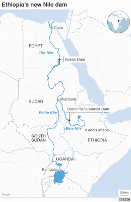

# 太阳能和风能可以帮助支持埃塞俄比亚的大坝项目

> 原文：<https://hackaday.com/2021/04/29/solar-and-wind-could-help-support-ethiopias-grand-dam-project/>

埃塞俄比亚正在进行一个重大的国家建设项目，建造宏伟的埃塞俄比亚复兴大坝(GERD)。建成后，GERD 将成为非洲最大的水电站，为该国日益增长的人口提供急需的电力。

该项目修建了蓝尼罗河大坝，这条河后来流入邻国苏丹，在那里与白尼罗河汇合，然后流入埃及。像所有跨越政治边界的河流一样，人们对为了上游和下游人民的利益公平管理水资源提出了关切。例如，在 GERD 上游筑坝过多的水可能会对依赖河流的埃及农业产生负面影响。正在努力寻找一个适合各方的和平解决办法。最近，有人建议用太阳能和风能来补充大坝的电力输出，以尽量减少对河流用户的干扰。

## 微妙的平衡

A map showing the various rivers that combine to become the Nile. Image credit: [BBC](https://www.bbc.com/news/world-africa-53416277)

当然，没有任何东西可以阻止埃塞俄比亚大坝简单地容纳所需的水量，并以它认为合适的方式使用它。然而，下游的农民并不倾向于欣赏他们宝贵的水源突然枯竭，以保持边境的灯光。埃及和苏丹也为他们自己的水电大坝拦蓄了一些河水。因此，这条河继续流下去，好好流下去，符合他们的利益。相关国家之间的谈判一再陷入僵局，看不到简单的解决方案。

来自布鲁塞尔自由大学和鲁汶大学的研究人员最近在《自然》上发表的一篇论文提出了一项计划，该计划涉及利用资源组合来最大化各方的利益。水电站的典型运行要求在多雨季节用河水注满大坝，在干旱季节排空大坝。流量得到管理，可以全年生产电力。很明显，大坝里储存的水越多，以后让水流出就能产生越多的电。GERD 足够大，如果需要的话，它可以拦下这条河全年的流量。筑坝改变了河流的自然流动，河流的水位取决于允许流出大坝的水量，而不是遵循正常的降雨模式。在干旱的年份，大部分的水可以保留在大坝里，严重减少了流向下游国家的水流。

Solar and wind resources would be outputting their maximum at opposite times to the greatest river flows. Combining these generation resources would allow the Blue Nile to maintain seasonality in its flows and minimise impacts of GERD on downstream communities. Image credit: [The Conversation](https://theconversation.com/solar-and-wind-power-could-break-the-grand-ethiopian-renaissance-dam-deadlock-158898)

当然，GERD 项目旨在产生大量的电力，从而拦蓄大量的河流年流量。然而，在埃塞俄比亚，值得注意的是有大量的阳光和风，特别是在与青尼罗河流量最大的季节相反的季节。因此，太阳能和风力发电资源可以与 GERD 协同使用。在更热、更干燥、更多风的季节，太阳能和风能将提供大量的电力，减少为水力发电而需要筑坝的水量——这些水随后将流向下游最需要的农业用户。相反，当多雨的月份到来时，水是丰富的。有了足够的能源，水力发电可以在这个时候增加，以抵消风能和太阳能资产产量的下降。随着雨季 GERD 水力发电的增加，根据自然季节变化，这将使河流水位在预期时间保持在高位。这是理想的，因为现有的用户——无论是农业还是其他水电大坝——已经围绕这种流态建立了他们的操作。保持季节性通常也是河流生态健康的关键。

## 基于多种方法

这是一个很好的例子，说明了多种可再生能源如何结合起来，以掩盖彼此的盲点。它还为下游用户提供了一个保持蓝尼罗河有规律流动的整洁解决方案，可能会使政治问题更容易解决。然而，天下没有免费的午餐。该计划需要对太阳能和风能资产进行大量投资，在旱季总发电量约为 3 GW。然而，这并非不可能——etho pian 的多兆瓦可再生能源计划已经摆在桌面上。

还有其他可能的好处。有了这么大的上游大坝，多雨年份的额外水捕获可以用来补充干旱年份的流出量，平滑自然的年度变化。这对于稳定农业产量特别有益，否则农业产量将受到自然可用水供应的支配。

这一提议是否足以让三方达成协议还有待观察。然而，它为水电项目提供了一个很好的模板，水电项目希望最大限度地利用现有电力，同时将对河流社区的负面影响降至最低。距离 GERD 全面投入运行只剩下几年时间，如果该项目要顺利进行，时间就是关键。