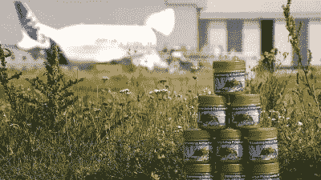

# 机场现在是蜜蜂的飞机场

> 原文：<https://hackaday.com/2021/04/30/airports-are-now-airbnbs-for-honeybees/>

2012 年夏天，蜜蜂蜂拥至匹兹堡机场，可能是因为那里的条件有利。像许多机场一样，停机坪周围是狂野、开阔的场地，它们的存在是为了抑制噪音。附近的几条小溪里点缀着许多值得食用的野花。

Free honey? Wúnderbar!

将近十年后的今天，这个机场是 110 个蜂群的家园，这些蜂群容纳了大约 400 万只蜜蜂。他们并不孤单。其他几个美国机场也加入了养蜂行动，包括奥黑尔机场、Sea-Tac 机场和明尼阿波利斯-圣保罗机场。

蜜蜂和机场之间的关系是共生的——蜜蜂生产的蜂蜜是机场周围空气污染水平的试金石，必须符合规定。二十多年来，德国机场一直雇佣蜜蜂作为“生物侦探”,它们在航站楼内免费发放蜂蜜。不过没关系——分析显示，机场蜂蜜中的碳氢化合物和重金属含量并不比非工业蜜蜂生产的蜂蜜高。

考虑到仅在美国，蜜蜂每年为大约 150 亿美元的农作物授粉，我们没有尽一切可能来对抗 T2 蜂群衰竭失调症和世界各地的其他问题，这是一个奇迹。这个神秘的问题在过去几年中有所增长，2020 年[的死亡人数是自 2016 年](https://www.agriculture.com/news/livestock/colony-collapse-toll-is-highest-in-four-years-for-us-honeybees)以来最高的。撇开群体崩溃紊乱不谈，对于我们毛茸茸的朋友来说，许多问题依然存在——害虫、杀虫剂、病原体和营养不良。

蜜蜂到底是怎么回事？它们是怎么飞的？因为它们不应该飞行。