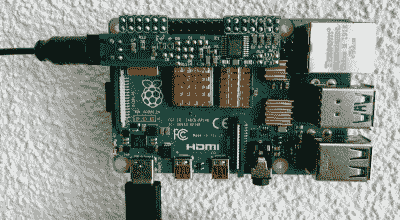

# 虚拟 Android 蓝牙嗅探器击败 Soundbar

> 原文：<https://hackaday.com/2021/05/02/soundbar-bested-by-virtual-android-bluetooth-sniffer/>

雅马哈 YAS-207 条形音箱可以通过蓝牙远程控制，但只能在 iOS 或 Android 上使用专用应用程序时使用。那些想用电脑或其他蓝牙设备控制硬件的用户被冷落了。或者至少在[Wejn]接手这个案子之前[是这样。](https://wejn.org/2021/04/multi-weekend-project-reversing-yamaha-yas-207-remote-control/)

为了捕获 soundbar 和应用程序之间的通信，[Wejn]首先在他的计算机上的虚拟机中安装了 Android-x86，然后在开发者设置中启用了“蓝牙 HCI 窥探日志”。从那里，在虚拟 Android 设备上运行的一个`netcat`命令不断地将`btsnoop_hci.log`文件的内容发送到他的 Linux 桌面上的 Wireshark。当他点击雅马哈应用程序中的按钮时，他可以实时观看数据。我们已经看到很多人在过去使用 Android 的集成蓝牙数据包捕获，但从来没有像这样。这当然是一个值得为未来在心里存档的提示。

The Pi can now control the TOSLINK connected speakers.

从那以后，事情进展得相当快。[Wejn]能够确定设备正在通过虚拟串行端口进行通信，并开始识别各个命令和响应数据包。事实证明，这些命令与他之前心血来潮破译的 NEC IR 代码非常相似，这有助于澄清事实。一旦校验和解决了，下一个合乎逻辑的步骤就是从他的 Raspberry Pi 媒体播放器中编写一些可以与条形音箱对话的代码。

[Wejn]将此与 Shairport Sync 项目相结合，该项目让 Raspberry Pi 在想要从手机上播放 AirPlay 时打开扬声器并切换输入。当然，同样的技术也可以应用到任何吸引你的数字音频源上。

这是一篇你应该完整阅读才能真正欣赏的文章。虽然每个设备都将是不同的，但[Wejn]在这个项目中展示的基本原则和工作流程绝对会在您自己的逆向工程冒险中有用。如果你更喜欢视觉学习，我们最近介绍了一个[系列的 YouTube 教程，其中包括嗅探 BLE 设备](https://hackaday.com/2021/03/23/a-crash-course-on-sniffing-bluetooth-low-energy/)，这也是不容错过的。