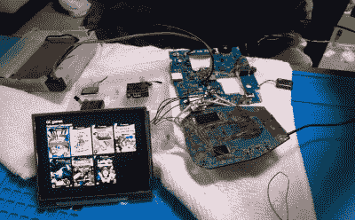

# 口袋大小的 Wii 为便携式产品树立了标杆

> 原文：<https://hackaday.com/2021/05/07/pocket-sized-wii-sets-the-bar-for-portable-builds/>

在过去的几年里，我们已经看到了几个项目通过“修整”的方式将任天堂的 Wii 转换成手持游戏机，其中系统的主板实际上被削减到原来大小的几分之一。这之所以成为可能，是因为控制台的大部分关键组件都在 PCB 上紧密地排列在一起。虽然它可能不是我们见过的最小的一个，但由[StonedEdge]设计的[Wii SPii 肯定会成为技术上最令人印象深刻的](https://bitbuilt.net/forums/index.php?threads%2Fthe-wii-spii.3347%2F)。

从第一个早期的 3D 打印外壳概念到全功能设备，花了[StonedEdge]大半年的时间，但我们要说这肯定是值得花的时间。这款便携设备的总体外观受到了任天堂自己的 GameBoy Advance SP 的强烈启发，尽管增加了额外的按钮和控制杆。在软件方面，该系统不仅能够运行存储在其 SD 卡上的 Wii 和 Gamecube 游戏 ISOs，还可以通过系统可用的各种控制台模拟器运行几十年的经典游戏。

Wii SPii 利用了 Wii 小型化概念的一个特别困难的变体，即欧米伽 trim，并由负责电源管理和音频输出等事情的定制 PCB 支持。由于它从未被设计为特别节能，经过修整的 Wii 主板将在大约两个半小时内耗尽系统的双 18650 电池，但至少你可以通过 USB-C PD 支持快速充电。所有的硬件*只是*适合定制设计的情况下，这是数控铣削丙烯酸，然后喷砂，以实现华丽的磨砂外观。

[StonedEdge]说 Wii SPii 的灵感来自于成就卓著的 small erizer[GMan]的工作，甚至使用了他为音频和电源管理系统开发的一些开源代码。事实上，鉴于其长长的致谢名单，该项目甚至可以被视为某种社区事务。就在我们惊叹于[一个功能强大的 Wii 被塞进一个 Altoids 罐](https://hackaday.com/2018/10/08/worlds-smallest-wii-is-also-worlds-worst/)的几年后，看到这个专注的控制台改装者团队通过合作所取得的成就，真的很鼓舞人心。

 [https://www.youtube.com/embed/A9R8gJrPmA8?version=3&rel=1&showsearch=0&showinfo=1&iv_load_policy=1&fs=1&hl=en-US&autohide=2&wmode=transparent](https://www.youtube.com/embed/A9R8gJrPmA8?version=3&rel=1&showsearch=0&showinfo=1&iv_load_policy=1&fs=1&hl=en-US&autohide=2&wmode=transparent)

感谢本杰明的提示。]