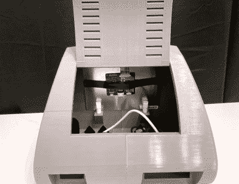

# 3D 打印终端让计算回到过去

> 原文：<https://hackaday.com/2021/05/13/3d-printed-terminal-takes-computing-back-in-time/>

除了计算的黄金时代之外，很难将今天视为别的时代。即使是入门级机器也有四核处理器和 1tb 或更多的存储空间，更不用说现代智能手机中集成的令人难以置信的大量技术了。但即便如此，早期台式电脑的优雅简洁还是值得一提的。

为了重现那些逝去日子的感觉，[【鸽子】创造了*Callisto II*T3。其完全 3D 打印的外壳无需胶水或螺钉即可咬合在一起，使其易于组装，并且零件已经过尺寸调整，因此即使在 Prusa Mini 等较小的机器上也可以打印。在里面，您会发现一个 1024×768 Pimoroni HDMI 8″ IPS LCD、60%机械键盘、四端口 USB 3 集线器、Raspberry Pi 4 和一个 22 瓦 USB 电源来运行这一切。](https://www.thingiverse.com/thing:4846997)

 机箱后部的舱口可以方便地接触到内部组件，如果你想添加硬盘驱动器，甚至[将 Pi 换成不同的单板计算机](https://hackaday.com/2020/12/22/new-part-day-hackboard-2-an-x86-single-board-computer/)，内部还有足够的空间来添加新的硬件。

为了真正将 Callisto II 的复古概念带回家，[【鸽子】为这台机器背后的虚拟电脑公司](https://www.solarhardwarecomputers.com/)创建了一个网站，充满了你从早期网络中期待的所有装饰。甚至还有一个[基于网络的“操作系统”](https://www.pigeonos.net/)你可以用它来展示你新打印的 *Callisto II。*

顺便提一下，II 号后缀不仅仅是迷因的一部分，在这个之前还真有一个 T2 木卫四。[我们在 2019 年](https://hackaday.com/2019/03/19/a-raspberry-pi-terminal-fit-for-fallout-76/)报道了更早的机器，虽然我们有点难过地看到功能性的 3.5 英寸软盘驱动器被删除，但我们不能否认的是，在最新版本中，整体美学得到了很大的改善。

 [https://www.youtube.com/embed/dTUpQzp1J1A?version=3&rel=1&showsearch=0&showinfo=1&iv_load_policy=1&fs=1&hl=en-US&autohide=2&wmode=transparent](https://www.youtube.com/embed/dTUpQzp1J1A?version=3&rel=1&showsearch=0&showinfo=1&iv_load_policy=1&fs=1&hl=en-US&autohide=2&wmode=transparent)

