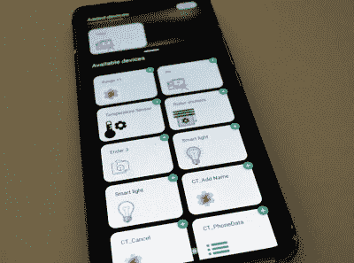

# 让 Android 的新电源菜单按照你的方式工作

> 原文：<https://hackaday.com/2021/05/14/make-androids-new-power-menu-work-on-your-terms/>

在 Android 11 中引入的电源菜单是一种快速与智能家居小工具交互的方式，而不必打开相应的应用程序。只要按住电源按钮一拍，你就会看到一系列你拥有的所有小工具的互动磁贴。不管怎样，这就是我的想法。

“NotEnoughTech”的[Mat]对这个系统如何开箱即用并不太满意，[所以他决定弄清楚如何创建自己的电源菜单磁贴](https://notenoughtech.com/tasker/android-power-menu-for-your-diy-smart-home/)。他的方法自然比谷歌的自动解决方案需要更多的手动工作，但它也提供了一些引人注目的优势。首先，你可以为自己的 DIY 设备制作瓷砖，否则这些设备将得不到支持。它还允许您避开商用家庭自动化产品通常需要的云基础设施。毕竟，当你每次想打开厨房的灯时，真的需要咨询地球另一端*的某个服务器吗？*

Adding tiles in *Tasker*.

拼图的第一块是 *Tasker* ，一个流行的 Android 自动化框架。它允许你创建自定义的磁贴，这些磁贴将显示在 Android 的电源菜单上，并带有它们自己的图标和简短描述。如果您只是想在本地设备本身上执行任务，这将是故事的结尾。但是假设你想要控制你网络上的设备， *Tasker* 可以被配置为当你与瓦片交互时向节点红色的实例发出命令。

在他的帖子中，[Mat]给出了一些如何使用这种组合来控制智能设备和检索传感器数据的例子，但确切的实现将取决于你试图做什么。如果你需要一点帮助来开始，我们自己的[Mike Szczys]去年编写了一个 Node-RED 初级读本，可以帮助你使用这个基于流程的可视化编程工具。

 [https://www.youtube.com/embed/ezsuA9ZwsUI?version=3&rel=1&showsearch=0&showinfo=1&iv_load_policy=1&fs=1&hl=en-US&autohide=2&wmode=transparent](https://www.youtube.com/embed/ezsuA9ZwsUI?version=3&rel=1&showsearch=0&showinfo=1&iv_load_policy=1&fs=1&hl=en-US&autohide=2&wmode=transparent)

