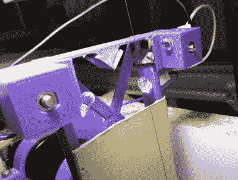

# 光学传感器密切关注跑偏的锯片

> 原文：<https://hackaday.com/2021/05/24/optical-sensor-keeps-eye-on-wandering-saw-blade/>

在过去一年左右的时间里，我们一直在检查[Andrew Consroe]令人难以置信的 CNC 线锯项目的进展。虽然我们已经对他的第一个原型版本印象深刻，但他设法通过每次新的升级不断推进信封，当他的进度报告到达收件箱时，我们总是很兴奋。

最近，他一直在努力应对这一事实，即锯的超薄刀片的相当大的弯曲会在切割时引入位置误差。为了解决这个问题，他的[开发了一种巧妙的传感器，可以在二维空间跟踪刀片](https://www.youtube.com/watch?v=5vjdLNiMfcc)的运动，而无需实际接触它。利用 Raspberry Pi HQ 相机、3D 打印框架和一些精确放置的镜子，[Andrew]说他的光学传感器能够确定刀片的位置，误差在 10 微米以内。

 在下面的视频中,【安德鲁】讲述了他的“分视潜望镜”是如何工作的，并完成了一些光线跟踪模拟，模拟了 Pi 相机透过设备实际看到的东西。在试验了不同的照明设置后，最终的光学配置为相机呈现了黑色背景上锯片组的两个不同视角。这使得使用计算机视觉来识别刀片并将其转化为位置信息变得相对容易。

潜望镜布置在这里特别有利，因为它允许相机和镜头放置在工作表面之下，远离实际切割，尽管我们有兴趣看看它如何对抗锯子切割时不可避免地产生的灰尘和碎片。虽然他实现了所有的设计目标，但[Andrew]确实注意到他的镜子确实有改进的空间；但是考虑到他是从旧硬盘上手工切割下来的，我们认为这个结果是可以接受的。

[自从](https://hackaday.com/2020/08/06/the-redesigned-cnc-scroll-saw-rides-again/)[我们第一次看到 CNC 卷轴锯](https://hackaday.com/2020/06/04/cnc-scroll-saw-makes-promising-first-cuts/)以来，已经取得了令人难以置信的进展，我们渴望看到这种新的传感器完全集成到【Andrew】令人印象深刻的长期项目的下一个版本中。

 [https://www.youtube.com/embed/5vjdLNiMfcc?version=3&rel=1&showsearch=0&showinfo=1&iv_load_policy=1&fs=1&hl=en-US&autohide=2&wmode=transparent](https://www.youtube.com/embed/5vjdLNiMfcc?version=3&rel=1&showsearch=0&showinfo=1&iv_load_policy=1&fs=1&hl=en-US&autohide=2&wmode=transparent)

