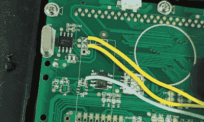

# ESP8266 为 433 MHz 气象站增加了 WiFi

> 原文：<https://hackaday.com/2021/05/26/esp8266-adds-wifi-to-a-433-mhz-weather-station/>

市场上不乏廉价的气象站，它们从运行在 433 到 900 MHz 范围内的几个无线传感器获取数据，并为你提供一个光滑的小桌面显示器，但这通常是信息流停止的地方。为了缩小差距，将所有当地的气候数据放到互联网上，[【乔纳森·戴蒙德】决定对他的气象站的工作方式进行逆向工程](https://www.robopenguins.com/weather-station/)。

该项目的第一阶段涉及 RTL-SDR 接收器、GNURadio 和少量 Python。[乔纳森]能够锁定信号，并拼凑出报告温度、风速和降雨量等变量的数据包。每一个问题本身都是一个小谜题，最后，仍然有一些他没有完全弄明白。但他至少有足够的时间进行下一步。

Tapping into the radio module.

此时，他本可以用 RTL-SDR 直接从空中提取数据。但是为了将他的技能提升到一个新的水平，[Jonathan]决定打开基站并隔离它的接收器。由于他已经解码了射频端的数据包，他清楚地知道他在用示波器和逻辑分析仪寻找什么。一旦他接入了来自无线电的反馈，最后一步就是为 ESP8266 编写一些代码，这些代码可以监听线路，解释数据包，并将结果变量通过网络发送出去。

在这种情况下，[Jonathan]决定通过个人气象站 API 将所有数据汇集到 Weather Underground。这不仅让他可以通过他们的网络界面和智能手机应用程序查看数据，还免费将他们的超本地预测技术融入其中。如果您对与公众分享您的信息不感兴趣，那么更改固件将是一件小事，这样数据就可以发布到本地 MQTT 代理，或者其他任何可以让您轻松的事情。

如果你真的幸运的话，[你自己的气象站可能已经有一个 ESP8266 机载](https://hackaday.com/2019/07/27/familiar-parts-make-interfacing-weather-station-easy/)，并正在将其收集的所有数据转储到串行端口。但如果没有，像这样的项目分解[如何逆向工程无线信号](https://hackaday.com/2019/06/04/your-table-is-ready-courtesy-of-hackrf/)可以是一个伟大的灵感和指导来源，如果你决定尝试破解代码。