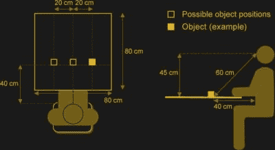

# 藻类基因给盲人一些基于光的视觉

> 原文：<https://hackaday.com/2021/06/01/algae-gene-gives-blind-man-some-light-based-sight/>

你可能会想，单细胞生物有什么用？科学已经为其中一种找到了一个奇妙的新用途——恢复遗传性失明患者的部分视力。更具体地说，他们从藻类中提取了一种对光有反应的基因，并向光移动，以取代位于人类瞳孔和视神经之间的死亡或有缺陷的光受体细胞。

 当光线进入眼睛时，它会触发感光细胞，感光细胞又会向被称为神经节的神经细胞发送信号。这些增加了关于运动的信息，并通过视神经将完整的图片发送到大脑。研究人员基本上侵入了神经节细胞，并将其转化为光受体。首先，他们使用一种病毒将名为 chrimson 的感光分子植入他们在疫情之前设法训练的一名孤独志愿者的视网膜中。他戴着护目镜出去散步，并告诉他们他可以看到人行横道的条纹。

他们能够在 2020 年夏天让他进入实验室，在那里他戴上一副护目镜，记录光线变化，并在发生变化时向眼睛发出琥珀色的光。他还戴了一顶布满电极的帽子，这样研究人员就可以看到当护目镜发挥作用时，他大脑的哪些部分被点亮了。戴上护目镜并准备开火，该男子能够区分他面前是否有一个黑色的杯子，甚至在大多数情况下能够正确地数出多个杯子。虽然这不是视力的完全恢复，但这是朝着那个方向的一个很好的发展，我们很高兴看到它的发展方向。

在未来，研究人员希望将护目镜变得更薄，更时尚。将它们与这些可拍照的鞋子结合起来，可访问性大大提高。

感谢提示，[foamyguy]！