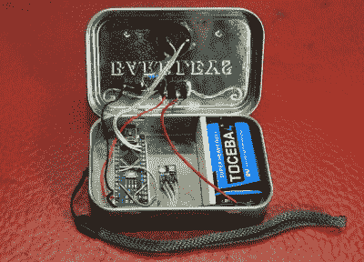

# 薄荷罐中的 Arduino 变率计

> 原文：<https://hackaday.com/2021/06/02/arduino-variometer-in-a-mint-tin/>

虽然人类已经用各种机械装置很好地解决了如何飞行的问题，但事实仍然是，我们的自然感觉并不真正适合离开地面。例如，除非你有一个视觉参考点，否则确定哪条路是向上的比你想象的要困难得多。这就是为什么飞行员依赖于诸如可变速度计之类的仪器，当他们的眼睛不可信时，这些仪器可以确定当前的爬升和下降速度。

 这也是滑翔伞飞行时非常方便的东西，这就是为什么【mircemk】决定[使用 Arduino Nano 和 BMP180 压力传感器](https://hackaday.io/project/179923-how-to-make-a-arduino-variometer-for-paragliding)建造一个手持版本。由于你不想盯着半空中的小屏幕，该设备通过音频来传达高度的变化。上升的音调意味着你在向上移动，而较低的音调意味着向下移动。在下面的视频中，你可以看到，只需要一两米的垂直移动，设备就会发现变化。

在为设备寻找一个简单而坚固的外壳时，[mircemk]找到了一个金属薄荷罐，可以容纳微控制器、传感器、蜂鸣器和为其供电的 9 V 电池。我们知道你在想什么，但是不要担心；为了确保罐子内部没有压力差，罐子的侧面已经被打了孔。有足够的空间用可充电电池组和相关的充电控制器来取代碱性电池，但我们想象在摆脱地球的束缚之前扔进一个全新的主电池会有一定的安全性。

如果你对滑翔机或其他真正有驾驶舱的飞机的 DIY 仪器感兴趣，这台由 Kobo 电子阅读器制成的[阳光可读飞行计算机将是一个很好的开始](https://hackaday.com/2014/05/28/e-reader-becomes-sailplane-and-paraglider-computer/)。

 [https://www.youtube.com/embed/dkzky-Mxypo?version=3&rel=1&showsearch=0&showinfo=1&iv_load_policy=1&fs=1&hl=en-US&autohide=2&wmode=transparent](https://www.youtube.com/embed/dkzky-Mxypo?version=3&rel=1&showsearch=0&showinfo=1&iv_load_policy=1&fs=1&hl=en-US&autohide=2&wmode=transparent)

