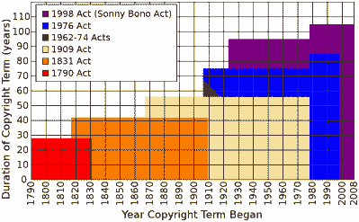
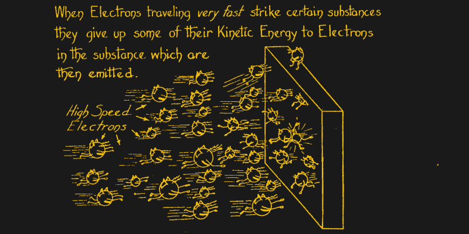
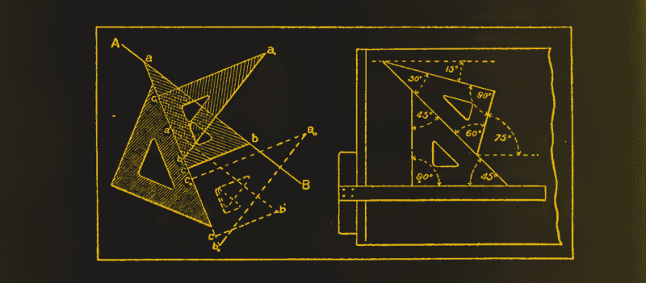
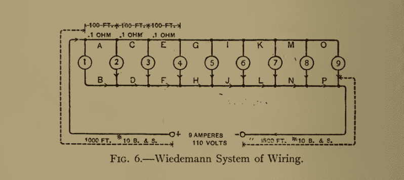

# 大量的旧教科书

> 原文：<https://hackaday.com/2021/06/04/old-textbooks-galore/>

这个公共领域书籍的集合宣称不是为了生存，而是为了幸存者。这是大量教科书、手册等的集合。，涵盖从会计到木工等 150 多个类别。由于版权保护期的法律，大多数都有一百年的历史了。

你可能不想让一个仅仅通过阅读约翰·斯卢斯博士 1908 年的巨著《全科医生的紧急手术》来学习外科手术的人切除你的阑尾，该书有 584 幅插图，其中一些是彩色印刷的。但是有些知识是永恒的。而且许多东西也具有历史意义，帮助我们更好地理解上世纪初人们所拥有的知识。这里有关于农业、锻造和铸造、蒸汽机、钟表制造、电报和电话的书籍，甚至还有过期的《科学美国人》和 73 本杂志，这里仅举几例。

这是从电子相关书籍中随机抽取的一些插图。

约翰·f·莱德于 1945 年出版的《真空管内的高速电子》，这是该系列中相对现代的一本书。光是这本书就值得下载，就为了看那些优秀的插图。[莱德先生写了如此多的技术书籍，以至于他成立了自己的出版公司。](https://en.wikipedia.org/wiki/John_F._Rider)

使用由 Linus Faunce 于 1898 年为麻省理工学院的学生准备的机械制图中的三角形。

布线灯的魏德曼系统，来自牛顿·哈里森于 1906 年出版的“*电气布线、图表和配电盘*”，配有“105 幅插图，展示了布线艺术的原理和工艺”。这个系统在每盏灯之间使用了等长的电线，试图使每个灯泡的电压降相同，但失败了。

你有什么永恒的参考书或你喜欢用的教科书吗？请在下面的评论中告诉我们。感谢[大卫·古斯塔菲克]的提示。