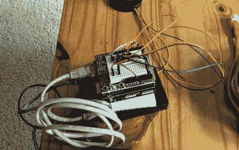

# 开发以太网供电堆栈灯

> 原文：<https://hackaday.com/2021/06/15/developing-a-power-over-ethernet-stack-light/>

堆栈灯是工厂车间常见的景象，用于向可视范围内的任何人指示机器的状态。但是黑客们发现你可以在网上以相当便宜的价格买到它们，所以我们开始看到它们被用作指示器，用在比它们原本打算用的稍微平凡一些的场合。[【泰勒·伍德】最近决定建造自己的网络控制堆栈灯](https://hackaday.io/project/179361-poe-stack-light)，并认为这将是一个潜入以太网供电(PoE)世界的绝佳机会。

现在，简单的方法就是拿起树莓派，给它戴上官方的 PoE 帽子，然后把它扔进一个漂亮的盒子里。编写一些代码来切换连接到堆栈灯中 led 的 GPIO 引脚，然后就到此为止。会在一个下午完成，晚饭前你可以在 Reddit 上炫耀一下。但这并不完全是泰勒的想法。

An early Arduino-based prototype.

他决定走风景优美的路线，并设计了自己的定制 PCB，将以太网接口、PoE 硬件和 ESP32 结合到一个紧凑的单元中。众所周知，将 ESP32 接入网络只需要几个额外的组件，而不是依赖 WiFi，但这仍然不是业余爱好者经常做的事情。更罕见的是看到有人推出自己的 PoE 解决方案，[，但由于[泰勒]为他的电路](https://www.scorpia.co.uk/2021/05/30/a-primer-on-implementing-poe-devices/)提供了深入的文档，这可能会在未来发生变化。

在软件方面,[Tyler]已经为 ESP32 开发了一个固件，它支持 Art-Net 和 RDM 协议，这是更大的 DMX 协议的子集。这意味着控制器应该与现有的用于控制剧院照明系统的软件兼容。如果你想采用更直接的方法，固件还提供了一个 web 界面和简单的 HTTP API 来提供一些额外的灵活性。

虽然这非常令人印象深刻，但并不是每个人都需要这样一个强大的解决方案。如果你只是想要一个快速简单的方法来点燃你的堆栈灯，[一个 USB 控制的继电器和一些 Python 可以带你去你需要去的地方](https://hackaday.com/2021/01/09/industrial-stack-light-keeps-an-eye-on-prusa-mini/)。