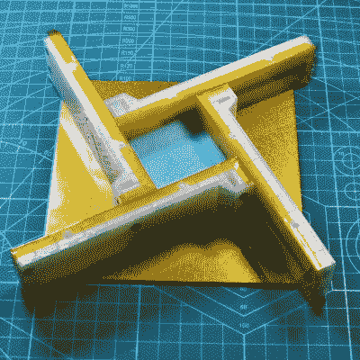

# 模块化箱体设计简化了硅胶模具制作

> 原文：<https://hackaday.com/2021/06/16/modular-box-design-eases-silicone-mold-making/>

树脂铸造是生产各种颜色和性能的高细节零件的绝佳方式，虽然过程并不复杂，但确实需要一定的细心和设置。大多数模具都是通过将一个零件放入定制的一次性盒子中并在其上浇注硅胶制成的，但[Foaly]发现制作和重新制作这些盒子的过程并没有优化到应有的程度。这导致了[这种可重复使用、模块化、可调节的模具箱](https://silica.io/modular-mold-box-for-resin-casting/)的设计，使小零件的工作流程更加高效。

 可调节盒子的壁是四个相同的 3D 打印部件，带有系留磁铁，盒子的底部是一块激光切割的钢板，磁性壁附着在上面。磁体的位置和极性使得盒子可以被组装成各种尺寸，并且多个壁可以被堆叠以形成更高的模具。为了帮助清理和防止可能干扰固化的污染，每一片的内表面都涂有 Kapton 胶带。

结果是一个可以使用和重复使用的模块化盒子，并且不会减慢模具设计的创建和迭代过程。这个系统是为小零件设计的，但是[Foaly]认为没有理由不能在一定程度上扩大规模。感兴趣吗？[设计文件可以从该项目的 GitHub 资源库中获得，](https://github.com/Foalyy/casting_mag_box)如果你需要稍微温习一下树脂浇铸的工作原理，[你可以在这里阅读所有相关内容](https://hackaday.com/2016/02/09/learn-resin-casting-techniques-duplicating-plastic-parts/)。