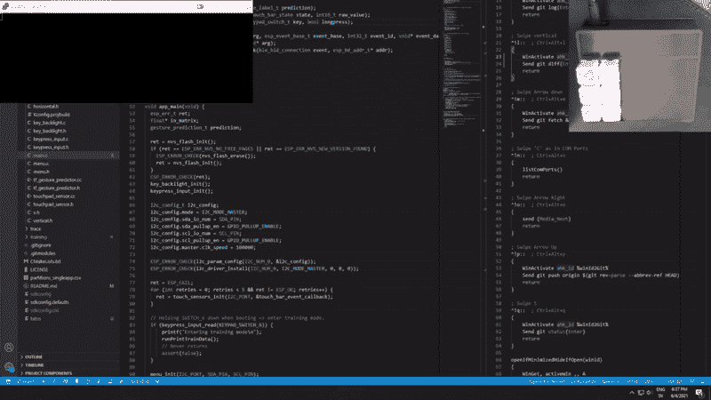

# 手势检测宏键盘知道你想要什么

> 原文：<https://hackaday.com/2021/06/13/gesture-detecting-macro-keyboard-knows-what-you-want/>

[jakkra]几年前从 Kickstarter 上买了几个电容触摸板，最近开始在一个项目中使用它们。这是一个怎样的项目:[这个超级宏垫结合了两个触摸板和 6 个常规开关，构成了一个豪华的手势感应输入设备](https://github.com/jakkra/Gesture-Detecting-Macro-Keyboard)。

里面是一个运行 TensorFlow Lite 的 ESP32，可以从两个触摸板读取手势。顶部的触摸板是一个音量滑块，方形触摸板是主要的输入，与按钮结合使用，在某些程序中运行自动热键脚本。[jakkra]可以通过一些简单的手势轻松运行 git 命令等等。这些手势对我们来说都是很自然的选择:`>`表示下一个媒体轨道，`∧`表示推送当前分支，`∨`表示提取当前分支，`s`表示 git 状态，`l`表示 git 日志，还有一个对我们来说听起来很有用的手势——画一个`C`来获得列出所有 COM 端口的通知。其中一个开关专用于蓝牙配对和有机发光二极管屏幕上的导航菜单。

我们喜欢这里的输入组合，认为这看起来很棒，尤其是双触摸板设计。休息之后一定要看看手势演示 gif。

手势输入似乎非常适合那些在移动中计算的人，一只[手势手套感觉起来非常合适](https://hackaday.com/2020/04/05/data-glove-gets-a-grip-on-gesture-input/)。

