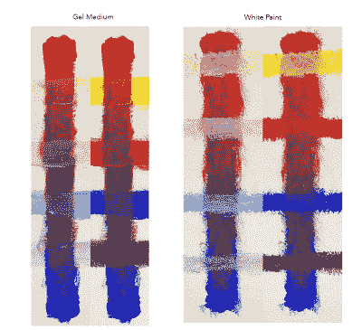

# 感应绘画用热和光做到这一点

> 原文：<https://hackaday.com/2021/07/13/responsive-paintings-do-it-with-heat-and-light/>

是的，艺术是一种对话。但通常来说，它很短:艺术家发表声明，观众回应，每个人都带来自己的解释。作为一名艺术家，最困难的事情是，一旦你向世界发布了一件作品，它就有点被束缚和堵住了嘴，因为它无法保护自己免受评论和误解。

另一方面，互动艺术允许更长时间的讨论。棋子反应灵敏，不再静音。但是，有这么多的互动艺术是纯数字的，缺乏某种来自物理的模拟温暖。对于今年的 Hackaday 奖，[Laura]试图在模拟视觉作品上放置一个数字界面，并根据数据输入做出改变的画作。

 目前，[劳拉]正专注于在她的画作中添加两种动态元素:使用 Arduino 和 TinyML，根据观众的存在和/或动作改变颜色和光线模式。为了改变颜色，[劳拉]最终将热变色颜料粉末与透明凝胶介质混合。

这是一段旅程，因为普通的透明介质太容易流动，将颜料与白色颜料混合会使颜色变得比[劳拉]想要的更浅，加热后会留下白色。但是透明的凝胶介质刚刚好。你可以在这张照片中看到不同之处——凝胶介质的颜色变得更深，加热后几乎完全消失。

[Laura]不希望只是将 led 穿过画布，在这种情况下，画布是 1/8 英寸的桦木面板。相反，在一对填充了热塑性塑料的薄而分散的切口后面，有一个 RGB 矩阵在发光。

在使用这两种技术的绘画素描休息后，请查看视频。盯着右边的紫色三角形，看着它们随着光线图案在扩散的切口后面跳舞而慢慢变成蓝色。留下来看第二个简短的视频，它展示了一个更新的灯光动画。

我们见过很多制作互动艺术的方法，比如这个用手机控制的 [Rube Goldberg 童话球迷宫](https://hackaday.com/2021/01/06/a-tubular-fairy-tale-you-control-with-your-phone/)。

 [https://www.youtube.com/embed/YmoYDgvpZ5E?version=3&rel=1&showsearch=0&showinfo=1&iv_load_policy=1&fs=1&hl=en-US&autohide=2&wmode=transparent](https://www.youtube.com/embed/YmoYDgvpZ5E?version=3&rel=1&showsearch=0&showinfo=1&iv_load_policy=1&fs=1&hl=en-US&autohide=2&wmode=transparent)

[hack adayprize 2021](https://prize.supplyframe.com)主办单位: