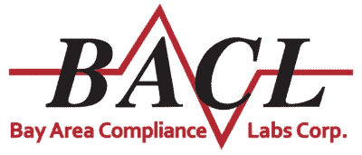

# 韩国撤销了 1700 项监管批准

> 原文：<https://hackaday.com/2021/06/19/1700-regulatory-approvals-revoked-in-south-korea/>

本周，韩国通信委员会自成立以来首次撤销了来自国内外 378 家公司的 1696 种电信设备的监管许可。这些公司必须从货架上召回未售出的库存，并证明已售出的现有产品符合要求。此外，这些公司在一年内不得就这些项目提交新的申请。目前还不清楚，如果制造商不能按照要求证明产品符合要求，那么已经售出的设备会怎么样——也许是召回？华为、DJI 甚至三星等公司的闭路电视产品、网络设备、蓝牙扬声器和无人机都卷入其中。

问题的核心是所谓的[相互承认协议(MRAs)](https://www.nist.gov/mutual-recognition-agreements-mras) 国家之间正式承认对方的认证测试实验室(或者行业术语中的合格评定机构，CAB)。目前，10 个国家(美国、加拿大、墨西哥、英国、以色列、日本、韩国、新加坡、越南和澳大利亚)、欧盟 27 个成员国、台湾和香港都相互签署了相互承认协议。例如，基于这些 MRAs，韩国制造商可以让以色列的实验室对产品进行测试，所有产品都符合 KCC 的规定。

 处于关注中心的是[【BACL】](http://www.baclcorp.com)湾区合规实验室，成立于 1996 年，总部位于加州森尼维尔。BACL 在世界各地(美国、台湾、香港特别行政区、越南和 mainland China)都有实验室。除了 mainland China 的实验室之外，所有 BACL 的实验室都符合 MRAs 的要求。KCC [在去年](https://en.yna.co.kr/view/AEN20201110006800320)收到一个提示，一些产品的一些符合性测试报告可能有缺陷。

与美国国家标准和技术研究所(NIST)合作进行的为期六个月的调查导致了本周的声明。准确地说，有 378 家韩国公司提交了 BACL 桑尼维尔公司的测试报告，这些报告似乎是合适的。但经过进一步调查，得知实际的测试是由 mainland China 的 BACL 实验室进行的，只有报告是在桑尼维尔准备的。

目前还不清楚这些公司是否故意玩弄这些规则，BACL 是否是同谋，这只是对复杂的监管和 MRAs 的误解，还是三者兼而有之。不管怎样，KCC 说根据他们的规则，意图并不重要。也没有暗示产品本身有问题，也没有任何人暗示 BACL 的中国实验室工作马虎——相反，KCC 表示，它别无选择，只能根据适用的法律进行撤销。