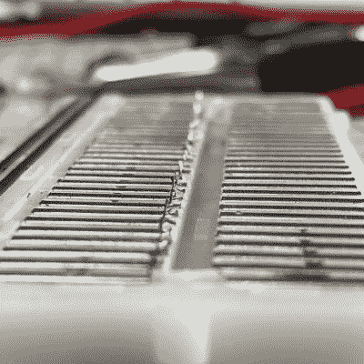

# 硅跳线使这种无线试验板可编程

> 原文：<https://hackaday.com/2021/06/23/silicon-jumpers-make-this-wire-free-breadboard-programmable/>

毫无疑问，可靠的无焊试验板很有用，但你必须承认它们并不完美。当然，对于某些类型的电路来说，它们并不理想，但这比那些跳线问题要小。粗心的人最终会让他们的元件毫无希望地纠结在跳接器的老鼠窝里，而挑剔的人会花更多的时间让跳接器整洁，而不是实际制作电路原型。怎么办？

 破解这个难题的一个方法就是让[也成为无焊试验板无跳线](https://hackaday.io/project/180394-breadware)。这就是由凯文·桑托·卡普齐奥(Kevin Santo Cappuccio)开发的“面包器皿”背后的想法。这个想法是改造一个标准试验板，这样任意一对公共接触条之间的连接——加上电源轨——可以用软件实现。这背后的技巧是一个模拟 CMOS 开关芯片矩阵，具体来说是 MT8816AP。每个芯片的 128 个交叉点开关可以处理高达 12 伏的电压，因此有大量的电路可以使用这些可编程硅跳线。

[Kevin]目前的版本为 0.2，大小适合无焊试验板，封装紧凑。他分享了他如何连接到试验板触点的细节，这看起来是一个痛苦的过程:拔出触点，在槽端剪下一个小标签，并将其向下弯曲，以便在 PCB 上形成一个通孔的引线。看起来工作量很大，肯定有更好的办法；[凯文]显然是开放的建议。

虽然我们之前已经看到过使用[交叉点开关来增强无焊试验板](https://hackaday.com/2019/05/27/the-augmented-reality-breadboard-of-the-future/),但我们发现这个项目的简单性令人满意。扔掉所有那些套头衫的想法当然很诱人。

The [HackadayPrize2021](https://prize.supplyframe.com) is Sponsored by: