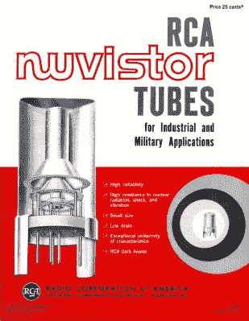
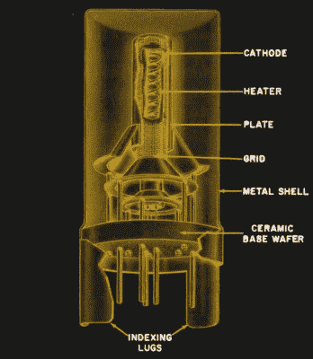

# Retrotechtacular: Nuvistor，真空的最后一口气

> 原文：<https://hackaday.com/2021/07/21/retrotechtacular-nuvistor-vacuums-last-gasp/>

到 2021 年，我们所有的电子产品都将是固态的，因为它们只使用半导体器件作为有源元件。我们中的一些人可能会用真空管做实验，但只是出于好奇或审美的目的。由于半导体具有更简单的设计要求、更高的可靠性、更低的成本和更高的性能，因此在几乎所有的特殊应用中，半导体已经取代了真空器件。

然而，情况并不总是这样，在半导体时代开始时，有一段时间晶体管和真空管并存，并直接竞争。真空管制造商在 20 世纪 70 年代继续创造新的设备，在这样做的过程中，他们将艺术的边界推向了前所未有的方向。[大卫·W·奈特]有一页是专门介绍 Nuvistor 的，他称之为“热离子阀的最终进化”。上面的对比照片显示了左边的一个 Nuvistor 一个你可能从未见过的微型真空管。

The cover of [an RCA data sheet for Nuvistor tubes](https://archive.org/details/bitsavers_rcanuvistoubesForIndustrialandMilitaryApplications_2971514/).

到 20 世纪 50 年代末，无线电频率应用不可阻挡地向更高的频率发展，使得一些传统的真空管不再适用。军用雷达、移动无线电和广播无线电开始利用 VHF 和 UHF 频率范围，虽然可用的高频晶体管噪声大、增益差，但其真空对应物在结构上存在杂散电感和电容。微型电子管和其他设计，如导体从侧面伸出的“橡子”电子管，似乎可以解决这些问题，但对 RCA 来说，这些还不够。他们在 1959 年发布的以晶体管命名的 Nuvistor 系列电子管不同于其他真空器件，被小型化到与当时的晶体管相似的尺寸，并具有陶瓷底座的金属外壳，而不是更常见的玻璃外壳。

在内部，他们有一个同轴设计的管状电极堆叠在另一个之上，并有一个新的插座，其连接直接通过底座，而不是像以前的管子那样弯曲成一定角度来满足引脚。它们的制造也不寻常，不是在抽空和密封之前组装，而是在真空室中机械组装和密封。很明显，阅读各种数据时期的文件，他们的目标市场是军事而不是民用(当暴露于核辐射和冲击时，出色的性能几乎不是一个调频广播接收机的要求！)，这可能解释了它们在民用上相对罕见的原因。

Inside a Nuvistor tube.

大约在 1991 年，当我还是一名学生的时候，我第一次直接遇到了一个 Nuvistor，当时我正在追求一个完全中空状态的 Hi-Fi 的圣杯，我花了 15 英镑(2021 年接近 50 美元)买了一个 1965 年的 Sansui TU-70 FM 调谐器。它在整个过程中使用电子管，包括它的立体声解码器，但它的 FM 调谐器引起了我的兴趣，它的一对 [6CW4](https://archive.org/details/manualsbase-id-455546/mode/2up) Nuvistor 三极管作为 RF 放大器。他们小巧的金属罐比 OC170 或类似的锗甚高频晶体管略大，我曾期望在那个时代的调谐器中看到，但安装在底盘上的特殊插座中，而不是像晶体管一样安装在 PCB 上。我已经足够大了，可以实验锗射频晶体管，公平地说，它们既聋又吵，所以我可以看到 Nuvistors 在制造时是一个高端设备。但是，相对于相对便宜的晶体管印刷电路板，它们所有硬件的额外费用相当高，这肯定使它们在过去十年里越来越成为不寻常的选择。它们仍然出现在 20 世纪 70 年代的 RCA 消费电子管手册中，但是到了 80 年代就没有了。

那就去参观吧。这是真空管时代末期的一种迷人设备，它们是有史以来最小的高频真空设备，但遗憾的是，它们的到来太晚了，只能成为电子史上的一个脚注。如果你找到了一个不要放手，你可能看不到另一个。

[主图像来源:Nuvistor 与 EC900、ECC83 和 6SN7 的对比，通过 [g3ynh.info](https://www.g3ynh.info/valves/var/7586/Nuvistor.html) ]