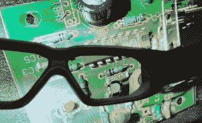

# Raspberry Pi 摄像机替代立体显微镜

> 原文：<https://hackaday.com/2021/07/09/raspberry-pi-cameras-stand-in-for-stereo-microscope/>

使用一台好的立体显微镜，处理微小的表面贴装元件和检查 PCB 要容易得多，但由于其成本和体积，大多数爱好者不得不放弃。充其量他们可能有一个基本的数字显微镜，但只有一个摄像头，他们只能显示 2D 图像，这对于细节工作来说并不理想。

[立体忍者]背后的团队希望通过开发一种立体视觉系统来改善这种情况，这种系统可以将微小的物体以三维方式显示在大屏幕上。Raspberry Pi 计算模块是一种定制载板，支持使用 MIPI CSI 摄像机接口和 3D 游戏监视器，他们的产品将传统立体显微镜的功能与数字解决方案的灵活性相结合。

 借助悬浮在工作区上空的两个树莓摄像头，以及大量 LED 灯的加入，立体忍者能够生成监视器所需的 3D 图像。虽然相机的放大倍数不如显微镜，但它们足以放大 SMD 部件，而且看大屏幕显示器肯定比趴在传统显微镜的目镜上要好。尤其是当你试图向一群人展示某样东西时，比如在黑客空间。

当然，并不是每个人的工作台上都有大型 3D 游戏显示器。事实上，考虑到上次消费者对这项技术的反应有多差，我们敢打赌，拥有立体显微镜的黑客比拥有 3D 显示器的黑客多。这就是为什么该团队的下一步是让[树莓 Pi 产生快门眼镜](https://hackaday.com/2012/03/28/v-synch-detector-lets-you-use-3d-shutter-glasses-on-linux-systems/)所需的信号，让立体忍者在 2D 显示器上显示三维图像；将这种有价值的能力带给比以前更多的观众。

 [https://www.youtube.com/embed/p-_V9IuZiU0?version=3&rel=1&showsearch=0&showinfo=1&iv_load_policy=1&fs=1&hl=en-US&autohide=2&wmode=transparent](https://www.youtube.com/embed/p-_V9IuZiU0?version=3&rel=1&showsearch=0&showinfo=1&iv_load_policy=1&fs=1&hl=en-US&autohide=2&wmode=transparent)

The [HackadayPrize2021](https://prize.supplyframe.com) is Sponsored by: