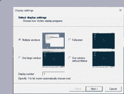
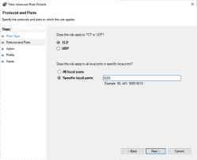

# Linux Fu:Windows X11 连接

> 原文：<https://hackaday.com/2021/08/05/linux-fu-the-windows-x11-connection/>

Linux 用户的生活可能有点困难。有时候你不得不——或者想要——运行 Windows。为什么是 Windows？有时候你有一台工作电脑或者一台笔记本电脑，而 Linux 并不支持它。也可能是软件。虽然有很多程序可以编辑，比如说，Word 文档，但总有一个文档翻译得不太正确。像视频会议软件这样的东西有时可以在 Linux 上运行，但是功能可能会少一些。

那你是做什么的？当然，你可以双重启动，但这并不方便。如果你有足够的马力，你可以在虚拟机中运行 Windows。还有 Wine，但它通常有自己的一系列问题，包括复杂程序的特性和稳定性。但是，Windows 的最新版本提供了用于 Linux 的 Windows 子系统(WSL)。

有了 WSL，您可以在 Windows 会话中拥有您喜欢的关于 Linux 的大部分内容。你只需要知道如何设置它，我将向你展示一种对我来说相当稳定的 Windows 10 版本有效的方法。

## 关于 WSL

WSL 非常强大，因为它为您提供了一个良好的 Linux 环境，并且与 Windows 紧密优化。然而，有一些警告。WSL 实际上有两种变体。第一个版本是版本 1，运行得很好，但是没有完全的兼容性，并且磁盘 I/O 速度较慢。大多数正常程序都可以，但 Docker 和 FUSE 之类的就不行了。版本 2 要求您的计算机支持虚拟化，但是运行速度要快得多。它还提供了一个真正的 Linux 内核，所以几乎所有东西都可以使用 WSL2 运行。

如果你愿意使用最新的开发者版本的 Windows 10，你甚至可以[运行图形程序](https://www.ctrl.blog/entry/wslg-desktop-apps.html)，如果你愿意运行的话。但是事实证明，你根本不需要使用开发者版本。如果说 X 有什么擅长的，那就是让服务器在一台机器上运行，而客户机在另一台机器上运行。因此，没有理由不能在 WSL 中运行 X 客户机，并使用基于 Windows 的 X 服务器来显示。

## 首先，获得一个 X 服务器

基于 Windows 的 X 服务器并不缺乏，无论是免费的还是商业的。我使用了 Cygwin 的，更具体地说，我使用了一个预配置的 Cygwin X11 设置，名为 [Swan](https://hackaday.com/2017/03/29/swan-better-linux-on-windows/) 。不幸的是，Swan 项目似乎已经停止，但是 [Cygwin](http://x.cygwin.com) 仍然存在并且运行良好。

[](https://hackaday.com/wp-content/uploads/2021/07/ss1.png) 另一个选择是 [VcXsrv](https://sourceforge.net/projects/vcxsrv/) 等几个类似的项目。最棒的是它们没有很多多余的东西。Cygwin 有很多通常非常有用的东西，但是这些东西是你想要安装在 WSL 下的东西的复制品。

我建议您首先运行 X 服务器，并从另一台 Linux 机器或虚拟机上测试它。如果你有一个像 Cygwin 这样的系统，你可以只运行原生应用。如果你的 X 服务器由于某种原因不能工作，WSL 也不能使用它。

## 性能版本 2

如果您已经使用了 WSL 一段时间，您应该检查一下您是否还在使用版本 1。您可以非常容易地在不同版本之间切换，甚至可以多次安装不同的版本。要找出您拥有哪一个，请以管理员身份打开 PowerShell:

```
wsl --list --verbose
```

您应该会看到您安装的每个 Linux 发行版都有一行和一个版本号。如果您使用的是版本 1，请确保在 BIOS 中打开了虚拟化支持，并确保打开了“虚拟机平台”Windows 功能。然后输入:

```
--set-version Ubuntu 2
```

当然，使用你在列表中看到的任何名字，可能是也可能不是“Ubuntu”这将需要一点时间，或者如果您没有正确设置 BIOS 和 Windows，您将会收到一条错误消息。你也可以得到一些指导[下载一些更新的内核支持](https://docs.microsoft.com/en-us/windows/wsl/install-win10#step-4---download-the-linux-kernel-update-package)。请按照说明操作。如果这个命令运行起来不花一点时间，它可能是在抱怨没有正确设置。您可以使用 list 命令再次验证它。

 [https://www.youtube.com/embed/MrZolfGm8Zk?version=3&rel=1&showsearch=0&showinfo=1&iv_load_policy=1&fs=1&hl=en-US&autohide=2&wmode=transparent](https://www.youtube.com/embed/MrZolfGm8Zk?version=3&rel=1&showsearch=0&showinfo=1&iv_load_policy=1&fs=1&hl=en-US&autohide=2&wmode=transparent)


版本很重要，因为网络设置不同于旧版本。虽然可以用同样的方式配置旧的 WSL，但是您也可以享受性能的提升。然而，如果您的机器或操作系统不符合要求，您可能必须坚持使用版本 1。

您也可以从 PowerShell 将版本 2 设置为默认版本:

```
wsl --set-default-version 2

```

如果你碰巧运行的是 Windows 10 版本 2004 或更高版本，现在安装 wsl 会更容易[。但是，您仍然希望确保您运行的是版本 2。](https://twitter.com/WindowsDocs/status/1422218133268467718?s=20)

## 连通性

X11 客户端知道如何通过 display 变量到达它们的显示器。通常，你会看到它被设置为:0 或:0.0，这被理解为当前机器的第一个屏幕。不过，这在这里是行不通的，因为 WSL 是在一个虚拟网络上，与你的 Windows 操作系统不同。

要让事情运转起来，你需要完成三个基本步骤:

1.  打开你的电脑防火墙上的 6000 端口，如果你使用的话
2.  告诉 X 服务器允许来自不同计算机(在本例中是一台虚拟计算机)的连接
3.  将显示变量设置为指向对应于 Windows 计算机的 WSL 地址

具体步骤将取决于您使用的防火墙和服务器。然而，对于您碰巧使用的任何工具，一般步骤都是相同的。

[](https://hackaday.com/wp-content/uploads/2021/07/ss2.png) 如果您使用 Windows Defender 防火墙，您可以通过搜索 Windows Defender 防火墙的设置来打开 6000 端口。选择高级，然后为 TCP 端口 6000 创建新的入站规则。但是，Windows 可能会在您第一次运行服务器时弹出一个防火墙窗口，询问您是否允许连接。在这种情况下，您可能不需要手动配置防火墙。

为 X 服务器设置访问控制将取决于您使用的服务器。对于 Cygwin，尝试从 Cygwin 提示符下运行`xhost +`。对于 VcXsv，您需要检查允许外部连接的启动选项。你可能不喜欢开放你的 X 服务器，但是如果你可以限制你的防火墙设置或者使用 XAuthority 文件。首先，让它工作，然后你可以加强安全。如果你在家用路由器的后面，你可以用它的防火墙阻止一些东西。

显示变量是所有变量中最简单的。从 WSL 端了解 Windows IP 地址的一个快速方法是查看名称服务器是如何设置的。转储后，您应该会看到类似这样的内容:

```
# This file was automatically generated by WSL. To stop automatic generation of this file, add the following entry to /etc/wsl.conf:
# [network]
# generateResolvConf = false
nameserver 172.25.32.1
```

这意味着显示变量应该设置为 175.25.32.1:0.0，如下所示:

```
export DISPLAY=175.25.32.1:0.0
```

你可以用`awk`来自动完成这个任务，但是记住一个合适的 shell 脚本不能设置你的环境。您需要找到允许这样做的脚本。例如，这里有一个驻留在`/usr/local/bin/setWinX`中的脚本:

```
WINIP=$(awk '/^nameserver / { gsub("nameserver ",""); print; }' /etc/resolv.conf)
export DISPLAY="$WINIP:0.0"
```

当然，您也可以安排它在启动时运行，方法是从`.profile`获取:

```
source /usr/local/bin/setWinX
```

根据您的 X 服务器和应用程序，您可能需要哄程序使用特定的输出驱动程序。例如，我听说这一行将修复一些问题:

```
export LIBGL_ALWAYS_INDIRECT=1
```

一旦你有了不错的 Linux/Windows 集成，你可以添加一些[启动器支持](https://github.com/cascadium/wsl-windows-toolbar-launcher#firewall-rules)。将你的 X 服务器设置为自动启动，你就可以在同一个屏幕上轻松地混合搭配 Windows 和 Linux 应用了。

## 不公平！

这似乎不公平。让 Windows 的东西在 Linux 下运行是很棘手的，因为 Windows 是关闭的。让 Linux 在 Windows 下运行要容易得多，因为 Linux 是开放的。当然，有时候你真的必须运行 Linux。例如，我需要直接读取鼠标，发现 WSL 路由输入事件的方式不太像普通的 Linux 安装。尽管如此，它工作得非常好，表现也很好。

这不是我们第一次[关注 WSL](https://hackaday.com/2019/12/23/linux-fu-wsl-tricks-blur-the-windows-linux-line/) ，如果你刚刚开始，这篇文章有一些好的技巧。你如何处理使用 Windows 和 Linux？理想的答案是你没有，你只是坚持其中一个。但是请在评论中告诉我们你在做什么。