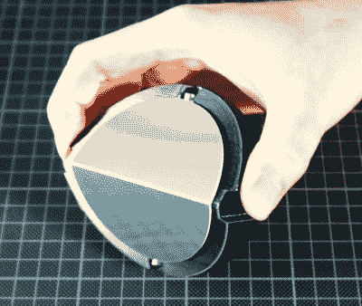

# 在家制作定制曲面镜

> 原文：<https://hackaday.com/2021/07/16/making-custom-curved-mirrors-at-home/>

一般来说，创建自定义镜像是一项复杂的任务，需要大量的仔细打磨，如果您需要精确的结果，就不能掉以轻心。问问那些给 NASA 提供了一面不稳定的哈勃望远镜镜子的人就知道了。但是假设你不是在轨道太空望远镜上工作(甚至是地面望远镜)，[【沃尔佐】最近记录了一些使用普通车间工具生产质量合理的单双曲面镜的技术。](http://volzo.de/posts/rapid-mirrors/)

 第一步是找到比玻璃更容易使用的东西。通过比较投影测试图案的反射，测试了各种反射材料，如 PVC 箔和彩色 PETG 板后，[volzo]发现层压聚苯乙烯给出了最准确的结果。如果你只是想做一个简单的弯曲镜子，他向你展示了如何在 CNC 路由器上弹出这些薄片，进行适当的切割，然后折叠成形。

这部分可能看起来有点显而易见，但更复杂的形状呢？在这里，[volzo]指出聚苯乙烯薄片也有助于真空成型。正如下面的视频所示，只需要一个 3D 打印插头和一些基本设备，就可以快速生产出任意形状的镜子。

显然，这种镜子的光学特性还有待改进，但这取决于你的应用，可能没什么大不了的。作为例子，[volzo]展示了一些使用这些定制镜子的项目，如同时捕捉桌子两侧的桌面摄像机和圆形投影仪。层压聚苯乙烯甚至有可能被用来制造低成本的可变反射镜。

 [https://www.youtube.com/embed/FzemhuI1knQ?version=3&rel=1&showsearch=0&showinfo=1&iv_load_policy=1&fs=1&hl=en-US&autohide=2&wmode=transparent](https://www.youtube.com/embed/FzemhuI1knQ?version=3&rel=1&showsearch=0&showinfo=1&iv_load_policy=1&fs=1&hl=en-US&autohide=2&wmode=transparent)

