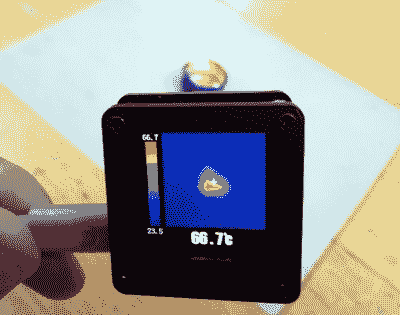
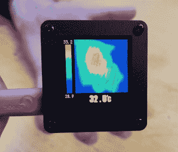
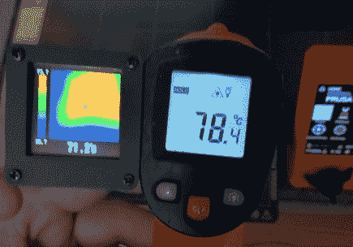
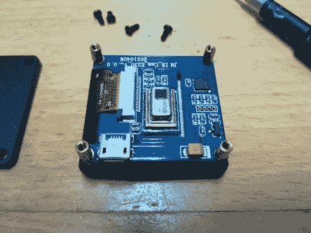
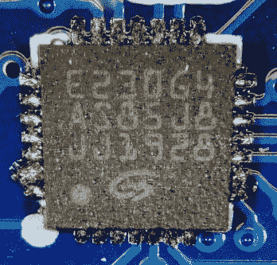

# 回顾:迷你 AMG8833 热感相机

> 原文：<https://hackaday.com/2021/08/12/review-mini-amg8833-thermal-camera/>

在我们不断寻求从全球电子市场的廉价端为您带来最佳产品的过程中，有时我们会关注一段时间，因为当它们出现时，它们只是有点太贵了，以至于不能考虑便宜。

今天的主题就是这样一个设备，它是一个极简的红外摄像机，使用 8 像素乘 8 像素[的松下 AMG8833](https://industry.panasonic.eu/components/sensors/industrial-sensors/grid-eye/amg88xx-high-performance-type/amg8833-amg8833) 热传感器。这种部件已经出现了一段时间，但即使使用它的任何相机的性能都比更成熟的型号低几个数量级，但对于偶然购买来说，它仍然有点太贵了。事实上，当这些迷你相机首次引起我们的注意时，它们的价格在 50 英镑(70 美元)以上，但现在已经降到了 30 英镑(42 美元)以上。30 英镑对于一台热感相机来说已经足够便宜了，所以订单被送到了中国，预期的灰色包裹如期而至。

The interface on this camera is about as simple as it gets.

这是一个小单元，40 毫米 x 35 毫米 x 18 毫米，由两个激光切割的黑色塑料片组成，由黄铜支架固定在一起，中间有一个 PCB，正面是传感器的切口，背面是 35 毫米有机发光二极管显示器的切口。在 PCB 的侧面是一个微型 USB 插座，仅用作电源。公平地说，这是一个很小的单位。

使用 USB 电池组供电，屏幕上出现一个正方形的彩色热图像，左侧有一个颜色到温度的校准条纹。颜色适应传感器可见的温度范围，图片中心有一个十字准线，图片下方以摄氏度显示温度。这是一个非常简单直观的界面，不需要任何指令，这很方便，因为该设备没有任何指令。

热感相机有一个特点，一旦你有了它，它就会指向一切。人们看起来像红色的斑点，一只伸出的手长出了难以辨认的手指，一小滩燃烧的酒精看起来像一个亮点。将它指向通电的电路板，显示每个芯片所在的红色斑点，并轻松地允许对热点进行低分辨率识别。虽然玩够了，但它到底有多好呢？Prusa Mini 加热床是一个方便的温度参考，因此它被加热到 86 度，用于 PETG 印刷，并接受相机拍摄。这是一个非常粗略和容易的校准，但相机读数为 71.2 度，红外温度计读数为 78.4 度。遗憾的是，我手头没有热电偶来直接测量 Prusa，但我倾向于认为这台相机产生的任何数字都非常低。

  Fingers can just about be discerned in this picture of a hand.  Comparing the calibration with another thermometer and a Prusa build plate at 86 degrees.

热感相机的另一个用途是观察一栋建筑，看看哪里在散热。在晚上把相机拿出来，它当然可以看到房子的窗户，但是在一个温暖的夏天晚上，它可能没有在一个开着暖气的寒冷的冬天晚上测量的东西多。值得注意的是，它能识别的最大距离始终在 5 米左右。

测试完相机后，是时候把它拆开了。在这种情况下，这不是一项繁重的任务，只需松开四个螺钉，PCB 就出来了。上面除了传感器、连接器、一个挑战我们识别技能的微控制器和一些无源器件之外，什么都没有。值得注意的是，传感器和微控制器之间的 PCB 被磨掉了，这无疑是为了防止热污染。这是一个非常简单的装置。

  There’s not much to this camera under the hood.  GigaDevices E230 ARM Microcontroller

迷你 AMG8833 热感相机:这是一款功能齐全的热感相机，价格非常实惠。那么该不该买呢？很明显，与更昂贵的热感相机相比，如我们最近评论的 FLIR 轻子运动 tCam-Mini，任何使用 AMG8833 的东西都只是一个玩具。因此，指责它没有提供高分辨率和其他高级功能是毫无意义的，因为它的成本只是价格的一小部分。

它确实为您提供了一种评估电子器件和其他器件热信号的可用方法，尽管校准并不完全可靠。保存图像或者让 USB 连接提供一些检索传感器数据的方法是很好的，但即使没有这些，它也达到了预期。是的，这是一个玩具，但它也是一个有用的玩具，鉴于你可能会花费超过 30 英镑的成本来从模块中构建自己的版本，我会称之为未经雕琢的钻石。我不后悔那个特别的全球速卖通订单，我想你也不会后悔。