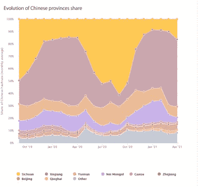
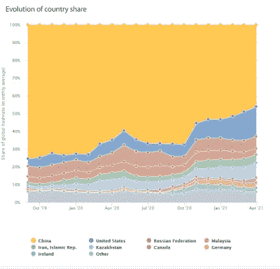

# 随着中国的打击动摇事物，比特币将经历坎坷

> 原文：<https://hackaday.com/2021/08/20/bitcoin-in-for-bumpy-ride-as-china-crackdown-shakes-things-up/>

比特币。神奇的互联网货币经常被那些忘记了所有货币只有因为我们相信它们才具有价值的人嘲笑为“一文不值”和“虚构的”。比特币或许是世界上没有枪支弹药支持的最强大的货币，但它仍然是一项有争议的发明，就像紧随其后的许多加密货币一样。

最近，中国政府打击了国内的经营活动。中国拥有世界上最大的比特币挖矿能力，这在网络上引发了冲击波，并在许多方面产生了巨大影响。事情是这样的。

A graph showing the wild swings in Bitcoin mining across various provinces in China. Source: CBECI

中国官员指示四川地区和其他地方的矿工停工，同时命令地方当局切断采矿作业的电力供应。银行还被指示关闭账户或停止涉嫌与加密货币操作有关的交易。由于有能力以一种在大多数民主国家通常不可能的方式出击并做出决定，这一行动迅速而果断。

一段时间以来，围绕比特币的政治风向改变的传言减缓了中国矿商对额外产能的投资。在此之前，中国的采矿业务占全球比特币交易量的 60-75.5%。然而，根据剑桥比特币能源消耗指数(CBECI ),这一数字很快下降到只有 46%。

随着许多大型采矿作业的离线，比特币网络的功耗大幅下降。今年早些时候，围绕比特币现在消耗的能源比阿根廷国家还要多的事实引起了很多争论。我们仔细分析了这些数字，发现这是一个合理的分析，而且从环境角度来看，这是一个特别值得关注的分析。当时，比特币全天候使用约 15 吉瓦，全年估计年消耗量约为 129 太瓦时。然而，[在撰写本文](https://cbeci.org/)时，CBECI 目前估计比特币的年消耗量仅为 11.92 GW，估计为 87.3 TWh，从本月早些时候接近 10 GW 的低点反弹。

Graph showing Bitcoin mining spread across countries around the world. Source: CBECI

这是一个巨大的下降，表明有多少采矿能力已经离线。这也对比特币网络的运作产生了流动效应。随着矿工散列的减少，矿工需要更长的时间来找到解决比特币块的解决方案。基于当前散列率，每 2016 个块，比特币算法自动改变挖掘的难度，以保持大约 10 分钟的块求解时间。在正常情况下，这大约每两周发生一次。然而，随着中国矿工人数的突然下降，解决障碍的时间激增至 14-19 分钟[，直到 7 月 3 日算法进行了修正](https://www.cnbc.com/2021/07/03/bitcoin-mining-difficulty-drops-after-hashrate-collapse-in-china-.html)。挖掘难度变得容易了 28%，这是加密货币历史上的一次大幅度下降。

对于目前的矿商来说，这是个好消息，他们将与数量少得多的参与者分享自己的成果。这至少会持续到中国的业务在其他司法管辖区开始运行(这可能有助于解释 8 月份的上升)。你可能从来没有去过哈萨克斯坦，因为这个国家没有优先发展旅游业，因此基础设施也很差。然而，它毗邻中国，而且电力便宜，所以许多矿商将业务转移到了那里。美国也是一个受欢迎的选择，因为它缺乏对比特币的任何有组织的政治反对，廉价的电力和做生意的便利。

Mining operations are selling gear online or shifting their operations overseas due to the crackdown in China. Source: [@ASIC_CHINA](https://twitter.com/search?q=miners%20china&src=typed_query&f=image)

能源使用从 15 GW 下降到 10 GW，降幅很大，达到 33%。在最近的最低点，瞬时消费量下降得更低，约为峰值的 50%。如果我们采用目前的数字，我们可以计算一下对排放的影响。美国能源信息署引用了 2019 年美国每千瓦时产生大约 [0.92 磅二氧化碳排放的数字。以此作为一个大概的数字，中国的举措在短短几周内减少了 1800 万公吨的二氧化碳排放。根据环保署的计算，这大约相当于减少 390 万辆汽车上路，](https://www.eia.gov/tools/faqs/faq.php?id=74&t=11)[。](https://www.epa.gov/energy/greenhouse-gas-equivalencies-calculator)

显然，完全关闭比特币将会节省大量的环境成本。从理论上讲，这也比安装可再生能源、转向更清洁的交通工具或减少主要工业的污染要容易得多。认为采矿作业可以使用可再生能源的观点忽略了一个事实，即用于采矿作业的能源不能被其他用户使用。

当然，在中国以外，这不像政府发出一封措辞严厉的信那么简单，因此比特币很可能会在未来很长一段时间内继续造成严重污染。毕竟，老牌的高财富玩家会竭尽全力对抗任何可能损害他们投资的势力。然而，比特币的价值和形象面临的最大危险，或许仅仅是政府监管或彻底禁止的建议。价格已经从今年早些时候的历史高点下跌了 30%,但随着 hashrates 的回升和海外采矿业务的重新建立，价格已经强劲反弹。我们怀疑比特币将会达到更高的高度——和恶名——在说了和做了之前。