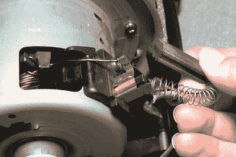

# 你应该能修理它吧？我们认为是的。

> 原文：<https://hackaday.com/2021/08/11/should-you-be-able-to-repair-it-we-think-so/>

你拥有它，你应该能修理它。当今市场上销售的许多设备要么被设计成无法维护，要么过于复杂而无法维护，只能通过授权服务代理提供的专业工具进行维护，要么没有可用的维修零件。在可持续发展成为全球关注的问题的时代，这是一个热点问题，所以在多年的无所作为之后，世界各地的立法者和监管者现在终于看到了它，它已经成为一个流行语。但是到底什么是*修改权，我们希望它是什么？*

## 是为维修而设计的吗？

For some reason, pod coffee makers are especially resistant to repair. Andy1982, [CC BY 3.0](https://upload.wikimedia.org/wikipedia/commons/thumb/a/ad/Dolce_Gusto.JPG/1280px-Dolce_Gusto.JPG)

要考虑的第一个问题是:如果某样东西在设计时特别考虑到它缺乏可修复性，那么你是否有权修复它是否重要？考虑一个典型的家用豆荚咖啡机，如 Tassimo 或类似的咖啡机:尽管它实际上是一个非常简单的设备，但它的拆卸和重新组装却非常复杂。出问题的时候你就是无法投入进去。

要求设计易于维修应该是监管者的专利吗？我们认为是的。还有其他的力量在作用于家电的设计者；面向制造的设计考虑和外观关注直接影响公司的底线，而最终用户的维修体验往往在列表的底部，即使在国家层面的好处是显而易见的。这就是法律的作用。

## 其他法律是否被滥用来限制维修？

John Deere tractors are notorious for their dodgy DMCA. Bahnfrend ([CC BY-SA 4.0](https://commons.wikimedia.org/wiki/File:John_Deere_7230R_%2B_Horsch_seeder,_Mukinbudin,_2014.JPG)).

在许多情况下，不存在缺乏维修权利的问题。牛津 Hackspace 的咖啡机坏了可能很难修理，但我有充分的法律权利这样做。

求助于许多“有权维修”故事中的典型代表/反面角色:John Deere。因为机器本身是为工作而设计的，所以很明显农民应该能够操作他们的拖拉机。

在这里，Deere 求助于 DMCA，这是一项 20 世纪 90 年代的立法，源于音乐行业对盗版的恐慌，旨在禁止规避版权保护机制。与用于中和重新灌装的打印机墨盒的方法类似，Deere 捆绑了一个必须链接到 Deere 计算机并由其授权的软件组件。虽然农民可以修理他们的拖拉机，但在未经授权的修理后，它就不再工作了。只有 Deere 或其代理可以执行维修的软件部分，绕过它将违反 DMCA。监管者是否应该有权通过将这一过程与其他立法捆绑在一起来禁止削减可修复性？我们认为是的。

## 不必要的复杂性阻碍了可修复性吗？

拥有为维修而设计的东西，不受法律障碍的阻碍，这当然很好，但制造商还有其他方式可以阻碍他们产品的可维修性。当一个本来简单的产品变得不必要的复杂时，它既增加了故障的可能性，又增加了维修的费用，这符合想销售新产品的制造商的利益，但不符合消费者的利益。这些迪尔拖拉机零件再次提供了一个例子，其中一个原本简单的零件带有一个芯片；以前只有简单的机械或液压部件，现在有了不必要的电子设备。

任何维修过 1980 年代制造的汽车和 10 年前制造的汽车的人都会明白这一点；前者只是有一个灯泡和一个照明开关，而后者现在在开关和灯中使用微控制器来完成完全相同的任务。那些准备通过描述 CAN 总线的优点来捍卫这种做法的人应该反思当前的芯片短缺及其导致汽车微控制器不必要扩散的原因。监管机构应该询问不必要的产品复杂性，以阻碍可修复性吗？我们认为是的。

## 小零件是否隐藏在模块中？

Are these brushes available separately, or only as part of the motor? Dvortygirl, [CC BY-SA 3.0](https://commons.wikimedia.org/wiki/File:Electric_motor_brushes_vacuum.jpg)

给定一个易于维修和进入的产品，我们转向零件可用性的问题。这是国内家电制造商最喜欢的伎俩，通过从市场上拿走备件系列来淘汰他们的旧产品，随着欧盟对这一问题的处理，这种做法受到了关注。

例如，他们要求洗衣机的零件在制造后的十年内都可以出售，但值得考虑一下:零件到底是什么？常识告诉我们，任何有故障能力的部件都应该是可用的，但这是一个可以解释的定义。

想象一分钟，一个电机的电刷出了故障，你可能会去零件商店买一套替换电刷。但是，一个不道德的制造商可以指定电机作为零件，而不是电刷，这意味着几美元的零件变成了很多美元的零件。包含在昂贵得多的零件组件中的小的可消耗零件的其它例子包括不能自行更换的轴承或密封件。监管机构是否有权要求单独提供可更换的耐磨件，而不是仅将其整合到更大的组件中？我们认为是的。

## 有足够的资料修复吗？

最后，众所周知，今天的许多设备都必须计算机化。例如，我们可能抱怨过在汽车中不必要的过度使用微控制器，但不可否认的是，现代汽车中有许多功能只有通过使用微控制器才能实现。由于它们的诊断功能是其维修的重要组成部分，因此它们不能通过限制对信息、软件、协议和错误代码的访问来限制可维修性。美国农民不得不求助于复活节欧洲软件盗版来访问他们的迪尔拖拉机上的系统，尽管世界各地的车主可以插入 OBD-2 加密狗，但它可以访问的许多信息仍然是专有的。监管机构是否应该要求向所有人提供文件、诊断协议和软件？我们认为是的。

这篇文章在陈述我们认为在评估维修权利提案时应该考虑的要点时，已经接近于一个宣言，但是我们认为把它们说清楚是很重要的。幸运的是，我们并不孤单。继欧盟里程碑式的维修权利指导方针之后，[美国美国联邦贸易委员会宣布打算更加积极地推行已经成文的维修法律](https://hackaday.com/2021/07/27/ftc-rules-on-right-to-repair/)。

不可避免的是，将会有强大的行业游说团体继续违背消费者的意愿，推动它们被淡化，所以有机会讨论它们的人越多越好。我们在探讨这个话题的时候考虑到所有的事情了吗？请在评论中告诉我们。