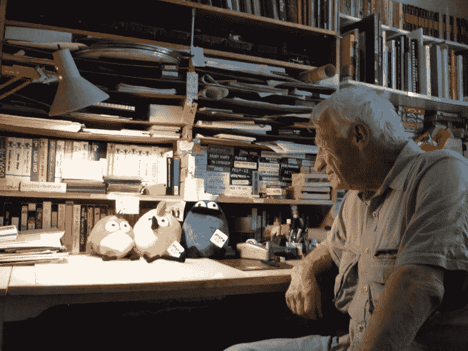

# 20 世纪 50 年代风格的教育动画

> 原文：<https://hackaday.com/2021/08/09/animation-in-education-1950s-style/>

在计算机出现之前，动画是手工绘制的。我们通常会想到卡通和动画电影，但也有其他类型的电影。例如，动画也被用于教育和培训电影。[Javier Anderson]在 20 世纪 50 年代和 60 年代从加拿大皇家空军找到了一系列天线和射频训练视频，并将它们发布在他的 YouTube 频道上。

他已经找到了其中的三个精华，都是关于天线基本原理的:传播、方向性和带宽(关于传播的电影链接在休息下面)。随便搜索一下这部电影的演职员表上的名字，你会发现一个无尽而迷人的兔子洞，里面有关于加拿大动画的历史，以及加拿大国家电影委员会及其工作室一群年轻先锋艺术家的形成(人们很容易在搜索时浪费几个小时，所以要提前警告)。对于[哈维尔]定位的这些电影，动画师是[卡·平达尔]。[Kaj] (1927-2019)是一个丹麦人，十几岁时学会了这门手艺，在哥本哈根画地下反希特勒漫画，直到逃命。他后来移民到加拿大，在那里他作为艺术家和教育家有着成功的职业生涯。

动画师【Kaj Pindal】在他的办公桌前，c.2012

任何试图真正掌握天线导线中流动的电流和由二阶偏微分电磁波方程描述的合成辐射信号之间的物理联系的人，都肯定会同意——毫无疑问，这是一个可以通过动画(如[Kaj]的动画)显著改善教学的主题。如果你想在时间相位和空间正交中散布更多类似“……*……*的短语

在你的教育和/或职业生涯中，有没有遇到过特别有帮助或者制作精良的动画教育视频？有没有类似但现代的电影使用计算机生成图像的例子？感谢读者[迈克尔·穆里略]给我们提示这些老电影。

 [https://www.youtube.com/embed/7bDyA5t1ldU?version=3&rel=1&showsearch=0&showinfo=1&iv_load_policy=1&fs=1&hl=en-US&autohide=2&wmode=transparent](https://www.youtube.com/embed/7bDyA5t1ldU?version=3&rel=1&showsearch=0&showinfo=1&iv_load_policy=1&fs=1&hl=en-US&autohide=2&wmode=transparent)

