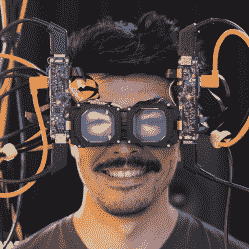

# 黑客日链接:2021 年 8 月 15 日

> 原文：<https://hackaday.com/2021/08/15/hackaday-links-august-15-2021/>

除非你想买一辆新车、家用电器或游戏机，或者你参与了这些东西的制造，否则全球半导体短缺很可能还没有直接影响到你。但是，随着芯片短缺开始影响我们的市场份额，我们这些爱好者可能会受到惩罚。我们认为，随着半导体制造商重新调整资源以服务于最有利可图的市场，构建 Arduinos 和 Raspberry Pis 所需的芯片供应将开始枯竭是很自然的事情。尽管如此，直到现在这一切都是抽象的，但看到 Adafruit、Pololu 和 Sparkfun 等公司关于他们被引用的长交付时间的可怕报价——一些芯片要到 2023 年才能看到！—令人沮丧。关于哄抬价格甚至囤积居奇的报道也是如此；当一个 10 美元的零件突然要价 350 美元时，你就知道出了严重的问题。

但是不用担心——我们确信全球芯片短缺不会对计划于 2027 年开业的世界首家太空酒店产生影响。旅行者空间站——曾经被称为冯·布劳恩空间站，但由于某种原因被重新命名——看起来像“2001:太空漫游”中的空间站 V，或者至少是它的一半。这东西很大——看看停靠在中心枢纽的星际飞船，以及几十架类似穿梭机的飞船——或许是逃生舱？—附在外缘。退一步说，这些渲染是富有想象力的——空间站看起来非常时尚，完全不受太阳能电池板等平庸之物的束缚。我们知道，一家私人公司需要吸引财力雄厚的投资者，而当他们可以出售“优质体验”时，专注于技术细节并不能做到这一点。但是说真的，如果你要去太空，你想要和地球上的高级酒店一样的外观和感觉，只是视野更好吗？还是你更愿意感觉自己真的去过太空？

说到太空，你有没有想过太空中第一台可编程计算器是什么？我们也没有，但这并不意味着我们没有发现这个关于 1975 年阿波罗-联盟号测试项目中发射的 HP-65 的详细故事非常有趣。ASTP 是阿波罗最后的欢呼，也是一个经常被低估的工程挑战。将两个航天器安全地连接在一起并不容易，为了实现会合和对接以及保持轨道不变，必须在轨道上进行大量的燃烧计算。HP-65 是一个可编程计算器，当时售价约为 750 美元(当然，非太空级版本)，它的可移动磁卡上加载了几个程序，阿波罗船员用它来验证阿波罗制导计算机(AGC)计算的结果。

 脸书，一家通过向人们提供他们不需要的产品而生存的公司，但现在不知何故不能没有它，现在正涉足怪异的水域:[反向穿越虚拟现实](https://research.fb.com/blog/2021/08/display-systems-research-reverse-passthrough-vr/)。我们认为，随着用户更广泛地采用虚拟现实并将其融入日常生活，每个人都将佩戴的虚拟现实耳机将使面对面的接触变得更加困难。那么，除了将虚拟现实用户眼睛的实时图像投射到虚拟现实设备外的屏幕上，让所有人都能看到之外，还有什么更好的方法来解决这个问题呢？纯粹的天才，一点也不恐怖。在实现他们的目标“真实世界和虚拟世界的无缝社交连接”之前，他们可能还有一点工作要做。

说到眼睛，很高兴知道开发人员仍然在努力工作，让最重要的应用程序在今天的硬件上以最高效率运行。是的，古老的 XEyes，一个在类 Unix 操作系统上为 X Window 系统开发的程序，它在屏幕上画出一双眼睛来跟随你的鼠标移动，终于迁移到了 1.2.0 版本。从 1.1.0 升级到现在已经 11 年了，所以这是一个漫长的过程。如果你还没有机会使用 XEyes，不要担心——几乎任何一台 Linux 机器都应该能够向你展示你错过了什么。或者，你知道，你甚至可以在摄像机上运行它，就像休息时间下面的视频显示的那样。

 [https://www.youtube.com/embed/f5sE4cZWGEU?version=3&rel=1&showsearch=0&showinfo=1&iv_load_policy=1&fs=1&hl=en-US&autohide=2&wmode=transparent](https://www.youtube.com/embed/f5sE4cZWGEU?version=3&rel=1&showsearch=0&showinfo=1&iv_load_policy=1&fs=1&hl=en-US&autohide=2&wmode=transparent)

