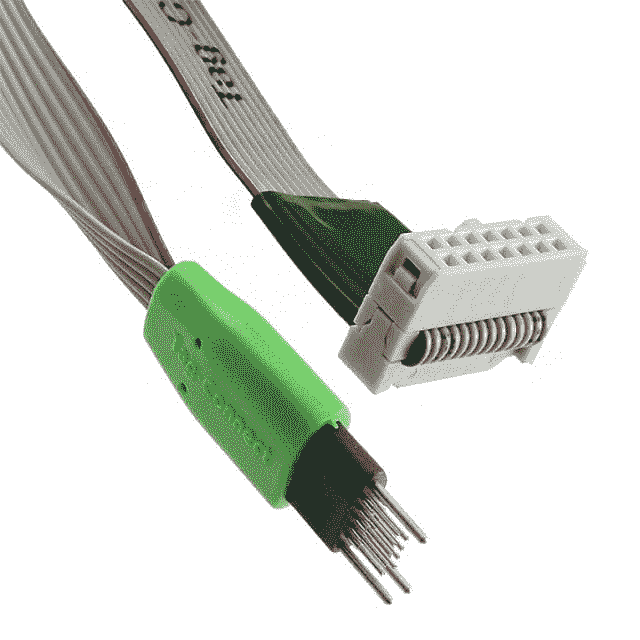
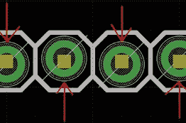
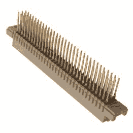
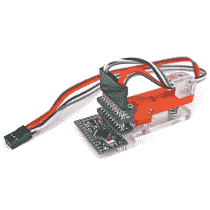

# 谁需要引脚接头？

> 原文：<https://hackaday.com/2021/08/12/who-needs-pin-headers/>

[Martin]将这个问题和主要照片一起发送到提示行，他提出了一个很好的观点。大多数开发和评估板都有多排引脚接头，通常松散地装在封装中，焊接由用户决定。非常谨慎的是，我们通常设计带有许多引脚接头的原型板，用于调试和测试。但是正如[马丁]提醒我们的，有其他替代焊料的方法。

*   你真的曾经与 PIC 微处理器板的多产设计师一起工作过。早在 Tag Connect 系列等解决方案出现之前，[Ralph]编写电路板程序时，只需将一个引脚头插入 PCB，然后用拇指轻轻按压，直到代码结束闪烁。
*   你可能见过交错偏移的 PCB 图案，当你焊接时，它能牢固地固定你的引脚接头。你可以稍微调整一下，在引脚上施加更大的压力，形成足以进行临时测试的无焊料连接。
*   采取相反的方法，你可以得到带有压配引脚的无焊连接器，这是我们几年前在 Raspberry Pi Zero 上测试过的方法。任何在像 VME 这样的基于欧洲卡的系统上工作过的人都可以体会到 96 针 DIN-41612 压配合连接器的节省时间和改进的可靠性。
*   或者，正如[Martin]建议的那样，您可以使用这些廉价的弹簧针夹中的一种。你最喜欢的亚洲电子产品经销商以不到 10 美元的价格出售这些产品。它们大约有一个大衣夹那么大，有几种不同的形状可供选择。

  Tag-Connect Style of Connector  Uncle Pete’s Footprint Experiments, Sparkfun  Press-FIt 96-Pin DIN  Pogo-Pin Clamp Fixture

如果你需要把你的板插到另一张卡上，比如把帽子插到树莓派上，这些技术就帮不了你。但是，当您只想抓取一些串行端口信号或探测一些数字 I/O 信号时，工具箱中有几个这样的夹子可以节省您焊接接头的时间和麻烦。你有什么小技巧可以让焊接头变得更容易，甚至完全避免使用它们吗？请在下面的评论中告诉我们。