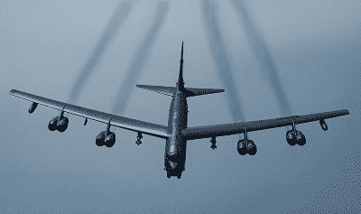

# 新的发动机可以推动 B-52 超过它的 100 岁生日

> 原文：<https://hackaday.com/2021/09/07/new-engines-could-propel-the-b-52-beyond-its-100th-birthday/>

B-52 同温层堡垒于 1952 年 4 月首次上天，并于 1955 年引入美国空军，此后成为美国空军的中流砥柱。最初作为一种核轰炸机开发，以执行关键的威慑作用，不断变化的现实使它在实际行动中只能运送常规弹药。

最初建造的 744 架 B-52 中，有 76 架仍在空军和空军预备役服役。这支舰队将在该型飞机诞生 100 周年后继续飞行，直到 2050 年甚至更久。为了达到这个里程碑，一个新的引擎套件将是让这些鸟保持飞行的关键。

## 建造核能发电站

A U.S. B-52H Stratofortress in flight over the Persian Gulf in 2019\. Note the black contrails commonly seen from the eight engines of the B-52.

尽管年事已高，B-52 仍然定期飞行，并保持最佳战备状态。其长期服务的部分原因是 Buff，或众所周知的“又大又丑的胖子”，被故意过度设计和过度建造。在计算尺的时代，设计者希望确保飞机能够应对高空核攻击任务的压力。在设计中留有足够的余量意味着尽管飞行了几十年，仍在服役的 B-52 仍然有足够的结构寿命。

B-52 以其独特的布局而闻名，四个独立的双引擎吊舱中有八个引擎。该轰炸机配备了普惠 TF33-PW-103 发动机，在不加油的情况下，航程可达 8800 英里(14162 公里)。然而，[这些发动机中的最后一个是在 1985 年制造的](https://newsroom.prattwhitney.com/2015-08-07-Pratt-Whitneys-TF33-Engine-Celebrates-its-55th-Year-with-a-Promise-of-Many-More-to-Come)，继续生产零件和维护发动机正在成为一个麻烦。

因此，空军寻求一种新的发动机来为剩余的舰队提供动力。的确，这也不是第一次了。在 1961 年 TF33 涡轮风扇发动机与 B-52H 生产一起推出之前，第一架 B-52 实际上与各种普惠 J57 涡轮喷气发动机一起飞行。从那时起，美国空军已经多次调查了发动机更换的前景。一次是在 B-1 轰炸机开发之前，另一次是在 1996 年，这两次项目都被拒绝。从那以后，发动机只会越来越旧，因此导致美国空军在 2020 年再次公开征求建议书。

## 飞得更远更聪明

为了使改装有意义，空军正在寻求一个替换计划，该计划将得到一个运行成本更低的发动机。这些节省可能来自可靠性的提高、维护的简化，或者仅仅是更好的零件供应。发动机也应该更安静，也许最重要的是，更省油。自 20 世纪 50 年代 TF33 研制以来，喷气发动机技术已经有了很大的发展，因此更新的设计可以给 B-52 平台带来巨大的好处。

The B-2 Spirit, pictured here flying next to a B-52 Stratofortress, is a more modern and stealthier aircraft than its predecessor. However, high running costs and the fact only 20 were built mean that the B-2 is not able to supplant the B-52 in regular operations.

由于老化的 B-52 机身的限制，人们对更大的推力或更高的速度没有多少渴望。然而，比 B-52 更高效的发动机可以实现更长的航程和更长的待机时间。希望能将航程提高 20-40%，在不加油的情况下达到 12，320 英里。这可以让 B-52 在没有加油机支持的情况下到达地球上的任何地方。

另一个主要的好处是，新的发动机将配备数字发动机控制系统。这些系统监控发动机健康的各个方面，从涡轮入口和出口温度，到轴速度，以及几乎所有其他方面。当处理每架飞机上八个引擎的维护时，拥有一个数字系统来监控什么出现了故障，什么需要改变，这对地勤人员来说是一个巨大的帮助。另外，任何提前解决的问题都不会影响训练计划或现行任务。考虑到这些操作的成本，这是一种很难准确量化的节约，但仍然是有回报的。

## 愿最好的引擎获胜

美国空军的目标是为其舰队订购 608 台新发动机，通用电气、罗尔斯·罗伊斯和普惠&是竞争该合同的三家公司。根据这些数字，今天仍在服役的 76 架 B-52 每架有 8 个发动机。因此，尽管四个更大的发动机是现代飞机上更典型的解决方案，但该计划似乎仍可能坚持八个发动机的设置。每家公司都提出了 20，000 磅推力范围内的发动机。通用电气推出了 CF34-10 和 Passport 发动机，劳斯莱斯推出了 F130，普惠推出了 PW800 的 a 版本。这些都是小型发动机，人们通常会在小型支线飞机或私人飞机等应用中看到。

It’s hoped that greater fuel efficiency could reduce the B-52’s dependency on aerial refueling during its missions.

显然，每家公司都渴望赢得利润丰厚的 B-52 改造合同。[劳斯莱斯已经从 2019 年开始测试他们的 F130 竞争者，](https://www.rolls-royce.com/media/press-releases/2019/16-09-2019-rr-f130-engine-for-b-52-completes-early-testing-in-indianapolis.aspx)远在该计划正式宣布之前，而 [GE](https://www.geaviation.com/military/engines/b-52) 和 [Pratt & Whitney](https://prattwhitney.com/products-and-services/products/military-engines/B52CERP) 也在忙于推销他们各自的引擎。军事采购是一笔大生意，在合同墨迹未干之前，激烈的战斗将会闭门进行。

问任何一个在 20 世纪 50 年代参与 B-52 项目的工程师，他们的飞机是否会在 100 年后飞行，你可能会引来一阵刺耳的笑声。然而，恰好 B-52 做了一项工作，而且做得很好。鉴于替换它需要开发一种昂贵的新飞机，这是空军近几十年来一直在努力的事情，很明显 Buff 仍将在空中翱翔一段时间。对于负责运行这台大型机器的飞行员和机组人员来说，希望新的发动机能在未来几年里让这项任务变得轻松一些。