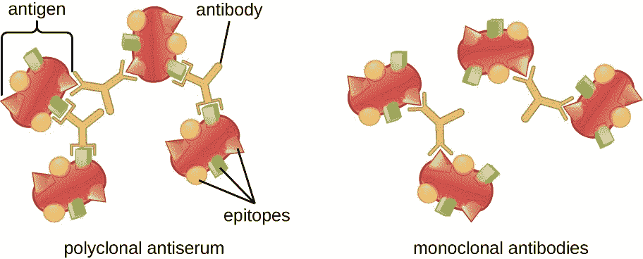
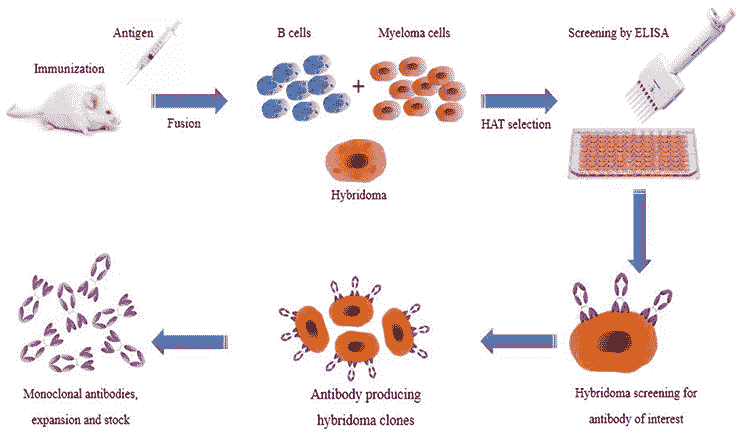
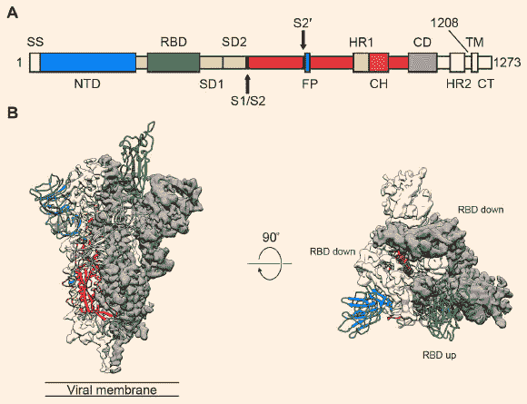

# 单克隆抗体:医学的制导导弹

> 原文：<https://hackaday.com/2021/09/15/monoclonal-antibodies-the-guided-missiles-of-medicine/>

如今，每当有人提到“抗体”这个词，它肯定会抓住你的注意力。思想通常流向人类免疫系统及其在正在进行的新冠肺炎疫情中的作用，以及我们的身体如何战胜疾病。免疫系统极其复杂，但几乎每个人都知道抗体是它的一部分，并且它们对身体识别和中和细菌和病毒等入侵者的能力至关重要。

但是，尽管抗体对长期免疫和避免疾病非常重要，但这还远远不是它们的全部优势。抗体对其目标抗原令人难以置信的特异性使它们成为生物研究和临床诊断的有力工具，如[快速新冠肺炎检测](https://hackaday.com/2020/03/30/coronavirus-testing-follow-up-rapid-immunologic-testing/)。抗体的特异性也开启了曾经是科幻小说的治疗模式，定制抗体就像制导导弹一样，不仅直接攻击体内的特定蛋白质，有时甚至攻击蛋白质的特定部分。

然而，要使这些疗法奏效，需要特殊的抗体:单克隆抗体。这些在最近的新闻报道中非常多，不仅仅是作为新冠肺炎的一种可能的治疗方法，而且可以治疗从风湿性关节炎到最严重的癌症。但是究竟什么是单克隆抗体，它们是如何制造的，又是如何工作的呢？

## 多声道与单声道

在深入研究单克隆抗体的细节之前，对免疫系统的工作原理有一个大致的了解会有所帮助。幸运的是，基本原理非常简单。简而言之，人体内有两种免疫系统:先天免疫系统和适应性免疫系统。两者都由称为淋巴细胞的特殊白细胞组成。先天免疫系统是一种“快速攻击”系统，能够快速辨别敌友并消化入侵者。这些入侵者的残余物，主要是它们的蛋白质片段，被称为抗原，它们被呈递到适应性免疫系统的淋巴细胞，这些淋巴细胞布满了称为免疫球蛋白的抗体。这些抗体是一个高度多样化的蛋白质群体，代表着身体以前遇到的抗原的化学记忆。任何与抗体匹配的抗原都会与其结合，引发一系列事件，导致携带该抗体的淋巴细胞大量堆积，然后这些淋巴细胞以极大的特异性寻找并摧毁入侵者。

虽然适应性免疫系统产生的抗体对特定抗原具有高度特异性，但其中仍有一些“回旋余地”。呈递到适应性免疫系统的抗原实际上非常大，完全有可能存在针对同一蛋白质不同特征的抗体，称为表位。这是一个优势，因为它增加了适应性免疫系统能够识别抗原的可能性，无论它被先天免疫系统如何分割。这也有助于防止病毒突变，这可能会改变一个足以不再被识别的表位。针对多个表位的抗体，称为多克隆抗体，提供了冗余性，有助于增加强大免疫反应的机会。

Cartoon of polyclonal and monoclonal antibodies. Note that monoclonal antibodies only bind to a single epitope of the antigen; polyclonals bind multiple epitopes, but tend to bind much more of the antigen. So monoclonals have the benefit of epitope specificity at the cost of decreased overall affinity for an antigen. Source: [Creative Diagnostics](https://www.creative-diagnostics.com/polyclonal-vs-monoclonal-antibodies.htm)

虽然到目前为止，我已经描述了免疫系统如何在你的身体中工作，但重要的是要记住，抗体也是研究和临床诊断的强大工具。创造一群能与特定蛋白质结合的抗体的能力给生物学研究带来了巨大的好处。制造抗体通常包括向大鼠或小鼠注射目标抗原，收集动物的白细胞，并纯化抗体以获得与感兴趣的抗原结合的抗体。这是一个需要大量时间的过程——三个月或更长时间并不少见——以及大量专业技能。最终结果是一组多克隆抗体。

虽然传统的抗体生产技术多年来在生物医学研究中做了许多繁重的工作，但有时它们生产的多克隆抗体并不是这项工作的工具。在某些情况下，需要更多的结合特异性，这就是单克隆抗体的用途。单克隆抗体，通常缩写为“mAbs”，是识别靶抗原的单一表位的抗体。这可能是一个非常强大的研究工具，因为可以制造出只与一个大蛋白质的一个区域结合的抗体。这可以用来探索那个区域的功能；例如，只与特定表位结合的单克隆抗体可用于探测该区域是否是另一种蛋白质的结合位点，方法是通过物理方式阻断对它的接近。

## 癌细胞变好了

虽然自然免疫系统基本上是一个多克隆抗体工厂，但这并不是说单克隆抗体不会自然出现。不幸的是，它们最常见于多发性骨髓瘤患者，这是一种影响免疫相关血细胞的血癌。所有癌症的特征都是特定组织类型的过度生产，天然骨髓瘤细胞为研究人员提供了一种工具，可以创建大量相同细胞的群体——克隆——每个细胞都产生一种抗体。

然而，关键是要弄清楚如何对骨髓瘤细胞进行编程，使其产生一种特定的抗体，而在 20 世纪 70 年代，当所有这一切首次被探索时，分子生物学仍处于起步阶段。因此，研究人员不得不做些手脚来实现这一点。他们提出的基本想法是将永生的骨髓瘤细胞与带有针对感兴趣抗原的抗体的细胞融合在一起。这些杂交瘤细胞各自携带一种抗体的基因，一旦创造它们的工作完成，它们就可以大量生长。

Monoclonal antibody production via hybridomas. HAT selection makes sure only fused cells get through by treating them with the chemotherapy agent aminopterin. Source: [Antibody Engineering for Pursuing a Healthier Future](https://www.researchgate.net/publication/315849444_Antibody_Engineering_for_Pursuing_a_Healthier_Future)

杂交瘤细胞很难产生。首先是在老鼠或其他哺乳动物体内培养大量产生抗体的细胞的问题，这种细胞称为 B 细胞。然后，B 细胞必须与骨髓瘤细胞融合，或者通过用聚乙二醇化学处理细胞，或者通过使用电场。还有一个问题是从未融合的骨髓瘤细胞和 B 细胞中分离出少数成功融合的细胞。这是通过使用对化疗药物氨基蝶呤敏感的骨髓瘤细胞来实现的。成功融合的骨髓瘤细胞将被 B 细胞中完整版本的基因“拯救”，并将能够在含有药物的生长培养基中生存。

下一个技巧是将杂交瘤细胞的多克隆群体转化为许多单克隆群体。这是通过将存活的融合细胞稀释到平均而言在给定体积的生长培养基中只有一个细胞的程度来实现的。将该体积置于[微量滴定板](https://hackaday.com/2017/06/23/go-small-get-big-the-hack-that-revolutionized-bioscience/)的每个孔中，允许单细胞生长，产生克隆细胞系，该细胞系携带产生针对单个表位的抗体的基因。找到与特定表位反应的细胞系就是使用各种免疫化学方法筛选所有杂交瘤细胞系，如将抗原固定在固体基质上，并使用它来结合对其具有特异性的杂交瘤。

自从杂交瘤技术被首次探索以来的几十年中，已经开发了许多其他的用于生产 mAb 的方法。噬菌体展示技术是对感染细菌的病毒进行改造，使其在蛋白质外壳上表达抗体，这种技术可用于筛选大量针对特定抗原的抗体，然后获得编码抗体的 DNA，以便克隆。携带人类抗体基因的转基因小鼠也可用于产生单克隆抗体文库；目前市场上几乎所有批准的单克隆抗体疗法都是通过转基因小鼠开发的。

## 医学制导导弹

3D-structure of SARS-CoV-2 spike protein; the receptor-binding domain (RBD) is shown in green. Monoclonal antibodies that bind to the RBD make it impossible for the virus to bind to ACE-2 receptors in the lung. Source: [SciNews](http://www.sci-news.com/medicine/sars-cov-2-spike-protein-08147.html)

从上面使用单克隆抗体探测蛋白质结合域的例子中，可以看出它们不仅可以用于诊断，还可以用于治疗。单克隆抗体的特异性有助于非常有针对性的治疗，这与口服药物并希望其通过整个身体到达治疗目标相反。这就是单克隆抗体被誉为医学“制导导弹”的由来。

不过，当你考虑单克隆抗体疗法的工作原理时，这个导弹比喻就开始有点站不住脚了。在导弹通常需要发射弹头才能有效的情况下，在单克隆抗体治疗中，有时仅仅是它们可以结合特定蛋白质的事实就足够了。对克罗恩病和类风湿性关节炎等自身免疫性疾病的治疗尤其如此，在这些疾病中，患者自身的免疫系统将自己的细胞误认为入侵者，并开始攻击它们。

这些疾病用针对并结合肿瘤坏死因子-α(TNF-α)的单克隆抗体治疗，肿瘤坏死因子-α是一种调节免疫系统的蛋白质，并下调自毁级联。一些癌症疗法使用类似的方法，单克隆抗体与某些调节细胞分裂的蛋白质结合，从而靶向它们，以便被患者的免疫系统清除。

但是，一些单克隆抗体疗法也携带一个有效载荷到他们的目标。在某些情况下，放射性同位素可以连接到单克隆抗体，以直接向癌细胞输送一定剂量的辐射；其他单克隆抗体可以以分子精度递送药物分子或药物前体分子，后者随后可以转化为其活性形式。

## COVID 的单克隆

所有这些将我们带到当前的疫情，以及如何利用单克隆免疫疗法来帮助新冠肺炎患者。美国美国食品药品监督管理局迄今已根据紧急使用授权(EUA)批准了三种用于新冠肺炎的单克隆抗体免疫疗法。其中两种是目前推荐的，正在用于轻度至中度新冠肺炎住院患者。一种是两种单克隆抗体的混合物，称为 casirivimab 和 imdevimab——你可以通过–*mAb*后缀来辨别药物是单克隆抗体——这很有趣，因为虽然每种单克隆抗体都与新型冠状病毒病毒传说中的刺突蛋白结合，但它们都与该蛋白的不同但重叠的表位结合。

这两个表位都在刺突蛋白的受体结合域(RBD)中，这意味着一旦单克隆抗体结合到循环病毒颗粒上的刺突蛋白，它就不再能够结合到其受体，即 ACE-2 受体的呼吸道上皮细胞。结果是病毒不再能够进入细胞并复制，这有望减少病毒载量并导致更快的恢复。

对于 Regeneron 以 REGEN-COV 的名称销售的 casirivimab/imdevimab，[数字看起来相当不错](https://www.medicalbag.com/home/news/regen-cov-casirivimab-imdevimab-monoclonal-antibody-therapy-high-risk-covid-19/) —在症状出现的前 10 天内给予单抗治疗，即静脉输注或一组四次皮下注射，可将轻度至中度 COVID 病例进展的风险降低约 70%。它还具有免疫缺陷个体暴露后预防性使用的适应症。

单克隆抗体已经成为生物学研究和治疗各种严重疾病的游戏规则改变者。新技术的发展使它们更容易制造，这将扩大它们作为医学制导导弹的用途。