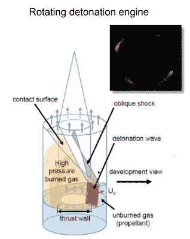
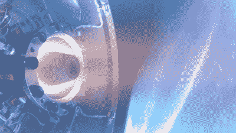

# 日本火箭发动机爆炸:持续和故意的

> 原文：<https://hackaday.com/2021/09/02/japanese-rocket-engine-explodes-continuously-and-on-purpose/>

自从第二次世界大战中期德国 V-2 火箭开发以来，液体燃料火箭发动机的设计很大程度上遵循了一个简单的模板。推进剂和氧化剂在燃烧室中混合，产生高压热气体混合物，非常希望离开火箭后部，产生推力。

然而，日本宇宙航空研究开发机构(JAXA)最近成功完成了一种不同类型火箭的测试，这种火箭被称为旋转爆震发动机。该发动机依靠一种完全不同的燃烧方法，目的是用更少的燃料产生更大的推力。我们将深入研究它是如何工作的，以及日本的测试如何预示这项技术的未来。

## 爆燃与爆炸

人类喜欢燃烧燃料来做有用的工作。迄今为止，在我们的历史中，无论我们看蒸汽机、汽油机，甚至火箭发动机，所有这些技术都有一个共同点:它们都依赖于爆燃燃烧的燃料。自从我们开始围坐在篝火旁，这种容易控制的缓慢燃烧方式我们都很熟悉。

A diagram of the JAXA rotating detonation engine, showing the intended operation in which the shock wave from detonating fuel travels around the engine in the annular channel to continue the combustion cycle. Source: [JAXA](https://www.youtube.com/watch?v=O0FoDi5DjR4)

然而，通过在爆炸中燃烧燃料来代替 T1，有潜在的效率增益。这是燃烧产生的冲击波，其传播速度超过音速，迅速传播爆炸反应，并伴随着巨大的压力增加。以这种方式燃烧燃料的主要优点是可以从巨大的压力增加中获得更多的能量。因此，通过从相同数量的燃料中释放更多的能量，基于爆震过程运行的发动机理论上可以更加节能。

然而，在基于爆震的循环中运行发动机有几个问题。可能难以维持连续的爆炸反应。此外，爆炸过程中温度和压力的大峰值以及相关的冲击波很容易损坏或破坏由非常坚硬的材料制成的部件。到目前为止，许多领域的工程师都在努力驯服和控制爆炸过程，以达到可以成功使用的程度。

旋转爆震发动机由一个环形结构的燃烧室组成。在这个环中，燃料和氧化剂被注入，并以引爆混合物的方式点燃。这样做的目的是让爆震的冲击波绕着环形燃烧室传播，从而在连续循环中引起进一步的爆震。

事实证明，将这一概念付诸实践是困难的；尽管这一概念最早是在 20 世纪 50 年代由密歇根大学提出的，但直到最近几年，工程师们才成功地演示了连续运转的旋转爆震发动机。中佛罗里达大学的一个团队[在 2020 年展示了氢氧燃料发动机，](https://newatlas.com/space/rotating-detonation-engine-ucf-hydrogen-oxygen/)在测试中产生高达 200 lbf (890 N)的推力。这一壮举是通过仔细调整喷射推进剂的喷嘴大小来实现的，以使混合物正好适合受控爆炸的进行。如果混合不当，燃料会以更慢的爆燃速度燃烧，对推力或效率没有任何好处。

## 日本的现场测试

 [https://www.youtube.com/embed/dK2CbJNHnC0?version=3&rel=1&showsearch=0&showinfo=1&iv_load_policy=1&fs=1&hl=en-US&autohide=2&wmode=transparent](https://www.youtube.com/embed/dK2CbJNHnC0?version=3&rel=1&showsearch=0&showinfo=1&iv_load_policy=1&fs=1&hl=en-US&autohide=2&wmode=transparent)

与中佛罗里达大学的实验不同，日本的努力包括发射一枚真正的火箭。该测试使用了一个带有常规发动机的标准探空火箭，将测试有效载荷发射到地球上空数百公里处，火箭的第二级安装了旋转爆震发动机。这项任务是利用探空火箭 S-520-31 于 2021 年 7 月 27 日从 JAXA 内之浦航天中心发射的。

The JAXA rotating detonation engine in operation over Earth. Source: Nagoya University, JAXA

第二级点火成功，运行了 6 秒钟，在此期间产生了 112 lbf (500 N)的推力，是佛罗里达小组地面验证机的 56%。从实验中收集的数据证实，发动机如预期那样运行，在爆震状态下燃烧其燃料。

鉴于飞行硬件的成功演示，JAXA 希望在五年内将这项技术投入实际应用。与名古屋大学的一个团队合作建造，希望进一步发展这项技术，以在未来创造更高效的航天器。它可以应用于各种领域，从第一级和第二级火箭发动机，到应用于深空任务，以充分利用有限的燃料资源。

在过去的几年里，这项技术取得了长足的进步。随着多个独立小组现在展示工作的发动机，它动摇了半个世纪以来与旋转爆炸概念相联系的“不可能”的头衔。显然，要制造出比现有设计更好的实用发动机，需要大量的工程设计。然而，随着最近在该领域取得的进展，现在有一线希望告诉我们这是可以做到的。