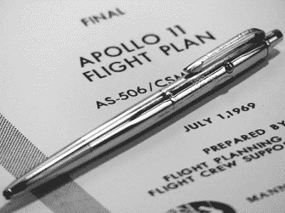
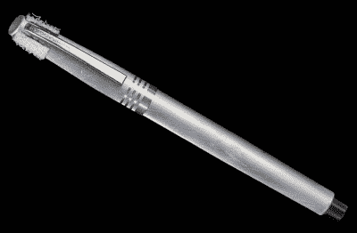
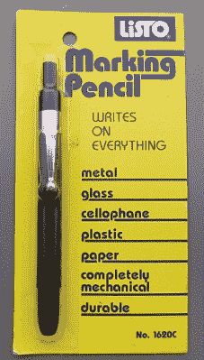

# 费希尔太空笔的天文前景

> 原文：<https://hackaday.com/2021/09/23/the-astronomical-promises-of-the-fisher-space-pen/>

我们都听说过费希尔太空笔。见鬼，甚至有一集《宋飞正传》就聚焦于这个墨水喷泉，不管你向它扔什么，它都应该准备好行动。费希尔太空笔的传说是，它可以并将从任何角度书写，在极端温度下，在水下，最重要的是，在零重力下。虽然这项技术对于太空中的宇航员来说是一个明确的先决条件，但它也有一长串实际的地面应用(尽管如果它也能在任何基底上书写就更好了)。

你可能听说过费希尔太空笔的主要神话，即美国国家航空航天局(NASA)花费数百万开发了它，随后很快伴随着一个笑话，即俄罗斯宇航员只是使用铅笔。事实是，美国宇航局已经尝试了铅笔，并决定石墨颗粒是一个太大的问题，因为它们可能会堵塞仪器，就像一袋袋起皱的薯片和不安全的蚂蚁农场。

## 一个真正值得太空使用的仪器

通常，是政府机构推进技术，然后技术在某个时候渗透到消费者市场。但是美国宇航局没有开发太空笔。没有政府机构这样做。费希尔钢笔公司的保罗·费希尔私下花了 20 世纪 60 年代的大部分时间研究一种不需要重力的加压钢笔，希望得到美国宇航局的关注和业务。这很有效，NASA 激励他继续努力，直到他成功。

The pen that went to the moon. Image via [Sebastien Billard](http://www.sebastien-billard.fr/tacticool/public/photos/fisher-space-pen-ag7-3.jpg)

然后，他们在所有可能的位置对它进行了彻底的测试，将它暴露在-50°F 到 400°F(-45°C 到 204°C)的极端温度下，并在从纯氧到完全真空的环境中写下清晰的洗衣单。那么，这个工程奇迹是如何工作的呢？

费希尔太空笔的墨盒用氮气加压到 45 磅/平方英寸(45 磅/平方英寸)( 45 磅/平方英寸)( 45 磅/平方英寸)( 45 磅/平方英寸)( 45 磅/平方英寸)( 45 磅/平方英寸)。里面是一种特别粘稠的凝胶状墨水，当它遇到精确配合的碳化钨圆珠笔的摩擦时，就会变成液体。

在圆珠笔的粘度和精确配合之间，这支笔应该不会漏，但正如你在下面的视频中看到的，(剧透警告！)折断原来的太空笔芯会导致浓稠的软泥快速涌入，因为墨水被氮气挤出。

到 1966 年，这支笔已经准备好了，并在阿波罗 7 号任务中开始了它的首次太空之旅。如今有 80 种不同型号的太空笔，但只有两种是美国宇航局批准的:最初的 AG-7(反重力)用于飞行，还有航天飞机模型，其中几十种漂浮在国际空间站周围供一般使用。

 [https://www.youtube.com/embed/3mjmAzf4oKs?version=3&rel=1&showsearch=0&showinfo=1&iv_load_policy=1&fs=1&hl=en-US&autohide=2&wmode=transparent](https://www.youtube.com/embed/3mjmAzf4oKs?version=3&rel=1&showsearch=0&showinfo=1&iv_load_policy=1&fs=1&hl=en-US&autohide=2&wmode=transparent)

## 阿波罗的另一支笔

The pen that saved the Apollo 11 mission. Well, close enough. Image via [National Air & Space Museum](https://airandspace.si.edu/collection-objects/pen-marker-collins-apollo-11/nasm_A19850140000)

这里还有一个你可能听过的神话:这支笔拯救了阿波罗 11 号任务。但是不，那实际上是一支杜罗制造的毡尖笔。在返回鹰后舱的途中，巴兹·奥德林的巨大背包打破了面板上的一个断路器。这碰巧是一个重要的启动了上升引擎，这是为了让他们离开月球。

阿姆斯特朗和奥尔德林已经丢弃了他们的许多工具，但他们仍然带着笔。在这个问题上睡了几个小时后，奥尔德林想把他的笔塞进面板，而宁静基地在休斯顿紧张地点击他们的 BIC。这很有效(显然)，他们能够升空并在太空舱里与柯林斯会合。

有趣的事实:在国家航空航天博物馆展出的杜罗实际上是迈克尔·科林斯的钢笔——[巴兹·奥德林把他的钢笔放在家里坏掉的断路器旁边。](https://www.eetimes.com/how-a-felt-tipped-pen-saved-the-apollo-11-mission/)

## 地球格格不入？

Image via [Pentulant](http://www.pentulant.com/2012/09/quick-review-marking-pencil.html)

费希尔太空笔可能是所有极端应用和环境的完美之选，从水下到太空真空，但显然它们在地球上会令人沮丧。但是你不能真的期望用那些为极端情况而写的东西有一个好的写作体验，你能吗？

尽管出于显而易见的书呆子趣味的原因，我一直有点想要一支太空笔，但我讨厌使用[圆珠笔](https://hackaday.com/2020/12/17/tech-hidden-in-plain-sight-the-ballpoint-pen/)，因此无法证明自己的成本。我们自己的(汤姆纳尔迪)有一个，说他们是废物。他们可以在任何条件下书写，但他们“使用粗糙”和“墨水(不)流动良好”。话又说回来，他的可能是一个哑弹，因为它是在 21 世纪初[从史泰博采购的，当时大约](https://www.bladeforums.com/threads/beware-fisher-pens-at-staples-ripoffs.240452/)有假冒钢笔。很多人说，因为粘稠的墨水，他们不得不使用比平常更大的压力。

我们有点想知道为什么美国宇航局没有用油性笔。可能又是粒子的事？[那时自动润滑铅笔已经是一种东西了](https://www.listo.com/)，所以它不可能是“到处都是小纸片”的借口。或者可能只是油性笔写得不够精细，或者他们的标记很容易被弄脏。

美国宇航局今天仍在使用费舍尔太空笔，太空 x 也是如此。至于俄罗斯人，他们在美国宇航局之后不久就开始购买费舍尔太空笔，早在 1967 年。