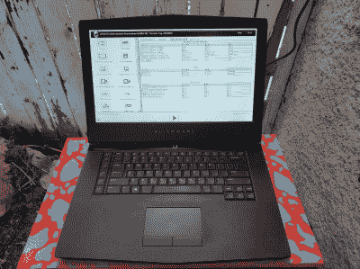

# 只需移除有问题的组件，笔记本电脑即可得到修复

> 原文：<https://hackaday.com/2021/09/15/laptop-gets-fixed-by-simply-removing-problem-component/>

我们不会说“不要在家里尝试这个”，但[Troy]让一台昂贵(但已过保修期)的笔记本电脑起死回生的方式很有趣，即使这不应该是任何人的维修计划。

它始于一个朋友的外星人笔记本电脑，它只会启动到黑屏，并在这个过程中变得非常热。在热成像相机和一些示意图的帮助下，[Troy]能够看到电源中的一个密集 MOSFETs 似乎是罪魁祸首。用替换品替换掉功率 MOSFETs 似乎是一个合理的方法，所以他配备了一个热风返工站开始工作。但这就是问题开始的地方。

拆焊过程远非干净，部分原因是笔记本电脑的多层 PCB 具有出色的热管理功能，吸收热量的速度几乎与[Troy]的热风枪释放热量的速度一样快。最终，这项工作变得一团糟，损坏了一些垫子。因此，在替代品上焊接的前景并不乐观。但是查看了示意图并思考了情况后,[Troy]有了一个想法。

One expensive laptop, brought back to service.

根据原理图，两个 MOSFETs(至少有一个有故障)在电路板的另一侧有平行的对应物。这通常是为了增加容量和分散热负荷。然而，根据原理图上的当前计算，这些器件预计总共可以处理大约 20 A 的电流，但数据手册显示，每个 MOSFETs 的*都可以轻松处理这种电流(只要散热能够跟上)。)理论上，笔记本电脑不需要额外的容量。*

既然故障部件已经被简单地移除，笔记本电脑还能“正常工作”吗？[Troy]和他的朋友[Mike]愿意试一试，所以在尽最大努力清理完混乱之后，他们打开了笔记本电脑，让他们有点惊讶的是，一切都正常了！一些密集游戏的压力测试表明，散热问题已经成为过去。

简单地移除一个零件可能不是最好的整体维修策略，但就像通过简单地将热风返工站切成两半来缩小它一样，很难对结果提出异议。