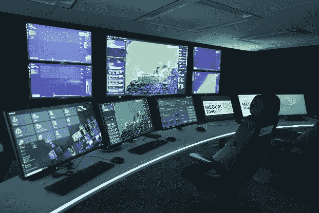
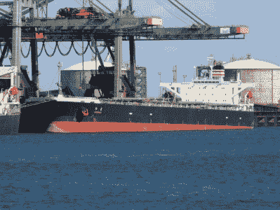

# 自动化货运:自主船寻找自己的位置

> 原文：<https://hackaday.com/2021/10/11/automate-the-freight-autonomous-ships-look-for-their-niche/>

毫不夸张地说，如果没有货船，我们所知道的生活将会停滞不前。如果对这一事实还有任何疑问的话，过去一年半的供应链危机让这一点烟消云散了；我们现在都知道我们需要多少东西——可悲的是，许多我们不需要但仍认为需要的东西——是通过一次或多次越洋来到我们身边的，通过专门运载从集装箱到散装液体和固体货物的船只。

虽然构成这些全球供应链主干的大型复杂船只是了不起的工程成就，但它们仍然完全依赖船员来使它们高效运行。因此，毫不奇怪，一些航运公司正在研究如何使他们的货船完全自动化，以减少对人工的需求。理论上，这似乎是个好主意——当然，除非你是个海员。但这是现实的情况吗？航运公司会意识到他们显然希望通过让无人驾驶的货船舰队往返于世界各大洋而实现的节约吗？这是自动化货运的正确方法吗？

## 无灯运输

到目前为止，航运公司 NYK 航运公司提供的计划细节很少，仅限于几篇新闻稿，几乎没有技术讨论。但从我们收集的信息来看，大约 30 家航运公司组成了一个名为 DFFAS 的财团，旨在“设计全自动船舶的未来”在日本政府的赞助下，他们已经建立了一个船队运营中心，该中心将支持无船员货船的运营。从发布的几张照片来看，FOC 看起来确实不错——光滑的控制台，随处可见的平板显示器，柔和的灯光，以及几个操作员的座位。

Part of the Fleet Operation Center that NYK Lines built to test autonomous domestic shipping. Source: [NYK Lines](https://www.nyk.com/english/news/2021/20210902_02.html)

运营中心将为日本列岛沿海贸易航线上的船只提供支持，并计划于明年 2 月进行一次短暂的测试航行。236 海里的航程将把 MV *朱雀*号，一艘 85 米长的集装箱货船，从东京湾沿着海岸驶向伊势市的港口。目前还不知道这艘船如何或是否为这次航行进行了改装，但很有可能自 2019 年建造以来，它可能已经安装了所有最新的导航、通信和计算机设备。

MV *Suzaku*, the target of the upcoming automation test. By [AlfvanBeem](https://commons.wikimedia.org/wiki/File:Suzaku_p2-1,_Mississippi_harbour,_Port_of_Rotterdam,_Holland_01-Jan-2005.jpg), CC0, via Wikimedia Commons

所有这些有趣的是问题的整体规模，包括船和路线。这艘船本身的额定重量为 749 总吨，这是一种测量船内部总体积的海事方法，因此是一艘相对较小的船，至少与跨洋集装箱船和超级油轮等庞然大物相比是如此。较小的船应该比较大的船更容易控制。像朱雀号这样的小型船只也被设计成在近岸作业，而不是像大型船只那样冒险进入公海。这对于自主测试有利有弊:一方面，测试船将总是离 FOC 足够近，低延迟的直接无线电联系应该是可能的；另一方面，与开阔的海洋不同，像测试将要进行的沿海航线往往会挤满其他船只。

## 在短期内

这些测试的路线选择也揭示了自主航运想要解决的许多经济问题。一艘大型集装箱船可能要花数周的时间进行航行，在这段时间里，很多机械方面的问题都会出现。这些船只上的船员不断地对设备进行维修，当没有东西需要修理时，总是有预防性维护任务要做。这些船只的甲板人员也总是很忙。远洋集装箱船尤其劳动密集型；船的持续振动和运动要求船员定期检查集装箱的捆绑，以确保没有集装箱在运输过程中松动。

还有一个事实是，长途运输船只已经高度自动化。这方面的证据在水手们发布的数百个视频日志中显而易见——只要在 YouTube 上搜索“集装箱船之旅”，你就会找到大量可供选择的内容。我从观看这些视频中注意到了什么(我已经观看了很多；杰夫夫和[首领马考伊](https://www.youtube.com/c/ChiefMAKOi)是我的最爱)是这些船有多空，至少相对于它们的大小和复杂程度。人们很少看到 vlogger 的许多船员，即使考虑到相机害羞或隐私问题，似乎也没有多少人需要运行这些大船之一。

然而，内陆航运似乎是自动化的一个更成熟的目标。自动化不擅长的大多数任务——在船上进行维护，检查货物——在有许多航段和更频繁的港口停靠的航行中不那么重要。其他东西的自动化——导航、驾驶船只，甚至可能是岸边操作——似乎会在这里产生更大的影响。

## 自动化与人口统计学

为 NYK 的自动化测试选择在岸航运似乎也有社会工程学的一面。像其他发达国家一样，日本在许多行业都面临着人口危机，尤其是交通运输，该行业的劳动力总体上呈老龄化趋势。这种趋势可能有很多原因，但可能是因为近岸航运往往会吸引年龄更大、更有经验的工人，他们可能不想接受会导致几个月远离家人的海上合同。水手 vlogs 似乎支持这一点；长途船上的大部分船员都比较年轻。

因此，对航运公司来说，内陆运输似乎比跨洋运输更划算。但这行得通吗？当然，这仍有待观察，但日本似乎在这方面下了大赌注。DFFAS 项目的时间表延长至 2040 年，并列出到那时 50%的国内船舶完全自动化的目标。从现在到 2030 年，该联盟的目标是让 10%的国内船队实现自动化，甚至有一个要点是在短短几年内将一些核心技术扩展到远洋船舶上。

设定这样的目标是创新的驱动力，我们为这种努力喝彩。在国内，国内航运似乎是合理的起点，并可能在不久的将来结出硕果。但是，完全取代大型远洋船舶的船员似乎有点遥不可及，因为有太多的任务最好由熟练的人手来完成。我们怀疑还需要一段时间才能看到熄灯船在这些航线上行驶。