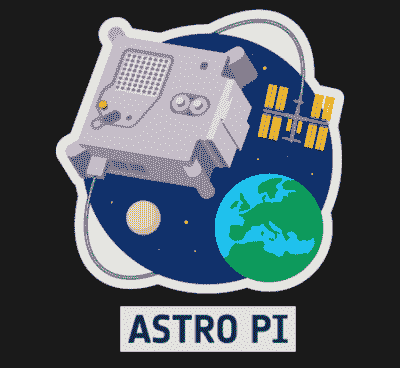
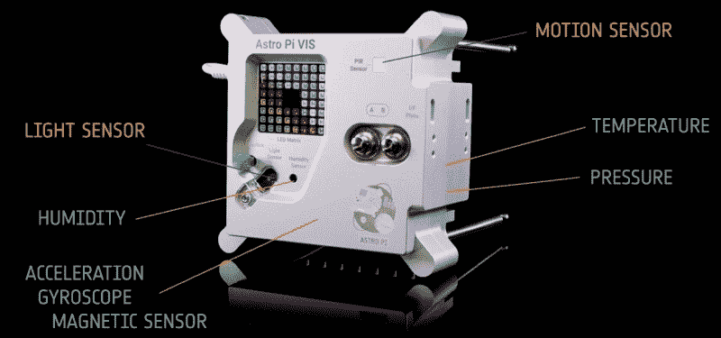
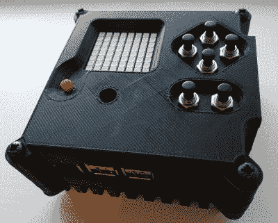

# Astro Pi Mk II，新的 Raspberry Pi 硬件前往空间站

> 原文：<https://hackaday.com/2021/09/22/astro-pi-mk-ii-the-new-raspberry-pi-hardware-for-the-international-space-station/>

早在 2015 年，欧洲航天局(ESA)宇航员蒂姆·皮克(Tim Peake)将一对特别装备的树莓 Pi 计算机(昵称为*伊西*和*埃德*)带到了国际空间站，并邀请地球上的学生为它们开发软件，作为 Astro Pi 挑战的一部分。迄今为止，已有 50，000 多名年轻人在其中一台单板计算机上运行了他们的代码；这使得它们成为太阳系中最受欢迎的，当然也是旅行最多的树莓。

 当*【伊西】*和*埃德*还在茁壮成长的时候，欧洲航天局决定是时候让这些老资格的覆盆子们退休了。新的 Astro Pi MK II 硬件初看起来与 2015 年的原始版本非常相似，计划于 12 月乘坐 SpaceX 货运龙前往国际空间站。但是在它的 6063 级铝制飞行箱里可以看到许多新的和改进的设备，包括一个 8 GB 内存的 Raspberry Pi 4 Model B。

更强大的硬件无疑会受到寻求突破的学生的青睐。虽然提交给 Astro Pi 计划的大多数 Python 程序只不过是轮询单元的温度或湿度传感器的当前读数，并在 Astro Pi 的 LED 矩阵上为宇航员滚动消息，但一些更高级的项目旨在执行合法的空间研究。从使用机载相机拍摄地球图像和进行天气预测到尝试绘制地球磁场图，由年长学生团队提交的代码肯定会受益于最新 Pi 的改进的计算性能和扩展的 RAM。

与最初的 Astro Pi 一样，ESA 和 Raspberry Pi 基金会分享了大量关于这些太空级 Linux 机器的技术细节。毕竟，学生们被期望在将代码传送到轨道计算机之前，在地球上基本相同的硬件上开发和测试他们的代码。因此，让我们快速看一下 Astro Pi MK II 内部的新硬件，以及它应该为 2022 年及以后的学生提供什么样的研究。

## 增强的传感器

在这一点上，我们都很清楚 Raspberry Pi 4 提供的[接近桌面的性能，因此不言而喻，它是对学生们迄今为止一直在使用的 2014 年的 pokey Raspberry Pi Model B+的巨大升级。与原始计算能力的提高一样重要的是，拥有 15 倍的内存将使以前根本不可能的更复杂的任务成为可能。](https://hackaday.com/2019/07/10/raspberry-pi-4-benchmarks-processor-and-network-performance-makes-it-a-real-desktop-contender/)

为了利用所有这些额外的动力，新的 Astro Pi MK II 除了在原始硬件上使用的升级版本之外，还包括更广泛的传感器阵列。新的 Sense HAT V2 仍然包括陀螺仪、加速计和磁力计以及测量国际空间站内部湿度、温度和压力的传感器。但这次还有一个被动红外传感器(PIR)，以及一个颜色和亮度传感器。

但也许最令人兴奋的传感器升级是树莓 Pi HQ 摄像头的形式。1230 万像素的索尼 IMX477 传感器是对第一个 Astro Pi 推出时可用的微小相机模块的巨大改进。它还可以接受 CS-mount 镜头，这意味着将他们的相机感知代码发送到 Astro Pi MK II 的团队将可以选择在他们的项目运行时安装不同的镜头和滤镜。例如，使用适当的过滤器，学生将能够进行归一化差异植被指数(NDVI)观测，以监测和研究地球表面的植物分布。

## 人工智能副驾驶

 当学生真的需要加速工作时，他们还可以选择使用 Astro Pi MK II 附带的 Coral USB 加速器。这种由谷歌设计的专用集成电路(ASIC)连接 Pi 的 USB 3.0 端口，每秒可以执行高达 4 万亿次操作，而功耗仅为 2 瓦。

这款低功耗设备专为机器学习而开发，可以以令人难以置信的速度运行 TensorFlow Lite 模型。官方文档称，当与桌面级处理器配对时，加速器可以以每秒近 400 帧的速度运行 MobileNet v2 图像分类和检测模型。

显然，当它与 Pi 4 一起工作时，它的能力将会降低，但对于那些想在轨道上进行机器学习的团队来说，它仍然是一个巨大的福音。当与新的高分辨率相机结合时，加速器的计算机视觉能力应该为实时地球观测提供一些迷人的机会。

像 Astro Pi 本身一样，Coral USB 加速器也包裹在定制设计的铝制外壳中，显然是为了帮助被动散热而设计的。但除此之外，它与你现在花 60 美元就能买到的[商业单元是一样的。这是导致 ESA 首先选择 Raspberry Pi 的同一种逻辑，因为它允许学校使用大部分现成的组件来构建负担得起的开发环境。](https://coral.ai/products/accelerator/)

## Astro Pi:主场游戏

那么什么时候学生或黑客读者能够建造他们自己的 Astro Pi MK II 呢？不幸的是，这还不清楚。显然，你现在就可以买到树莓 Pi 4 和 Coral USB 加速器，但据说芯片短缺推迟了大规模生产新 Sense 帽子的努力。参与该项目的学生可以[暂时使用基于网络的模拟器来测试他们的代码](https://trinket.io/mission-zero)，被选中的团队将进入第二阶段，预计在 11 月前获得真实的东西。鉴于最初 Sense HAT 的成功，新版本最终将进入零售市场似乎是不可避免的，但这可能不会在今年发生。

A DIY version of the original Astro Pi

同样，虽然该项目的网站上说他们将在不久的将来供下载，但新的 Astro Pi MK II 外壳的 CAD 文件尚未向公众开放。Raspberry Pi Foundation 有一份关于制作原始 Astro Pi 复制品的详细指南，其中包含 3D 打印表壳的信息，因此希望类似的东西能够在 12 月份推出新版本。

早在 2017 年，一家公司生产了一个价值 250 美元的原始 Astro Pi 表壳的复制品，它是如此精确， [Eben Upton 自己说它们几乎无法与飞行准备单元区分开来](https://www.raspberrypi.org/blog/astro-pi-case-guest-post/)。一旦 CAD 文件出来，我们可能会看到复制新版本的类似努力，但不要指望这次会更便宜。

即使你年纪太大或不在地球的先决条件一侧，无法参加官方的 Astro Pi 挑战，由 ESA 和 Raspberry Pi 基金会开发的平台仍然对地球上的公民科学家和实验者有吸引力。希望到 2022 年春天挑战项目开始上传到国际空间站的时候，我们将能够在家里使用我们自己的硬件模型。

 [https://www.youtube.com/embed/uCg6DZ5YRLc?version=3&rel=1&showsearch=0&showinfo=1&iv_load_policy=1&fs=1&hl=en-US&autohide=2&wmode=transparent](https://www.youtube.com/embed/uCg6DZ5YRLc?version=3&rel=1&showsearch=0&showinfo=1&iv_load_policy=1&fs=1&hl=en-US&autohide=2&wmode=transparent)

