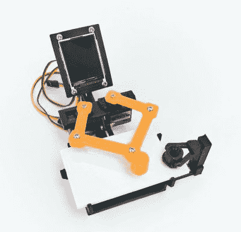

# TICO 机器人通过在小白板上画画来玩井字游戏

> 原文：<https://hackaday.com/2021/09/27/tico-robot-plays-tic-tac-toe-by-drawing-on-a-tiny-whiteboard/>

井字游戏(或称“画圈画叉”)是一种简单到可以在任何计算机系统中实现的游戏:事实上，它经常被用在初学者的编程课程中。一个更具挑战性的项目，也可以说是更有趣和有用的项目，是制造某种可以在现实生活中播放它的硬件。[mircemk] [建造了一个简单而优雅的机器](https://hackaday.io/project/181756)，它可以和人类玩家玩井字游戏，其方式看起来非常类似于人类之间的游戏方式:通过绘画。

这个机器人的设计和程序是由 PlayRobotics 开发的，他们将这个项目命名为 [TICO](https://playrobotics.com/blog/tico-tic-tac-toe-arduino-robot-documentation/) 。机械零件以 STL 文件的形式提供，可以由任何 3D 打印机打印，一本全面的手册解释了如何组装和编程整个事情。由于它都是开源的，任何人都可以从头开始构建它，并根据自己的喜好进行修改。图片显示的是 PlayRobotics 的原始设计，而视频(插播后)显示的是[mircemk]的版本，其中包括一个木制框架，使其更具存在感。

 电子元件是一个带有有机发光二极管屏幕和蜂鸣器的 Arduino，加上三个伺服系统来操作机械部分。在没有 3D 打印机的情况下，[mircemk]从 3 毫米的 PVC 板上切割塑料部件，这似乎效果惊人。游戏板由一个小白板组成，机器人和人可以在白板上画出他们的 O 和 X。

这个机器人的机械结构看起来有点像一个微型人用双臂用一个巨大的马克笔画画。当开始一个游戏时，机器人用一点橡皮擦清除白板，然后画出标准的 3×3 网格，并进行第一步。然后人类画出他们的移动，并使用遥控器告诉机器人他们做了什么(这里没有机器视觉)，之后游戏继续进行，直到要么有一个赢家，要么游戏结果是平局。

虽然看起来该程序的播放策略可能需要一些微调，但机械部分设计良好，手臂的动作快速而稳定。我们喜欢比赛结束时庆祝的“欢呼”,不管 TICO 队赢了还是没赢，都会这样做。

机器人的基本设计灵感来自[绘图时钟](https://hackaday.com/2014/02/13/a-clock-that-plots-time/)，它使用类似的设置来绘制时间。我们以前见过其他[井字游戏机器人](https://hackaday.com/2020/09/16/tobot-is-your-tic-tac-toe-opponent-with-a-bad-attitude/)，以及游戏的一些[巧妙的电子实现](https://hackaday.com/2019/06/29/tic-tac-toe-in-ttl/)。

 [https://www.youtube.com/embed/wTRLY3n7lMM?version=3&rel=1&showsearch=0&showinfo=1&iv_load_policy=1&fs=1&hl=en-US&autohide=2&wmode=transparent](https://www.youtube.com/embed/wTRLY3n7lMM?version=3&rel=1&showsearch=0&showinfo=1&iv_load_policy=1&fs=1&hl=en-US&autohide=2&wmode=transparent)

