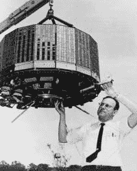
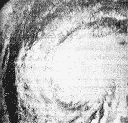
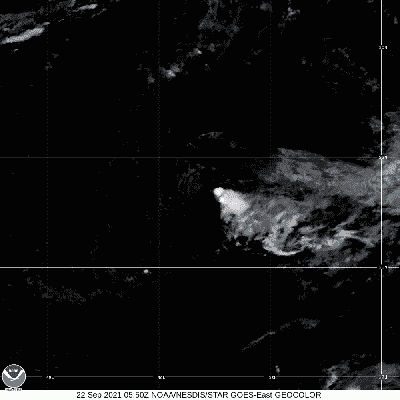

# 从外层空间搜寻飓风

> 原文：<https://hackaday.com/2021/09/27/hurricane-hunting-from-outer-space/>

如果你住在世界上正确的地方，你会在一年中的大部分时间里担心飓风或者——严格来说——热带气旋。这些风暴携带着惊人的力量，可以改变你的生活。然而，与过去相比，我们现在相对被宠坏了。很难想象，但是曾经有一段时间飓风的到来是一个谜。当然，船只会报告他们遇到的情况，但是找到关于飓风的准确数据有点困难。我们经常谈论太空技术让生活更美好。天气预报——尤其是对热带风暴的预报——是太空支出让地球上的生活变得更加美好的一个领域。

缺乏关于风暴的数据可能是致命的。1900 年的加尔维斯顿飓风夺去了大约 12000 人的生命。它可能有一个更好的结果，但预报员错过了风暴的方向，宣布它将从古巴到佛罗里达，这是完全错误的。这并不是说预报员今天不会犯错，但是有了飞机和卫星的覆盖，你会很快知道预测是错误的，你会发出警报。事实上，这些年来，预测模型已经变得非常好了，所以无论如何，今天这种情况发生的可能性几乎为零。但是能够精确定位和跟踪风暴有助于减少风暴的影响，还可以将数据输入模型，使其在未来更加准确。

## 侦察机

你可能会认为在飓风中驾驶飞机有点冒险。你是对的，尽管如果你做得正确，一切顺利，你就远离了飓风，但是——当然——事情并不总是顺利的。

The first man to fly into a hurricane — at least, on purpose

1943 年 7 月 27 日，美国陆军航空兵中校约瑟夫·b·杜克沃斯是一名在平民生活中经验丰富的仪表等级商业飞行员，他决定故意飞入飓风中心。他和一名导航员在休斯顿附近发现了一个风暴眼，在确认后，他和一名气象学家再次飞进了风暴眼。

这次飞行是未经授权的，可能是打赌的结果，但数据足够有用，该服务在那年晚些时候进行了更多的飓风飞行，这开始了飓风猎人飞行的长期传统。

## 外层空间

当然，在太空时代，你为什么需要一架飞机来观看飓风？答案是，自然，你没有。我们今天想当然地认为卫星会把地球的图像传下来，但事实并非总是如此。20 世纪 60 年代的电视红外观测卫星计划(TIROS)是从太空传送地球图像的先驱。

The TIROS 3 satellite before launch

据美国宇航局称，泰洛斯一号是当时的一个技术奇迹:

> 飞船直径 42 英寸，高 19 英寸，重 270 磅。这艘飞船由铝合金和不锈钢制成，上面覆盖着 9200 块太阳能电池。太阳能电池用来给车载电池充电。三对固体推进剂旋转火箭安装在底板上。
> 
> 飞船上装有两台电视摄像机，一台低分辨率的，一台高分辨率的。为每个照相机提供了一台磁带录音机，以便在卫星超出地面站网络范围时储存照片。
> 
> 天线由底板上的四根杆组成，用作发射器，顶板中央的一根垂直杆用作接收器。
> 
> 这个飞行器是自旋稳定的，面向太空的(不是面向地球的)。因此，只有当地球的这一部分在阳光下时，相机才在指向地球时工作。

这颗卫星只运行了 78 天，尽管下一颗类似的卫星飞行了一年多。

 [https://www.youtube.com/embed/EEQnAfo_XIA?version=3&rel=1&showsearch=0&showinfo=1&iv_load_policy=1&fs=1&hl=en-US&autohide=2&wmode=transparent](https://www.youtube.com/embed/EEQnAfo_XIA?version=3&rel=1&showsearch=0&showinfo=1&iv_load_policy=1&fs=1&hl=en-US&autohide=2&wmode=transparent)

Hurricane Esther imaged from TIROS 3

然而，创造飓风历史的是泰洛斯 3 号。1961 年，它发现了飓风埃斯特。以前曾有过来自太空的风暴照片，但埃斯特是第一个由卫星发现的风暴。

巧合的是，这场风暴也是海军用来测试一种理论的风暴，这种理论认为在风暴眼播撒碘化银可能会降低风暴强度。

最初的报道是，人工降雨冷却了风眼的水，降低了风暴强度，但后来的分析表明，这一过程是无效的。无论如何，从轨道上搜索海洋风暴的能力改变了游戏规则。在对船只和人口的预警和改进的预测数据之间，这种能力挽救了无数的生命和财产损失。

## 今天

埃丝特的照片今天看起来显然是低技术含量的。将其与 GOES 卫星拍摄的最近一次风暴形成的图像进行比较:

Modern image of a tropical storm from space

飓风预报现在比以往任何时候都好，尤其是对位置 T1 的预报，而强度预报仍然会引起一些问题。除了让公众获得信息之外，这对公民科学家来说也是一个福音。如果你想研究这些数据，或者只是为了建立你自己的[预警系统](https://hackaday.com/2020/08/31/the-hurricanes-are-coming/)，这些数据是可用的。