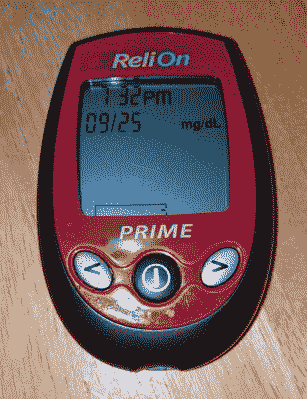
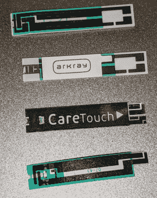

# 显而易见的技术:血糖仪

> 原文：<https://hackaday.com/2021/10/20/tech-in-plain-sight-glucose-meters/>

如果你或你认识的人有糖尿病，血糖仪很有可能是你生活中的固定设备。它们便宜又丰富，但它们实际上是相当高的技术——嗯，至少部分是如此。

仪表本身看起来没什么，但这是误导。一块电池，几个零件，一个显示器，以及足够的控制器来做像记忆读数这样的事情，这似乎涵盖了一切。当然，你不会感到惊讶，你可以在一个芯片上得到整个事件。但事实证明，真正的魔力在试纸上，从试纸上获得良好的读数需要比你想象的更多的计量。普通电表需要低至 10nA 的精密电流测量。读数也必须根据温度进行调整。对于一件看起来像是一次性消费品的东西来说，这款设备复杂得令人惊讶。

当然，一直都有关于不需要针扎的新技术的公告。到目前为止，由于这样或那样的原因，这些都没有真正流行起来，但是，当然，这可能会改变。例如，GlucoWatch G2 是一款可以读取血糖的手表，但显然无法应对出汗。

即使是持续监控的电表，其工作方式也与廉价电表大致相同。正如 Hackaday 的 Dan Maloney 几年前详述的那样，[连续血糖监测器在你的皮肤下留下一个微小的传感器，测量你体内的液体](https://hackaday.com/2018/12/03/why-is-continuous-glucose-monitoring-so-hard/)，不一定是血液。但是传感器的工作方式通常是一样的。

出于本文的目的，我将只讨论传统的血糖仪:你插入一个试纸，刺破你的手指，让试纸吸收一点点血液。

## 两种不同的

Typical inexpensive glucose meter

不管你怎么分析，真正的魔力在试纸上。然而，你如何测量带可以有所不同。到目前为止，最常见的方法是使用放大器来读取非常小的电流。然而，您也可以使用精确的 led 和光电二极管，这也需要非常精确的电流读数、额外的化学物质和精确的时序，因此今天您不会经常看到基于光学的电表。例外的是，有一些试纸，你只需看试纸的颜色就能读懂。这不是很准确，但它既便宜又方便。对于大多数人来说，准确的血糖读数不一定像知道血糖是正常、高还是非常高那么重要，所以目测试纸的颜色有时就足够了。

普通的试纸使用一种化学物质对血样进行反应。使用不同的化学反应或不同数量的电极，每种试条类型可以不同。然而，有一些共同的要素。

首先，试纸将使用某种酶，这种酶将与样本中的葡萄糖发生反应，并产生一些你可以用电子手段检测到的东西。葡萄糖氧化酶是最常见的选择，尽管也有其他类似的酶，如葡萄糖脱氢酶烟酰胺腺嘌呤二核苷酸或葡萄糖脱氢酶黄素腺嘌呤二核苷酸。

下图显示了两种不同品牌的带盖和不带盖的布条，它们隐藏了所有的工作原理。血液从左侧进入，右侧有连接到血糖仪的触点。

The top and bottom test strips have had their internal structure exposed.

如果你一天要用针扎手指几次，你会对那根针有多大非常敏感。随着时间的推移，血糖仪变得越来越灵敏，因此需要的血液越来越少。更少的血意味着你可以用更细的针，也许不会扎得这么深。任何可以减少每次测试所需血液量的方法都将有助于向患者销售血糖仪。当今最先进的血糖仪可能只使用 300 微微升的血液。一只饥饿的蚊子大约需要 10 微升，所以 300 微微升确实是非常少的量。一般来说，在你插入手指后，毛细作用会将一定量的血液吸入试纸。

## 细胞

一个条带可能有多个单元格用于不同的目的。例如，一个单元可以简单地检测到血液到达了该位置，这意味着前一个单元应该提供有效的读数。每个单元将具有至少一对电极。在某些情况下，一个电池会有两个以上的电极，在这种情况下，仪表会向一个电极施加偏置电流。这增加了复杂性，但可以提供更好的结果。

有些仪表选择测量化学反应产生的总电荷。其他人测量反应中特定时间的电荷，并以此推断出总量。

顺便说一下，试纸条是所有钱的来源，因为它们是一次性的。就像 Radio Shack 过去常常赠送手电筒来卖电池一样，血糖仪经常免费赠送或以非常低的价格出售，因为你知道你将需要购买稳定供应的试纸来使血糖仪有用。

## 编码

如今，大多数电表不需要编码，但这在过去很常见。不同批次的试纸会有不同的特性，所以你需要将试纸上的代码输入血糖仪，以获得准确的读数。如果你是铁杆，你也可以得到校准解决方案，以测试仪表的准确性。

有些血糖仪会使用试纸条，将代码自动传送给血糖仪。这可以通过条带上或用于条容器的容器中的一些机构来实现。虽然一些测试条可能具有专用于校准的单元，但是现在大多数测试条都简单地按照严格的公差生产，从而可以通过使用单个校准常数或者通过使用测试条上的简单连接检测几个常数中的一个来容易地自动编码。

## 高科技无处不在

这些传感器背后的技术相对较新。最初的工作可以追溯到 20 世纪 50 年代末，与你今天看到的类似的实用传感器出现在 20 世纪 60 年代初。然而，所需的血液量、精确度，以及——当然——所有微控制器的惊人特性在过去六年里都有所改进。然而，令人惊讶的是，即使过了这么多年，还没有找到更好的无创测量血糖的方法。

如果我让你去药店买一个纳米安培计，你可能不会想到去糖尿病检测区。我有点惊讶，我们没有看到更多的这种仪表——或驱动它们的芯片——被侵入其他仪器，尽管我们已经看到至少有一个[重新利用了一些电化学电路](https://hackaday.com/2020/08/02/electrochemistry-at-home/)。与此同时，我们仍在等待我们不断听说的[无创血糖监测系统](https://hackaday.com/2018/12/06/eyes-on-the-prize-of-glucose-monitoring/)。