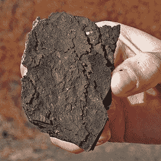

# 电动汽车、汽油问题和合成燃料

> 原文：<https://hackaday.com/2021/10/18/electric-vehicles-the-gasoline-problem-and-synthetic-fuels-part-1/>

当你站在加油站给你的车加油时，看着油泵上的数字飞快地跳动会是一种发人深省的经历。燃料价格，尤其是汽油价格，一直受到密切关注，因此很难想象汽油曾是一种低价值的废品。但是主要用于照明的煤油曾经是石油工业之王，至少在汽车出现之前是如此，以至于提炼煤油时产生的汽油被简单地倒入溪流中处理掉。

一想到如此规模的环境犯罪，现代人可能会不寒而栗，我们无法想象怎么会有人认为这是解决问题的好办法。然而，我们现在面临着几乎相同的问题，因为全球机动车辆的日益电气化压低了汽油需求。为了理解为什么这是一个问题，我们首先来看看原油是如何形成的，以及对汽油需求的减少实际上是如何导致我们在走得太远之前应该思考的问题。

## 在你的鱼缸里放一点浮游生物

当你给你的 ICE 或混合动力车加满油并启动引擎时，你就结束了一个数十亿年前就开始的化学过程的循环。为大多数车辆提供动力的石化燃料最初是大气中的二氧化碳，通过光合作用被无数万亿的微生物如浮游生物、藻类和蓝细菌贪婪地吞噬，并被锁定在它们的生物聚合物中——脂质、碳水化合物、蛋白质和核酸。

这些微生物在原始地球的海洋和湖泊中大量繁殖，最终死亡时成为沉积物。持续不断的死亡之雨形成了厚厚的沉积物层，富含有机分子。这些沉积物中的大多数碳通过氧化反应分解，但在某些地区，由于地质作用，大量丰富的有机淤泥最终被无机沉积物覆盖。这些部分分解的沉积物远离氧气的腐蚀作用，并由于其顶部物质的重量而经历不断增加的热量和压力，逐渐转化为干酪根，这是一种锁定在沉积岩中的有机物质沉积物。

Oil shale, a kerogen. Credit: Fafner, CC BY-SA 3.0, via [Wikimedia Commons](https://commons.wikimedia.org/wiki/File:Grube_Messel_%C3%96lschiefer_2005-09-24.jpg)

虽然干酪根富含大型复杂的碳氢化合物，有些甚至丰富到足以用作燃料——煤本质上是一种干酪根，其起始生物质主要是陆地植物——但大多数干酪根并没有完全转化为石油。像北美页岩油田这样的干酪根被认为是“热不成熟的”——基本上，它们还没有充分成熟。但是其他干酪根，那些上面沉积了更深层沉积物的干酪根，经历了进一步的地球化学反应，随着时间的推移，将复杂的碳氢化合物分解为越来越简单的化合物，最终形成了大量的液态原油。

最热成熟的产品，也就是烹饪时间最长的产品，是从单碳甲烷到四碳丁烷的短链气态烃。在热成熟度谱的另一端，长链碳氢化合物(其链中可能含有 40 个或更多的碳)构成了粘稠的沥青化合物。

就发动机燃料和润滑剂而言，重要的碳氢化合物往往来自热成熟度范围的中间值。柴油、煤油和喷气燃料往往来自 C [9] 到 C [16] 范围，更长的碳链构成了用于为船用发动机提供燃料的重油。在较短的一端，C [5] 到 C [8] 范围的碳氢化合物构成了汽油的主体，这是许多不同碳氢化合物的复杂混合物，包括直链烷烃，如己烷和辛烷，环烷烃，以及任何数量的添加剂，如醚和醇，包括乙醇。

 [https://www.youtube.com/embed/_PDOD_FEnNk?version=3&rel=1&showsearch=0&showinfo=1&iv_load_policy=1&fs=1&hl=en-US&autohide=2&wmode=transparent](https://www.youtube.com/embed/_PDOD_FEnNk?version=3&rel=1&showsearch=0&showinfo=1&iv_load_policy=1&fs=1&hl=en-US&autohide=2&wmode=transparent)

## 粗略的估计

值得注意的是，任何原油沉积物都含有碳氢化合物的混合物。一些矿藏的碳氢链长度会比另一个更丰富，但总的来说，每一个矿藏都会有至少一部分的碳氢链，从甲烷到沥青。那里有什么取决于形成原油的干酪根经历的条件，以及不同来源的碳氢化合物如何随着时间的推移在地下混合。

这就引出了石油开采的基本问题。虽然像柴油和汽油这样的燃料是高度工程化的化学品，但它们不是从原油中提炼出来的 T2。确切地说，它们是从中提炼出来的*。这似乎是不言自明的，但这是很重要的一点。一桶典型的原油含有大约 40-50%的汽油(或者更准确地说，是混合到汽油中的 C [5] 到 C [8] 馏分)，当你加入柴油、煤油和船用燃料油时，每桶原油中含有整整 84%的燃料级馏分。*

这是汽油问题的根源。目前，电动汽车只占整个车队的很小一部分——可能占全球的 3%。但在某种程度上，通过更好的工程设计、政治压力、改进的电池技术和气候意识的结合，对电动汽车的需求将会大幅增长。一些估计认为 2040 年电动汽车在道路上的比例为 58%,至少对于乘用车来说是这样。这意味着大量的汽车不会每隔几天就在当地加油站停下来加油，这意味着对汽油的需求必然会大幅下降。

但是，正如我们所见，大约一半的每桶原油是汽油。如果我们突然不需要那么多的汽油，我们应对需求下降的唯一方法就是首先不要从原油中提炼。如果我们仍然需要其他分数，这就产生了一个问题，而我们很可能会需要。以柴油为例。[2019 年的一份报告](https://www.trucks.com/2019/04/01/electric-trucks-fraction-market-for-years/)估计，到 2025 年，中型和重型卡车车队将只有约 4%是电动的，其中大部分将是在当地和区域交付路线上工作的卡车，主要是因为电池寿命的限制。然而，长途卡车可能在相当长的一段时间内不会实现电气化，这意味着原油仍然需要蒸馏以生产柴油来驱动它们。

同样的问题也适用于飞机——除非电池技术大幅提高，否则我们仍然需要原油中的煤油。再加上道路建设所需的沥青、保持货船运转所需的重油、运转几乎所有机械所需的润滑剂，以及用于制造化肥、药品和塑料的石油馏出物，你会发现一桶石油中的所有东西都是有用的，也是必需的——除了汽油，汽油恰好是桶中的大部分。

## 后续步骤

这就是问题所在:我们从地下抽取的每一桶原油中，大约有一半是由注定无用的东西制成的，至少在一个由电动汽车主导的世界里是如此。如果每桶油的另外 50%不包含非常有用的东西，那也不会太糟糕；否则，我们可以把石油留在地下，然后称问题已经解决。这可能是最终的解决方案，一旦目前燃烧燃料的一切都转化为其他能源，但与此同时，我们要么必须找出如何处理废汽油，要么找到一种方法来获得我们需要的碳氢化合物。

请继续关注本系列的第二部分，在那里我们将深入研究合成燃料、合成油，以及我们可能如何解决汽油问题。