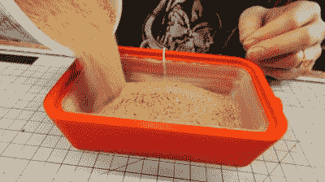

# 扩展可折叠容器的创建

> 原文：<https://hackaday.com/2021/09/30/expanding-on-the-creation-of-collapsible-containers/>

你可能还记得工业设计师[Eric Strebel]几周前尝试用 3D 打印模具制作可折叠的硅胶容器，经过几十次尝试终于成功。有人评论说，商业容器是在折叠状态下成型的，而不是在展开状态下成型的，所以很自然地，[【Eric】在看到这些模具的照片样张后，不得不尝试一下](https://www.youtube.com/watch?v=k0fnv2f2MbY)。

 这一次，【埃里克】让事情变得更简单，他给模具增加了一些把手，并在注入脱气硅胶之前使用蜡和喷雾脱模剂。第一个是失败的——他让它在坍塌的模具中固化了整个时间，它只是不想保持膨胀。在第二次尝试中，[Eric]决定在它固化的时候把它拔出来，大约 5 个半小时。

在小心地将它脱模后，他将它压入一个旧模具的凹槽中，这个旧模具是在膨胀状态下成型容器的。然后他用沙子填满它，让它固化剩下的路。这样做效果很好，但即使如此，[埃里克]还是做了第三次尝试，大约 3.5 小时后，当硅胶仍有粘性时，他进行了尝试。他又玩了一次沙子把戏，但这一次，他将一根细绳沿墙和边缘向上拉，这样被困在沙子下面的空气就可以逸出。最终的结果看起来很棒，虽然有点松软，但[Eric]将最终产品放入一个框架中，使它们更加坚固。休息后看看视频中的过程。

你错过了第一集吗？创造可折叠墙壁的科学值得一看。

 [https://www.youtube.com/embed/k0fnv2f2MbY?version=3&rel=1&showsearch=0&showinfo=1&iv_load_policy=1&fs=1&hl=en-US&autohide=2&wmode=transparent](https://www.youtube.com/embed/k0fnv2f2MbY?version=3&rel=1&showsearch=0&showinfo=1&iv_load_policy=1&fs=1&hl=en-US&autohide=2&wmode=transparent)

