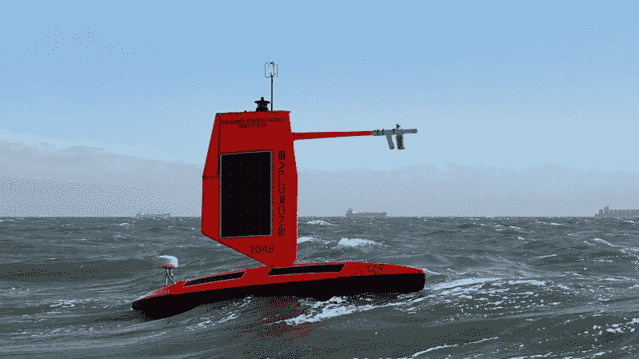

# 赛欧无人机如何在创纪录的时间内将飓风镜头带回家？

> 原文：<https://hackaday.com/2021/10/05/how-does-a-sail-drone-bring-home-hurricane-footage-in-record-time/>

作为一个年轻的小伙子，[理查德·詹金斯]不太可能想象航行到 4 级飓风的中心。然而，这正是他在探险家 1045 上所做的，这是一辆由他的公司 Saildrone 制造的未经评审的帆船。如果这还不够的话，这艘船经受超过 120 英里/小时(几乎 200 公里/小时)的大风和 50 英尺(15 米)的海浪的镜头在第二天被发布到网上，你可以在休息时间下面看到它。我们将快速浏览使这成为可能的两项技术:先进的帆船和卫星通信。两者在浏览器 1045 的同级 1048 上都是可见的，如下所示:

Saildrone Explorer 1048, a sibling of Explorer 1045, each one of five vessels equipped with a “hurricane wing”

最突出的特点当然是缺少了传统的风帆。你看，从 1999 年到 2009 年，[理查德·詹金斯]专注于创造风力驱动车辆的陆地世界速度记录。他通过完善现有的帆翼技术创造了 126.1 英里/小时的记录。[理查德]取消了传统的索具，增加了一个带有控制表面的吊杆，很像滑翔机的机身和尾翼。

除了调节索具之外，控制表面可以用来在使用很少能量的情况下将机翼飞行到最佳位置。[Richard]已经能够在他的公司 Saildrone 应用这项技术。23 英尺长的探险船和它的兄弟们就是结果。

视频录制仅一天后，世界如何看待飓风眼中的景象？如果你看船的尾部，你可以看到一个圆顶的白色圆柱体。这是一个名为 Thales VesseLINK 的卫星通信基站。泰雷兹是为铱星下一代舰队制造卫星的合作伙伴公司之一，该舰队在低地球轨道上有 66 颗运行卫星。铱星 Certus 服务使用其 L 波段(1.6 GHz)信号提供高达 352 kbps 的上传速度和 704 kbps 的下载速度。虽然速度不快，但这项服务在世界任何地方都可以使用，而且可靠，因为它不容易受到雨衰和其他天气因素的干扰。

凭借这两项最新的创新，探索者 1045 号能够航行到飓风中心，记录镜头和收集数据，然后在几个小时后将其运回家。我们几乎没有探索冰山一角。不仅仅是基于帆船的相机，这些科学仪器被设计成可以在地球上最恶劣的环境中生存一年以上。它们是应用工程的奇迹，我们确信在明亮的橙色外表下隐藏着一些优秀的黑客。

如果无人驾驶的帆船让你的船漂浮，你可能也会喜欢这艘[自主太阳能拖船](https://hackaday.com/2021/09/18/solar-powered-autonomous-tugboat-for-rescuing-autonomous-vessels/)，或者那次一艘潜艇耗尽燃料，躺在床单上航行回家的[。](https://hackaday.com/2018/10/17/hacking-when-it-counts-setting-sail-in-a-submarine/)

 [https://www.youtube.com/embed/uQM_03zuSAI?version=3&rel=1&showsearch=0&showinfo=1&iv_load_policy=1&fs=1&hl=en-US&autohide=2&wmode=transparent](https://www.youtube.com/embed/uQM_03zuSAI?version=3&rel=1&showsearch=0&showinfo=1&iv_load_policy=1&fs=1&hl=en-US&autohide=2&wmode=transparent)

